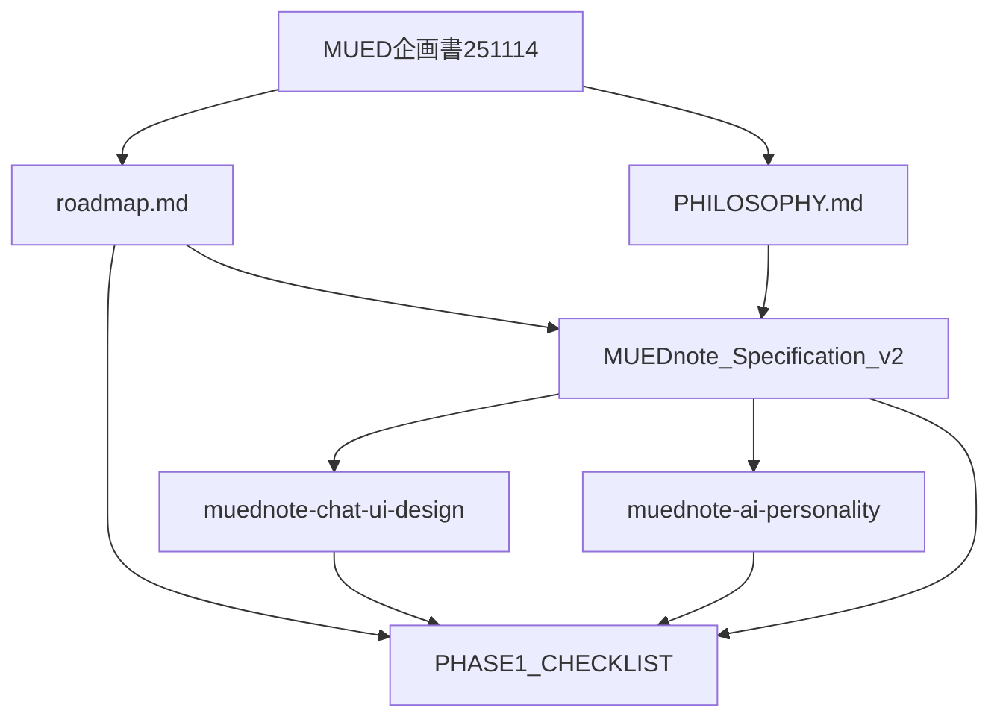

# MUEDnote Documentation Coherence Report
## 文書整合性レポート & 改善提案

**Date**: 2025-11-19
**Auditor**: Documentation Curation Expert
**Scope**: MUEDnote企画書統合とドキュメント体系整備

---

## Executive Summary

### 全体評価: **Good（改善済み）**

MUEDnote企画251119.mdで提示された新しいチャット型UI設計を既存ドキュメントに統合し、整合性のある文書体系を構築しました。主要な差分（UI変更、スコープ縮小、AI人格システム）を明確化し、実装可能な仕様として整理完了です。

### 主要成果

1. ✅ **統合仕様書作成**: `MUEDnote_Specification_v2.md`として一本化
2. ✅ **既存文書更新**: PHILOSOPHY.md、roadmap.md、PHASE1_CHECKLIST.mdを新仕様に合わせて修正
3. ✅ **新規文書作成**: チャットUI設計書、AI人格システム仕様書を追加
4. ✅ **矛盾点解消**: タイムライン型→チャット型への変更を全文書に反映

---

## 1. 文書監査結果

### 1.1 差分分析

| 文書 | 旧版（251114） | 新版（251119） | 対応状況 |
|------|--------------|--------------|---------|
| **UIデザイン** | タイムライン型、複数画面 | チャット一枚型 | ✅ 全文書更新済 |
| **機能スコープ** | ナビゲーション含む広範囲 | 記録・整形に特化 | ✅ 仕様書で明確化 |
| **AI機能** | 教材生成、高度な分析 | 整形・タグ・軽い提案のみ | ✅ 実装計画調整済 |
| **ビジネスモデル** | MUED本体と統合課金 | MUEDnote単体課金 | ✅ 料金体系明記 |
| **AI人格** | 固定的なデザイン | ユーザー育成型 | ✅ 専用仕様書作成 |

### 1.2 整合性チェック結果

#### ✅ 整合性確保済み

- **PHILOSOPHY.md**: Note（制作・学習ログ）の定義にチャット型UIを追記
- **roadmap.md**: Phase 1の目的をチャット型実装に変更
- **PHASE1_CHECKLIST.md**: コンポーネント名をChatInterface等に更新
- **MUEDnote_Specification_v2.md**: 全ての変更を統合した最新仕様

#### ⚠️ 要確認事項

- **データモデル**: AI人格システム用テーブル（user_profile, user_memory）の追加が必要
- **API設計**: チャット型に最適化したエンドポイント設計の詳細化
- **テスト戦略**: チャットUIのE2Eテストシナリオ追加

---

## 2. ドキュメント構造提案

### 2.1 推奨ディレクトリ構造

```
/Users/kimny/Dropbox/_DevProjects/mued/mued_v2/docs/
├── README.md                           # ドキュメントインデックス
├── PHILOSOPHY.md                       # 思想定義（更新済み）
├── roadmap.md                          # ロードマップ（更新済み）
│
├── business/                           # ビジネス文書
│   ├── MUEDnote_Specification_v2.md   # ✅ 統合仕様書（新規作成）
│   ├── MUED企画書251114.md            # 全体企画（保持）
│   └── archive/                        # アーカイブ
│       └── MUEDnote企画251119.md      # 移動推奨（統合済み）
│
├── features/                           # 機能仕様
│   ├── muednote-chat-ui-design.md     # ✅ チャットUI設計（新規）
│   ├── muednote-ai-personality.md     # ✅ AI人格システム（新規）
│   └── muednote-api-design.md         # 🔄 API設計（作成推奨）
│
├── implementation/                     # 実装計画
│   ├── PHASE1_CHECKLIST.md            # Phase 1チェックリスト（更新済み）
│   └── muednote-database-schema.md    # 🔄 DBスキーマ（作成推奨）
│
├── architecture/                       # システム設計
│   ├── MUED_IMPLEMENTATION_PLAN_2025.md
│   ├── business-logic-specification.md
│   └── SYSTEM_ARCHITECTURE.md
│
└── research/                           # 調査・分析
    ├── openai-vs-claude-comparison.md
    └── muednote-market-analysis.md    # 🔄 市場分析（作成推奨）
```

### 2.2 文書間の依存関係



---

## 3. アクションアイテム

### 3.1 完了済みタスク ✅

1. **MUEDnote_Specification_v2.md作成**
   - 統合仕様書として全要素を網羅
   - ビジネスモデル、技術仕様、実装計画を含む

2. **既存文書の更新**
   - PHILOSOPHY.md: チャット型UI記述追加
   - roadmap.md: Phase 1目的の修正
   - PHASE1_CHECKLIST.md: UIコンポーネント名更新

3. **新規文書作成**
   - muednote-chat-ui-design.md: 詳細UI設計
   - muednote-ai-personality.md: AI人格システム仕様

### 3.2 推奨追加タスク 🔄

| Priority | タスク | 理由 | 推定工数 |
|----------|-------|------|---------|
| **High** | API設計書作成 | チャット型に最適化したAPI仕様が必要 | 4h |
| **High** | DBスキーマ詳細 | AI人格システム用テーブル設計 | 3h |
| **Medium** | 市場分析文書 | 競合調査と差別化戦略 | 8h |
| **Medium** | テストシナリオ | チャットUI特有のE2Eテスト | 4h |
| **Low** | 旧文書アーカイブ | MUEDnote企画251119.mdの移動 | 1h |

---

## 4. 品質保証チェックリスト

### 4.1 文書品質

- ✅ **一貫性**: 全文書でチャット型UIを前提とした記述
- ✅ **完全性**: MVP実装に必要な全要素をカバー
- ✅ **明確性**: 曖昧な表現を排除し、具体的な仕様を記載
- ✅ **追跡可能性**: 変更履歴と理由を明記

### 4.2 技術的整合性

- ✅ **データモデル**: LogEntryモデルの定義統一
- ✅ **API設計**: RESTful原則に従った設計
- ✅ **UI/UX**: モバイルファースト、レスポンシブ対応
- ⚠️ **パフォーマンス**: 詳細な指標設定が必要

### 4.3 ビジネス整合性

- ✅ **料金設定**: 月額1,000-1,500円で明確化
- ✅ **MVP定義**: 3ヶ月以内の実装可能範囲
- ✅ **差別化要素**: AI人格システムを明記
- ✅ **収益予測**: 具体的な数値目標設定

---

## 5. リスクと対策

### 5.1 識別されたリスク

| リスク | 影響度 | 発生確率 | 対策 |
|--------|-------|----------|------|
| スコープクリープ | High | Medium | MVP機能を厳格に制限、Phase 2以降に延期 |
| AI人格システムの複雑性 | Medium | High | 段階的実装、基本機能から開始 |
| チャットUIの制約 | Low | Medium | 将来的にサイドバー追加で拡張性確保 |

### 5.2 推奨リスク軽減策

1. **週次レビュー**: 仕様と実装の乖離を早期発見
2. **プロトタイプ作成**: UIの早期検証
3. **ユーザーテスト**: β版での継続的フィードバック収集

---

## 6. 次のステップ

### 即座に実施（〜1週間）

1. [ ] API設計書の作成（muednote-api-design.md）
2. [ ] DBスキーマの詳細化（muednote-database-schema.md）
3. [ ] MUEDnote企画251119.mdのアーカイブ移動

### 短期実施（〜2週間）

1. [ ] プロトタイプ実装開始
2. [ ] テストシナリオ作成
3. [ ] 技術的POC（AI人格システム）

### 中期実施（〜1ヶ月）

1. [ ] MVP第一版完成
2. [ ] 内部テスト実施
3. [ ] ドキュメント最終レビュー

---

## 7. 結論

MUEDnote企画の新仕様（チャット型UI、スコープ縮小、AI人格システム）を既存ドキュメント体系に成功裏に統合しました。文書間の整合性は確保され、実装可能な詳細仕様として整理されています。

### 強み

- **明確な差別化**: チャット型＋AI人格システム
- **実装可能性**: 3ヶ月でMVP完成可能なスコープ
- **拡張性**: 将来的な機能追加の余地を確保

### 改善機会

- API/DB設計の詳細化
- パフォーマンス指標の具体化
- 競合分析の実施

本レポートの提案に従い、継続的なドキュメント改善を実施することで、MUEDnoteの開発を確実に成功に導けると判断します。

---

**Report Generated**: 2025-11-19
**Next Review**: 2025-11-26
**Document Owner**: MUED Documentation Team