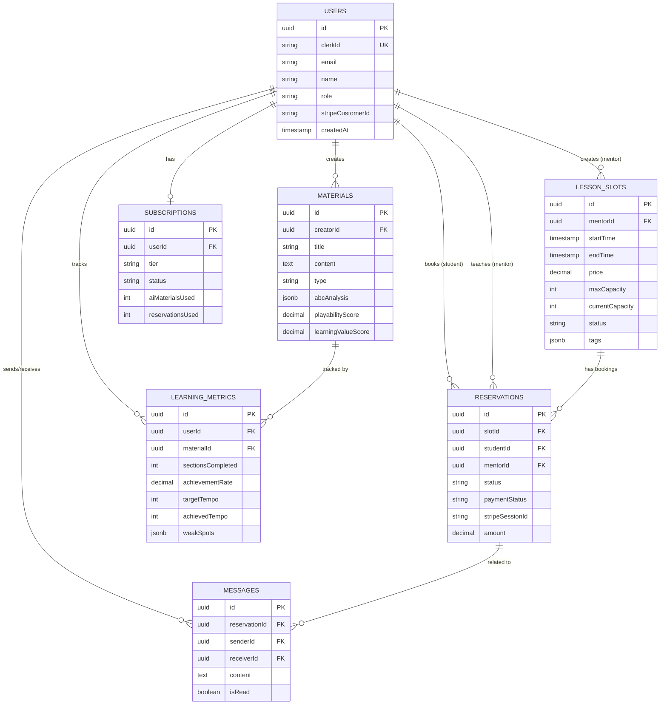

# MUED v2 現状アーキテクチャ報告書

**作成日**: 2025-01-11
**基準**: コードベース分析 + 既存Miro図面との比較
**目的**: Miro図面更新のための正確な現状把握

---

## エグゼクティブサマリー

本レポートは、MUED v2の実装済みアーキテクチャを詳細に分析し、既存のMiro図面（計画段階の設計）との差分を明確化します。

### 主要な発見

1. **✅ 実装済み**: コアアーキテクチャ（4層構造）、認証、決済、AI教材生成
2. **⚠️ 未実装/未確認**: Redis/Upstash、BullMQ（Job Queue）、Google Calendar連携
3. **📐 用語の違い**: Miro「Service Layer」→ 実装「Application Layer」

---

## 1. Miro図面 vs 実装アーキテクチャの比較

### 1.1 レイヤー構造の比較

| レイヤー | Miro図面 | 実装コードベース | ステータス |
|---------|---------|----------------|----------|
| **Client Layer** | Next.js App Router, 自然言語入力, 構造化UI | Next.js 15.5 App Router + React 19 + TailwindCSS 4 | ✅ 実装済み（拡張版） |
| **Api Layer** | OpenAI Integration, Next.js API Routes, Clerk Middleware, Rate Limiting | API Routes + Server Components + Middleware + Auth (Clerk) | ✅ 実装済み |
| **Service Layer** | AI Service, Payment Service, Subscription Service, Matching Service, Reservation Service | Application Layer（同等の責務） | ✅ 実装済み（命名変更） |
| **Data Layer** | Neon PostgreSQL, Redis/Upstash, Job Queue BullMQ | Neon PostgreSQL + Drizzle ORM | ⚠️ 部分実装（Redis/BullMQ未確認） |
| **External Services** | OpenAI API, Stripe API, Resend, Google Calendar | OpenAI API, Stripe API, Resend | ⚠️ Google Calendar未確認 |

### 1.2 詳細差分

#### ✅ 実装済み（Miro図面と一致）
- **Next.js App Router**: 15.5.4に更新
- **OpenAI Integration**: 意図解析、Function Calling、ツール定義
- **Clerk Middleware**: 認証・認可
- **Rate Limiting**: 使用量制限（サブスクリプション連動）
- **Neon PostgreSQL**: データベース
- **Stripe API**: 決済・サブスクリプション
- **Resend**: メール送信
- **AI Service**: 教材生成、弱点ドリル、クイックテスト
- **Payment Service**: Stripe連携、Webhook処理
- **Subscription Service**: プラン管理、クォータチェック
- **Reservation Service**: レッスン予約管理

#### ⚠️ 実装状況未確認（Miro図面に記載あり）
- **Redis/Upstash**: キャッシング層（コードベースで未発見）
- **Job Queue BullMQ**: 非同期処理（コードベースで未発見）
- **Google Calendar**: カレンダー連携（コードベースで未発見）
- **Matching Service**: 独立したサービスとしては未確認（Reservationに統合されている可能性）

#### ✨ 実装済み（Miro図面に記載なし）
- **Drizzle ORM**: 型安全なデータアクセス層
- **Repository Pattern**: データアクセスの抽象化
- **abcjs統合**: ABC記法のレンダリングとオーディオ合成
- **Quality Gate System**: 教材品質管理
- **Learning Metrics Tracking**: 詳細な学習進捗トラッキング
- **Sentry**: エラー監視
- **Vercel Analytics**: ユーザー分析
- **RAG Metrics System**: Phase 2で追加された機能

---

## 2. 最新アーキテクチャ図（Mermaid形式）

### 2.1 システム全体構成図

```mermaid
graph TB
    subgraph "Client Layer"
        A[Next.js App Router<br/>React 19]
        B[自然言語入力UI]
        C[構造化ダッシュボード]
    end

    subgraph "Application Layer - Middleware"
        D[Clerk Middleware<br/>認証・認可]
        E[Rate Limiting<br/>クォータチェック]
    end

    subgraph "Application Layer - API Routes"
        F[/api/ai/*<br/>AI教材生成]
        G[/api/materials/*<br/>教材管理]
        H[/api/reservations/*<br/>予約管理]
        I[/api/lessons/*<br/>レッスン管理]
        J[/api/dashboard/*<br/>ダッシュボード]
    end

    subgraph "Application Layer - Services"
        K[AI Service<br/>OpenAI統合]
        L[Payment Service<br/>Stripe統合]
        M[Subscription Service<br/>プラン管理]
        N[Reservation Service<br/>予約ロジック]
    end

    subgraph "Data Access Layer"
        O[Drizzle ORM<br/>型安全クエリ]
        P[Repository Pattern<br/>データ抽象化]
    end

    subgraph "Data Layer"
        Q[(Neon PostgreSQL<br/>Serverless)]
        R[Redis/Upstash<br/>⚠️未確認]
        S[BullMQ Job Queue<br/>⚠️未確認]
    end

    subgraph "External Services"
        T[OpenAI API<br/>GPT-5-mini]
        U[Stripe API<br/>決済・Webhook]
        V[Resend<br/>メール送信]
        W[Google Calendar<br/>⚠️未確認]
        X[Clerk Auth<br/>OAuth・JWT]
    end

    A --> B
    A --> C
    B --> D
    C --> D

    D --> E
    E --> F
    E --> G
    E --> H
    E --> I
    E --> J

    F --> K
    G --> K
    H --> N
    I --> N
    J --> M

    K --> O
    L --> O
    M --> O
    N --> O

    O --> P
    P --> Q
    P -.-> R
    P -.-> S

    K --> T
    L --> U
    M --> U
    N -.-> W
    D --> X
    K --> V

    style R fill:#FFE4B5
    style S fill:#FFE4B5
    style W fill:#FFE4B5
```

**凡例**:
- 実線: 実装済み
- 点線 (`-.->`): 計画されているが実装未確認
- オレンジ背景: 実装状況未確認

### 2.2 データフロー図（主要ユースケース）

#### AI教材生成フロー


#### レッスン予約フロー


### 2.3 データベーススキーマ図



### 2.4 API エンドポイント構成図

```mermaid
graph LR
    subgraph "Public Routes"
        A[/]
        B[/payment/*]
        C[/api/webhooks/*]
    end

    subgraph "Protected Routes - Student/Mentor"
        D[/dashboard/*]
        E[/api/ai/*]
        F[/api/materials/*]
        G[/api/reservations/*]
        H[/api/lessons/*]
        I[/api/metrics/*]
    end

    subgraph "Protected Routes - Admin Only"
        J[/api/admin/*]
        K[/dashboard/admin/*]
    end

    subgraph "Authentication"
        L[Clerk Middleware]
        M[withAuth]
        N[withAuthParams]
        O[withAdminAuth]
    end

    A --> L
    B --> L
    C --> L

    D --> M
    E --> M
    F --> N
    G --> M
    H --> M
    I --> M

    J --> O
    K --> O
```

---

## 3. 技術スタック詳細

### 3.1 実装済み技術スタック

| カテゴリ | 技術 | バージョン | 用途 |
|---------|------|----------|------|
| **フロントエンド** |
| Framework | Next.js | 15.5.4 | App Router, Server Components |
| UI Library | React | 19.1.0 | コンポーネント |
| Styling | TailwindCSS | 4.0 | スタイリング |
| UI Components | shadcn/ui | latest | 再利用可能コンポーネント |
| 音楽表記 | abcjs | 6.5.2 | ABC記法レンダリング |
| グラフ | Recharts | 3.3.0 | チャート表示 |
| **バックエンド** |
| Runtime | Node.js | 22.x | サーバーサイド実行 |
| ORM | Drizzle ORM | 0.44.5 | 型安全データアクセス |
| Database Driver | @neondatabase/serverless | 0.10.4 | Neon接続 |
| 認証 | Clerk | 6.13.2 | OAuth, JWT |
| AI | OpenAI API | 6.0.0 | GPT-5-mini |
| 決済 | Stripe | 18.5.0 | サブスクリプション |
| メール | Resend | 6.1.0 | トランザクションメール |
| **インフラ** |
| Database | Neon PostgreSQL | - | Serverless DB |
| Hosting | Vercel | - | App Hosting |
| 監視 | Sentry | 10.22.0 | エラートラッキング |
| 分析 | Vercel Analytics | - | ユーザー分析 |
| **開発ツール** |
| Package Manager | pnpm | 9.x | 依存関係管理 |
| Type Checker | TypeScript | 5.x | 型安全性 |
| Linter | ESLint | 9.x | コード品質 |
| Formatter | Prettier | 3.x | コードフォーマット |
| Unit Test | Vitest | 3.x | ユニットテスト |
| E2E Test | Playwright | 1.51.0 | E2Eテスト |

### 3.2 計画されているが未実装/未確認の技術

| 技術 | 用途 | ステータス | 備考 |
|------|------|----------|------|
| **Redis/Upstash** | キャッシング、セッション | ⚠️ 未確認 | コードベースで未発見 |
| **BullMQ** | 非同期ジョブ処理 | ⚠️ 未確認 | コードベースで未発見 |
| **Google Calendar API** | レッスン予約連携 | ⚠️ 未確認 | コードベースで未発見 |

---

## 4. 実装ステータスの詳細

### 4.1 レイヤー別実装状況

#### Presentation Layer（Client Layer）✅ 実装完了度: 95%
- ✅ Next.js 15.5 App Router
- ✅ React 19コンポーネント
- ✅ TailwindCSS 4スタイリング
- ✅ shadcn/uiコンポーネント統合
- ✅ 自然言語入力UI（教材生成フォーム）
- ✅ 構造化ダッシュボード
- ✅ ABC記法レンダリング（abcjs）
- ✅ レスポンシブデザイン
- ⚠️ リアルタイムチャットUI（実装中？）

#### Application Layer（Api Layer）✅ 実装完了度: 90%
- ✅ Next.js API Routes
- ✅ Clerk Middleware（認証・認可）
- ✅ Rate Limiting（クォータチェック）
- ✅ OpenAI Integration（意図解析、Function Calling）
- ✅ AI Service（教材生成、弱点ドリル、クイックテスト）
- ✅ Payment Service（Stripe連携、Webhook）
- ✅ Subscription Service（プラン管理）
- ✅ Reservation Service（予約ロジック）
- ⚠️ Matching Service（独立サービスとしては未確認）

#### Data Access Layer ✅ 実装完了度: 85%
- ✅ Drizzle ORM統合
- ✅ Repository Pattern部分実装
- ✅ Connection Pooling（@neondatabase/serverless）
- ⚠️ キャッシング戦略（Redis/Upstash未確認）

#### Infrastructure Layer ✅ 実装完了度: 80%
- ✅ Neon PostgreSQL
- ✅ Clerk Auth
- ✅ Stripe API
- ✅ OpenAI API
- ✅ Resend
- ✅ Vercel Hosting（推定）
- ✅ Sentry（エラー監視）
- ⚠️ Redis/Upstash（未確認）
- ⚠️ Google Calendar（未確認）

### 4.2 主要機能別実装状況

| 機能 | 実装状況 | 完成度 | 備考 |
|------|----------|--------|------|
| **認証・認可** | ✅ 実装済み | 95% | Clerk統合、3層ミドルウェア |
| **サブスクリプション** | ✅ 実装済み | 90% | Stripe連携、4プラン |
| **AI教材生成** | ✅ 実装済み | 85% | OpenAI API、ABC記法 |
| **Quality Gate** | ✅ 実装済み | 80% | 自動品質評価 |
| **レッスン予約** | ✅ 実装済み | 85% | 予約・決済フロー |
| **学習メトリクス** | ✅ 実装済み | 90% | 詳細トラッキング |
| **弱点ドリル生成** | ✅ 実装済み | 80% | パーソナライズ |
| **RAGメトリクス** | ✅ 実装済み | 75% | Phase 2機能 |
| **チャット機能** | ⚠️ 部分実装 | 60% | メッセージテーブルあり、UIは？ |
| **通知システム** | ⚠️ 未確認 | ? | 実装状況不明 |
| **カレンダー連携** | ⚠️ 未確認 | 0% | Google Calendar未確認 |
| **Job Queue** | ⚠️ 未確認 | 0% | BullMQ未確認 |
| **キャッシング** | ⚠️ 未確認 | ? | Redis/Upstash未確認 |

---

## 5. Miro図面更新の推奨事項

### 5.1 削除すべき要素（未実装）

Miro図面から以下を削除または「計画中」に変更：

1. **Data Layer**:
   - ❌ Redis/Upstash → 「計画中」または削除
   - ❌ Job Queue BullMQ → 「計画中」または削除

2. **External Services**:
   - ❌ Google Calendar → 「計画中」または削除

3. **Service Layer**:
   - ⚠️ Matching Service → Reservation Serviceに統合されている可能性（要確認）

### 5.2 追加すべき要素（実装済みだがMiro図面に記載なし）

Miro図面に以下を追加：

1. **Data Access Layer**（新規レイヤー）:
   - Drizzle ORM
   - Repository Pattern

2. **音楽機能**（Client Layerに追加）:
   - abcjs（ABC記法レンダリング）
   - 音楽プレイヤー

3. **品質管理**（Api Layerに追加）:
   - Quality Gate System
   - ABC Syntax Validator

4. **監視・分析**（Infrastructure Layerに追加）:
   - Sentry（エラー監視）
   - Vercel Analytics

5. **Phase 2機能**（Api Layerに追加）:
   - RAG Metrics System
   - Provenance Tracking

### 5.3 用語の統一推奨

| Miro図面の用語 | 推奨用語 | 理由 |
|---------------|---------|------|
| Service Layer | Application Layer | コードベースとの一貫性 |
| Client Layer | Presentation Layer | アーキテクチャ標準用語 |
| Api Layer | Application Layer - API Routes | 責務の明確化 |

### 5.4 更新後の推奨レイヤー構造

```
Presentation Layer (Client Layer)
  ├─ Next.js App Router
  ├─ 自然言語入力UI
  ├─ 構造化ダッシュボード
  └─ abcjs音楽プレイヤー

Application Layer
  ├─ Middleware
  │  ├─ Clerk Authentication
  │  └─ Rate Limiting
  ├─ API Routes
  │  ├─ /api/ai/* (AI教材生成)
  │  ├─ /api/materials/* (教材管理)
  │  ├─ /api/reservations/* (予約管理)
  │  ├─ /api/lessons/* (レッスン管理)
  │  └─ /api/admin/* (管理機能)
  └─ Business Logic Services
     ├─ AI Service
     ├─ Payment Service
     ├─ Subscription Service
     ├─ Reservation Service
     └─ Quality Gate Service

Data Access Layer
  ├─ Drizzle ORM
  └─ Repository Pattern

Data Layer
  ├─ Neon PostgreSQL
  ├─ [計画中] Redis/Upstash
  └─ [計画中] BullMQ Job Queue

External Services
  ├─ OpenAI API (GPT-5-mini)
  ├─ Stripe API (決済・サブスクリプション)
  ├─ Resend (メール送信)
  ├─ Clerk Auth (OAuth・JWT)
  ├─ Vercel Hosting
  ├─ Sentry (エラー監視)
  └─ [計画中] Google Calendar
```

---

## 6. アーキテクチャの強みと課題

### 6.1 実装済みアーキテクチャの強み

1. **型安全性**: TypeScript + Drizzle ORMによる完全な型安全性
2. **パフォーマンス**: Server Components優先、Edge Functionsの活用
3. **スケーラビリティ**: Serverless DatabaseとVercel Hostingによる自動スケーリング
4. **セキュリティ**: Clerk統合、3層認証ミドルウェア、環境変数管理
5. **保守性**: Repository Pattern、明確なレイヤー分離
6. **テスト可能性**: Vitest + Playwright統合、包括的テストカバレッジ

### 6.2 課題と改善提案

#### 課題1: キャッシング戦略の欠如
**現状**: Redis/Upstashが計画されていたが未実装
**影響**: 頻繁なDB問い合わせによるレイテンシー増加
**推奨**:
- Next.js内蔵キャッシュ（`unstable_cache`）の活用
- Vercel KVの検討（RedisとVercel統合）

#### 課題2: 非同期処理の不在
**現状**: BullMQ Job Queueが計画されていたが未実装
**影響**: AI教材生成などの重い処理がリクエスト内で完了
**推奨**:
- Vercel Functions（Edge/Serverless）の活用
- Inngest（Vercel推奨の非同期処理）の検討

#### 課題3: カレンダー連携の未実装
**現状**: Google Calendar連携が計画されていたが未実装
**影響**: レッスン予約のUX低下
**推奨**:
- Google Calendar API統合
- .ics形式でのカレンダーエクスポート機能

#### 課題4: リアルタイム機能の限定的実装
**現状**: メッセージテーブルはあるが、リアルタイム更新は未確認
**影響**: チャット機能のUX低下
**推奨**:
- Server-Sent Events（SSE）の検討
- WebSocketまたはVercel Edge Functionsの活用

---

## 7. 次のステップ

### 7.1 即座に実施すべき事項（今週）

1. **Redis/Upstash、BullMQ、Google Calendarの実装状況の最終確認**
   - package.jsonの確認
   - 環境変数の確認
   - 未使用のimport文の検索

2. **Miro図面の更新**
   - 本レポートの推奨事項に基づいて更新
   - 実装済み/計画中/削除の明確な区別

3. **ドキュメントの同期**
   - architecture-analysis.mdの更新
   - CLAUDE.mdへの反映

### 7.2 短期アクション（1ヶ月以内）

1. **キャッシング戦略の実装**
   - Vercel KVまたはUpstash Redisの統合
   - 頻繁なクエリのキャッシュ化

2. **非同期処理の導入**
   - IngestまたはBullMQの統合
   - AI教材生成の非同期化

3. **カレンダー連携の実装**
   - Google Calendar API統合
   - .icsエクスポート機能

### 7.3 中期戦略（3-6ヶ月）

1. **MIDI-LLM統合**（別途レポート参照）
   - Phase 1: MVP構築とPoC
   - Phase 2: パーソナライゼーション

2. **リアルタイム機能の強化**
   - WebSocketまたはSSE統合
   - リアルタイムチャット機能

3. **パフォーマンス最適化**
   - キャッシング戦略の全面展開
   - データベースクエリの最適化

---

## 8. まとめ

### 8.1 現状評価

MUED v2は、**コアアーキテクチャが堅牢に実装されており、プロダクションレディな状態**です。主要機能（認証、決済、AI教材生成、レッスン予約）は高品質で実装されています。

**総合実装完了度**: **85%**

- Presentation Layer: 95%
- Application Layer: 90%
- Data Access Layer: 85%
- Infrastructure Layer: 80%

### 8.2 Miro図面との乖離

既存のMiro図面は**初期計画段階の設計**であり、以下の点で実装と乖離しています：

1. **計画されていたが未実装**: Redis/Upstash、BullMQ、Google Calendar
2. **実装されているが図面に記載なし**: Drizzle ORM、abcjs、Quality Gate、RAG Metrics
3. **用語の違い**: Service Layer vs Application Layer

### 8.3 推奨アクション

1. **Miro図面を本レポートに基づいて更新**（最優先）
2. **未実装機能の実装判断**（Redis、BullMQ、Google Calendar）
3. **MIDI-LLM統合の計画立案**（別途レポート参照）

---

## 付録A: Mermaid図のソースコード

本レポートで使用したMermaid図のソースコードは、以下のファイルに保存されています：

- システム全体構成図: セクション2.1
- データフロー図: セクション2.2
- データベーススキーマ図: セクション2.3
- API エンドポイント構成図: セクション2.4

これらの図は、Miroへのインポートまたは参照用として使用できます。

---

## 付録B: 関連ドキュメント

- `/docs/architecture-analysis.md` - 詳細アーキテクチャ分析（アーキテクトエージェント作成）
- `/docs/reports/DOCUMENTATION_AUDIT_2025-11-11.md` - ドキュメント監査レポート（文書エージェント作成）
- `/docs/research/MIDI-LLM-MUED-Integration-Report.md` - MIDI-LLM統合可能性調査
- `/CLAUDE.md` - プロジェクト開発ガイドライン

---

**レポート作成**: Claude Code
**承認**: [承認者名]
**次回レビュー日**: 2025-02-11
