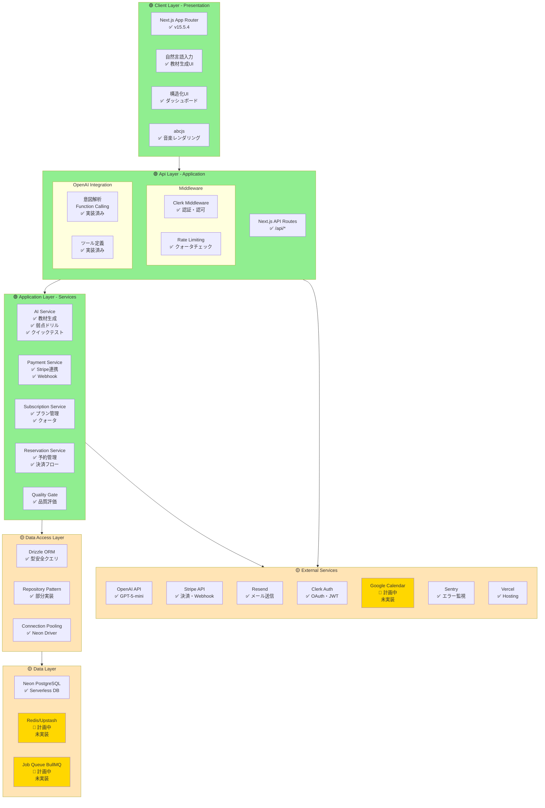
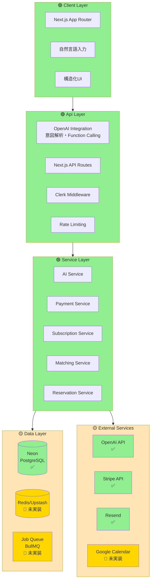
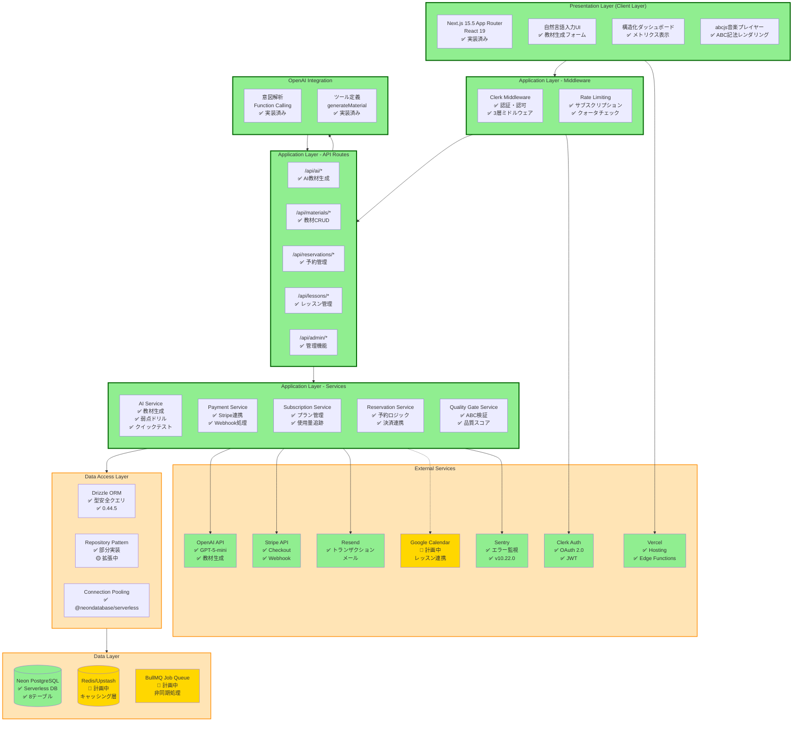
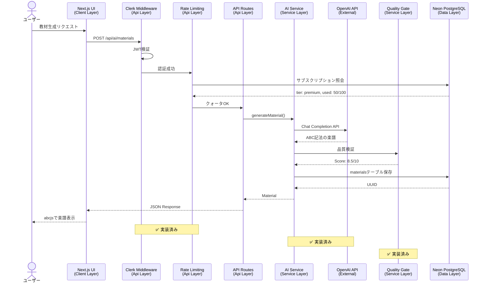
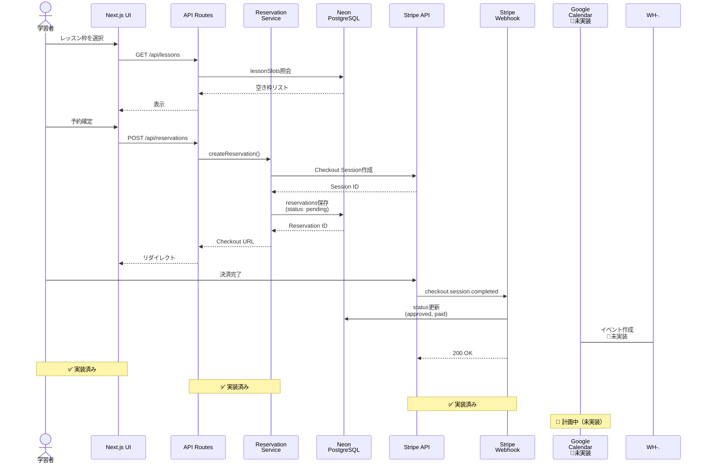
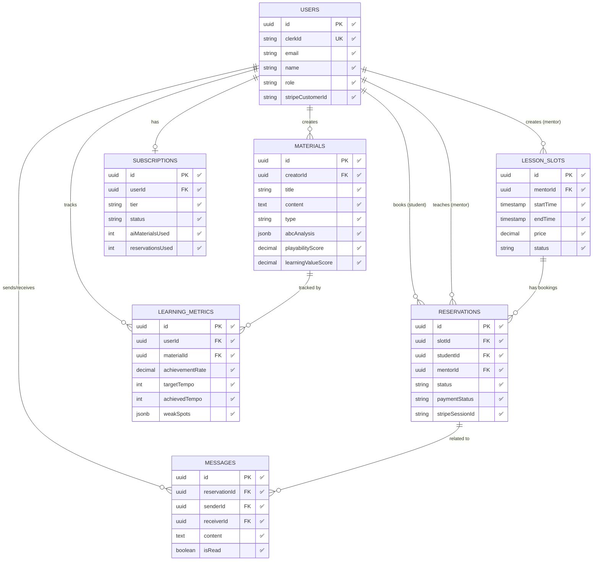
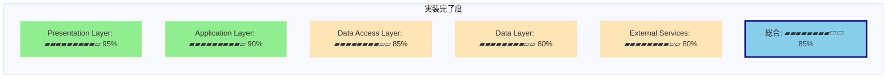
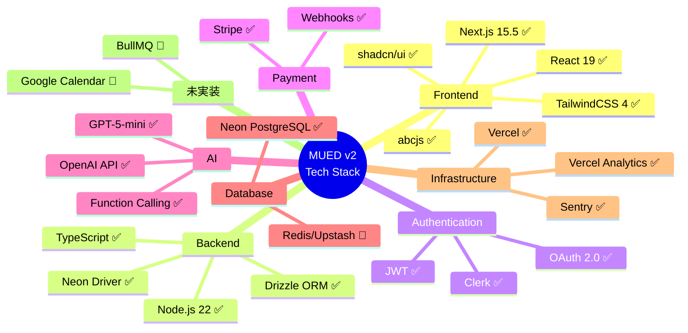

# MUED v2 アーキテクチャ図（Mermaid版）

**作成日**: 2025-01-11
**目的**: 既存Miro図面と同じ形式のMermaid図を提供
**ステータス表示**:
- ✅ 緑色: 実装済み
- 🟡 黄色: 部分実装/実装中
- 🔶 オレンジ色: 計画中（未実装）
- ⚪ 灰色: 削除推奨

---

## 図1: 全体アーキテクチャ（Miroスタイル・縦型レイヤー構造）

---

## 図2: シンプル版（Miro図面に最も近い形式）

---

## 図3: 詳細版（実装状況を完全に反映）

---

## 図4: データフロー図（AI教材生成）

---

## 図5: データフロー図（レッスン予約）

---

## 図6: データベーススキーマ（ER図）

---

## 図7: 実装ステータス概要（横棒グラフ風）

---

## 図8: 技術スタック一覧（マインドマップ風）

---

## 凡例

### ステータスアイコン
- ✅ **実装済み**: プロダクションで動作確認済み
- 🟡 **部分実装**: コア機能は動作、一部機能が未完成
- 🔶 **計画中**: 設計されているが未実装
- ⚪ **削除推奨**: 計画から外すべき

### 色コード
- 🟢 **緑色** (`#90EE90`): 実装完了
- 🟡 **黄色** (`#FFE4B5`): 部分実装または要改善
- 🔶 **オレンジ色** (`#FFD700`): 計画中（未実装）
- ⚪ **灰色** (`#D3D3D3`): 削除推奨

---

## 使用方法

### Miroへのインポート
1. 上記のMermaid図をコピー
2. MiroのMermaid統合機能を使用
3. または、Mermaid Live Editorで画像化してインポート

### Mermaid Live Editor
https://mermaid.live/

### VS Code / Cursor
Mermaid Preview拡張機能で直接プレビュー可能

---

## 各図の用途

| 図番号 | 用途 | Miro図面との対応 |
|--------|------|----------------|
| 図1 | 全体像把握（Miroスタイル） | ✅ 最も近い |
| 図2 | シンプル版（プレゼン用） | ✅ 近い |
| 図3 | 詳細版（開発チーム用） | ⚠️ より詳細 |
| 図4 | データフロー（AI教材生成） | ➕ 新規 |
| 図5 | データフロー（レッスン予約） | ➕ 新規 |
| 図6 | データベーススキーマ | ➕ 新規 |
| 図7 | 実装ステータス | ➕ 新規 |
| 図8 | 技術スタック | ➕ 新規 |

---

## Miro更新時の推奨ワークフロー

### Step 1: 図1または図2を参照
既存Miro図面と同じ形式なので、レイヤー構造を理解しやすい

### Step 2: 未実装要素の処理
- Redis/Upstash → 🔶 計画中ラベル
- BullMQ → 🔶 計画中ラベル
- Google Calendar → 🔶 計画中ラベル

### Step 3: 新規要素の追加
- Data Access Layer（新規）
- abcjs、Quality Gate、Sentry等

### Step 4: 図3の詳細を参照
各コンポーネントの実装状況を確認

### Step 5: データフロー図（図4, 5）を別ページに追加
ユースケース別の動作を視覚化

---

**作成者**: Claude Code
**更新日**: 2025-01-11
**次回更新**: Redis/Upstash実装時、またはMIDI-LLM統合時
