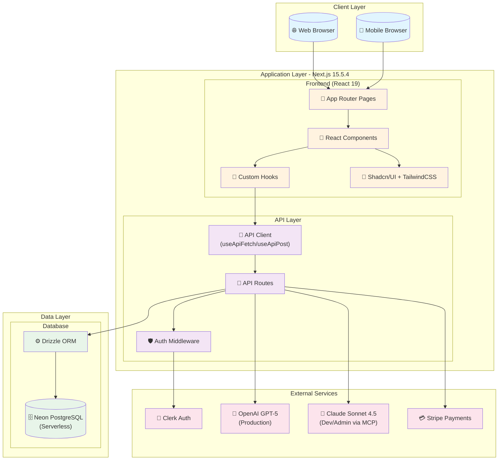
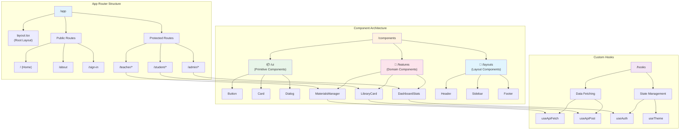
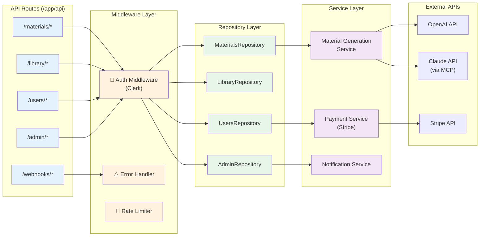
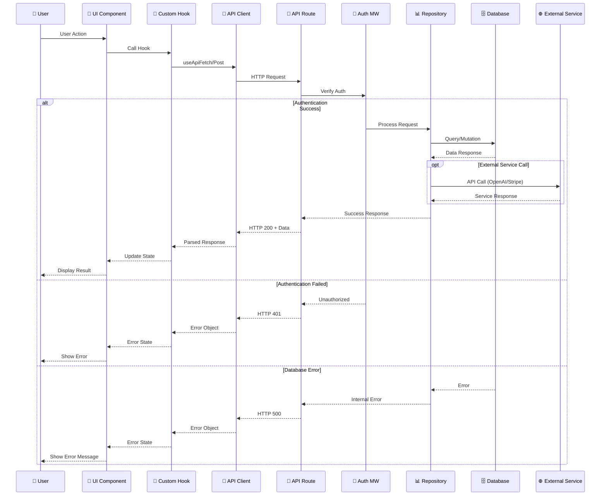
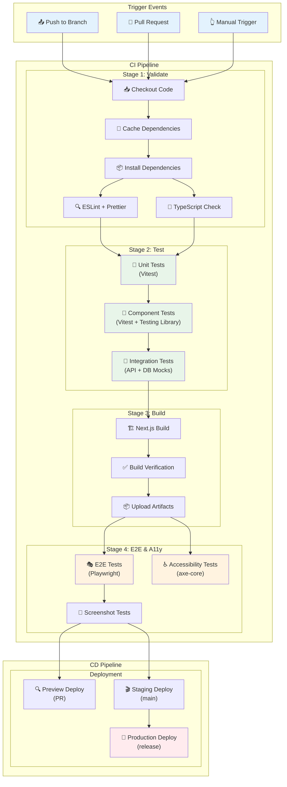
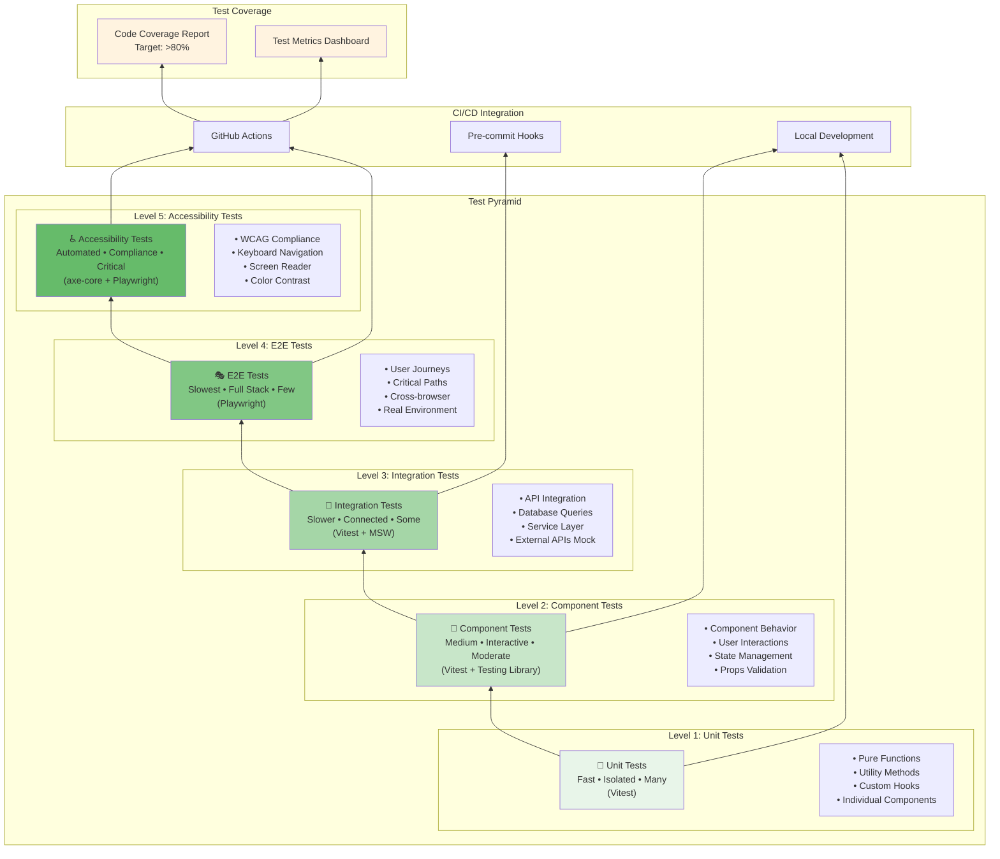
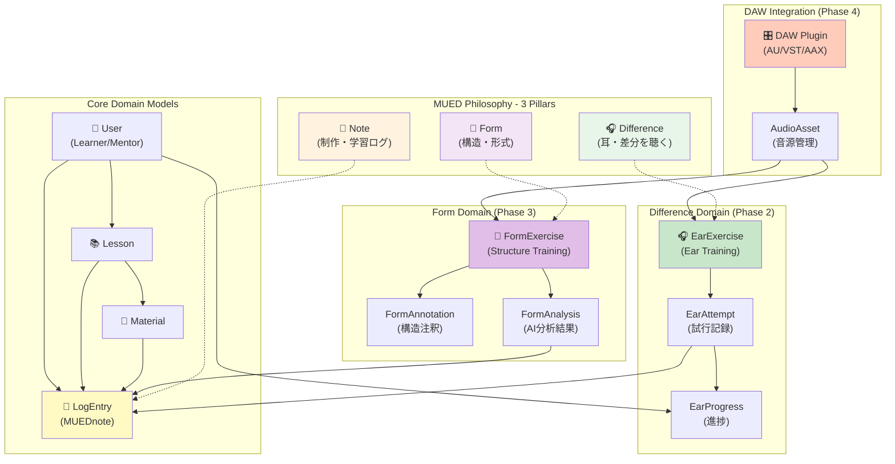
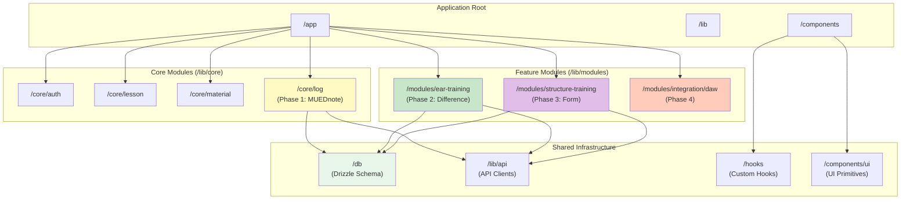
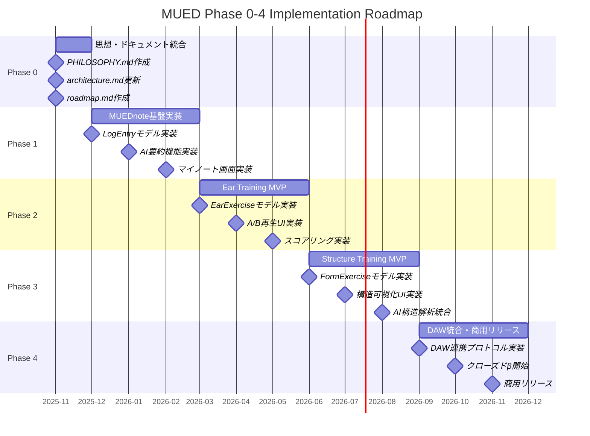

# MUED LMS v2 システムアーキテクチャ図

最終更新: 2025-12-10

## 1. システム全体アーキテクチャ

**説明**: MUED LMS v2の全体的なシステム構成と、各コンポーネント間の関係性を示します。クライアント層、アプリケーション層、データ層、外部サービス層の4層構造で構成されています。

**主要コンポーネント**:
- **Client Layer**: ユーザーがアクセスする各種ブラウザ環境
- **Application Layer**: Next.js 15.5.4による統合アプリケーション層（フロントエンドとAPIを統合）
- **Data Layer**: Neon PostgreSQLとDrizzle ORMによるデータ永続化層
- **External Services**: 認証、AI、決済などの外部サービス統合

---

## 2. フロントエンドアーキテクチャ

**説明**: フロントエンドのコンポーネント構造とディレクトリ構成を示します。コンポーネントは責務に応じて3層に分離され、カスタムフックによるロジックの再利用を促進しています。

**主要コンポーネント**:
- **App Router**: Next.js 15のApp Routerによるファイルベースルーティング
- **Component Layers**: UI層（基本コンポーネント）、Features層（機能コンポーネント）、Layouts層（レイアウト）の3層構造
- **Custom Hooks**: データフェッチングと状態管理のロジックを分離・再利用

---

## 3. API層アーキテクチャ

**説明**: API層の内部構造と、Repository パターンを使用したデータアクセス層の実装を示します。認証ミドルウェアと統一されたエラーハンドリングを含みます。

**主要コンポーネント**:
- **API Routes**: リソースベースのRESTful API設計
- **Middleware Layer**: 認証、エラーハンドリング、レート制限の横断的関心事
- **Repository Layer**: データアクセスロジックの抽象化
- **Service Layer**: ビジネスロジックと外部API統合

---

## 4. データフローダイアグラム

**説明**: ユーザーアクションから始まるデータの流れと、エラーハンドリングを含む完全なリクエスト・レスポンスサイクルを示します。

**主要コンポーネント**:
- **Success Path**: 認証成功時の通常のデータフロー
- **Error Handling**: 認証失敗とデータベースエラーの処理フロー
- **External Services**: 必要に応じた外部API呼び出し
- **State Management**: フックによる状態管理とUIの更新

---

## 5. CI/CDパイプライン

**説明**: GitHub Actionsを使用した自動化されたCI/CDパイプラインの構成を示します。コードの検証からデプロイまでの完全なフローを含みます。

**主要コンポーネント**:
- **Validate Stage**: コード品質の検証（Lint、型チェック）
- **Test Stage**: 3層のテスト実行（Unit、Component、Integration）
- **Build Stage**: Next.jsビルドと成果物の保存
- **E2E & A11y Stage**: エンドツーエンドとアクセシビリティテスト
- **Deployment**: 環境別の自動デプロイ

---

## 6. テスト戦略

**説明**: テストピラミッドに基づいた包括的なテスト戦略を示します。各テストレベルの責務と使用ツールを明確化しています。

**主要コンポーネント**:
- **Unit Tests**: 最下層・最多数・最高速のテスト
- **Component Tests**: UIコンポーネントの振る舞いテスト
- **Integration Tests**: API・DB統合のテスト
- **E2E Tests**: 実環境での完全なユーザーフローテスト
- **Accessibility Tests**: WCAG準拠とアクセシビリティ確保
- **CI/CD Integration**: 各テストレベルの実行環境

---

---

## 7. ドメインモデル（Phase 0-4対応）

**説明**: MUED の思想（Difference / Note / Form）に基づくドメインモデルと、各概念の関係性を示します。Phase 0-4の実装計画に沿った設計です。

**主要ドメインモデル**:

### Core Domain
- **User**: 学習者とメンター（Clerkで管理）
- **Lesson**: レッスンセッション
- **Material**: 教材（楽譜、音源、説明）
- **LogEntry**: MUEDnote（すべての学習活動のログ）

### Difference Domain (Phase 2)
- **EarExercise**: 耳トレーニング課題（EQ差分、バランス差分等）
- **EarAttempt**: 各課題への回答記録
- **EarProgress**: 学習者の耳の成長トラッキング

### Form Domain (Phase 3)
- **FormExercise**: 構造分析トレーニング課題
- **FormAnnotation**: 楽曲構造の注釈データ
- **FormAnalysis**: AI による構造解析結果

### DAW Integration (Phase 4)
- **DAW Plugin**: AU/VST/AAX によるDAW完全統合
- **AudioAsset**: 統合音源管理

---

## 8. モジュール境界とディレクトリ構成（Phase 0-4対応）

**説明**: MUED の思想に沿ったモジュール境界とディレクトリ構成を示します。責務を明確に分離し、Phase ごとの段階的実装を可能にします。

**モジュール境界の定義**:

### Core Modules
- **core/auth**: 認証・認可（Clerk統合）
- **core/lesson**: レッスン管理
- **core/material**: 教材管理（ABC記譜法生成含む）
- **core/log**: MUEDnote（Phase 1）- すべての活動ログの中心

### Feature Modules
- **modules/ear-training**: Difference系機能（Phase 2）
  - EarExercise 管理
  - A/B 再生 UI
  - スコアリング・進捗トラッキング

- **modules/structure-training**: Form系機能（Phase 3）
  - FormExercise 管理
  - 構造可視化 UI
  - AI 構造解析統合

- **modules/integration/daw**: DAW統合（Phase 4）
  - AU/VST/AAX プラグイン
  - DAW連携プロトコル（Window Title, File Path, MIDI/OSC）
  - 商用リリース準備

### Shared Infrastructure
- **db/**: Drizzle ORM スキーマ定義
- **lib/api/**: 統一 API クライアント
- **hooks/**: カスタムフック（データフェッチング、状態管理）
- **components/ui/**: Shadcn/UI ベースの基本コンポーネント

---

## 9. Phase別実装マイルストーン

**説明**: Phase 0-4 の実装順序と各フェーズでの主要成果物を示します。

**各Phaseの完了条件**:

- **Phase 0**: PHILOSOPHY / architecture / roadmap の3文書が整合
- **Phase 1**: 学習者がすべてのレッスン・教材にノートを残し、一覧で閲覧可能
- **Phase 2**: EarExercise の最小セットが動作し、MUEDnote と連動
- **Phase 3**: FormExercise の最小セットが動作し、AI 解析と連動
- **Phase 4**: DAW統合（AU/VST/AAX）が動作し、商用リリース

---

## まとめ

これらの図は、MUED LMS v2の包括的なシステムアーキテクチャを表現しています。各図は異なる視点からシステムを捉え、開発チームが全体像を理解しやすくなるように設計されています。

**Phase 0-4 対応アーキテクチャの特徴**:
1. **思想の明文化**: Difference / Note / Form の3本柱をドメインモデルに反映
2. **段階的実装**: Phase ごとに独立して価値を提供できる設計
3. **モジュール分離**: core/ と modules/ の明確な境界
4. **拡張性**: DAW統合や新機能追加に対応可能な構造

**活用方法**:
1. 新規開発者のオンボーディング資料として
2. アーキテクチャレビューの基礎資料として
3. システム改善の議論のベースラインとして
4. ドキュメントの一部として保管
5. **Phase 実装時の参照資料として**（新規追加）

各図はMermaid記法で記述されているため、GitHubやNotionなどのMarkdown対応プラットフォームで直接表示可能です。また、Miroへの転記時は、これらの図を視覚的な基準として使用できます。
