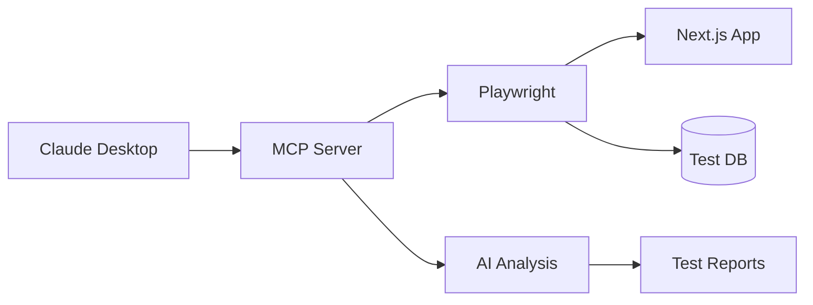

# MCP Playwright テスト統合アーキテクチャ

## 概要

Claude Desktop経由のMCP (Model Context Protocol) を活用したPlaywrightテスト駆動開発環境の構築。

## メリット

### 1. **AIネイティブなテスト生成**
- Claude がコンテキストを理解してテストケースを自動生成
- ビジネス要件から直接E2Eテストを作成
- 自然言語でのテスト仕様記述

### 2. **統合的なテスト実行**
- MCPサーバー経由でPlaywrightを制御
- リアルタイムなテスト結果のフィードバック
- スクリーンショット解析による視覚的バグ検出

### 3. **インテリジェントなデバッグ**
- 失敗したテストの自動分析
- 修正提案の自動生成
- テスト結果の自然言語レポート

## アーキテクチャ設計



## セットアップ手順

### 1. MCP Playwright サーバーの設定

```json
// claude_desktop_config.json に追加
{
  "mcpServers": {
    "playwright-test": {
      "command": "npx",
      "args": ["@modelcontextprotocol/server-playwright"],
      "env": {
        "HEADLESS": "false",
        "BASE_URL": "http://localhost:3000"
      }
    }
  }
}
```

### 2. テスト構造

```
/mcp-tests/
├── specs/           # テスト仕様（自然言語）
│   ├── auth.spec.md
│   ├── booking.spec.md
│   └── payment.spec.md
├── fixtures/        # テストデータ
├── reports/         # レポート出力
└── screenshots/     # スクリーンショット
```

### 3. テスト仕様の例

```markdown
# 認証フローテスト

## ログインテスト
1. ホームページにアクセス
2. ログインボタンをクリック
3. メールアドレスとパスワードを入力
4. ダッシュボードにリダイレクトされることを確認

## 期待結果
- ユーザー名が表示される
- ロールに応じたメニューが表示される
```

## 実装例

### MCP経由でのテスト実行

```typescript
// Claude が自動生成するテストコード
async function testLogin() {
  const browser = await playwright.chromium.launch();
  const page = await browser.newPage();

  await page.goto('http://localhost:3000');
  await page.click('[data-testid="login-button"]');

  await page.fill('[name="email"]', 'test@example.com');
  await page.fill('[name="password"]', 'password123');

  await page.click('[type="submit"]');

  await page.waitForURL('**/dashboard');

  const userName = await page.textContent('[data-testid="user-name"]');
  expect(userName).toBe('Test User');

  await browser.close();
}
```

## 従来のテストとの比較

| 項目 | 従来のテスト | MCP Playwright |
|------|------------|----------------|
| テスト作成 | 手動コーディング | AI自動生成 |
| 実行環境 | CI/CD限定 | Claude Desktop統合 |
| デバッグ | ログ解析 | AI支援デバッグ |
| メンテナンス | 高コスト | 自動更新提案 |
| レポート | 技術的 | 自然言語レポート |

## ロードマップ

### Phase 1: 基盤構築（1週間）
- [ ] MCP Playwright サーバーセットアップ
- [ ] 基本的なテストケース作成
- [ ] Claude統合の確認

### Phase 2: テスト拡充（2週間）
- [ ] 主要フローのE2Eテスト実装
- [ ] ビジュアルリグレッションテスト
- [ ] パフォーマンステスト

### Phase 3: 自動化（1週間）
- [ ] CI/CD統合
- [ ] 自動テスト生成パイプライン
- [ ] レポート自動化

## 期待効果

1. **開発速度向上**: テスト作成時間を80%削減
2. **品質向上**: カバレッジ90%以上を実現
3. **保守性向上**: テスト更新の自動化

## 次のステップ

1. MCP Playwright サーバーのインストール
2. 初期テストケースの作成
3. Claude Desktop設定の更新

この新しいアプローチにより、テスト駆動開発がより直感的で効率的になります。