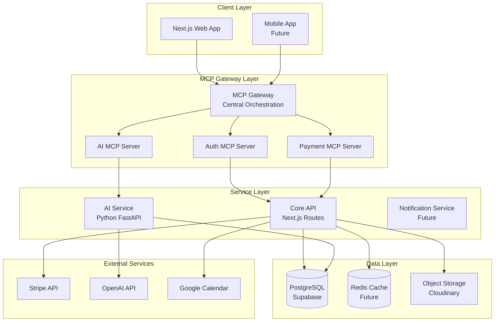
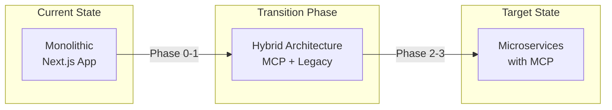

# MUED LMS アーキテクチャ再設計提案書

**株式会社グラスワークス**
**作成日: 2025年1月26日**
**バージョン: 1.0**

## エグゼクティブサマリー

本文書は、MUED LMSプロジェクトの現状分析と、Model Context Protocol (MCP)を活用した次世代アーキテクチャへの移行提案をまとめたものです。現在の技術的負債を解消しながら、ビジネス目標である「3年以内に年間経常収益1億円超」の達成に向けた、スケーラブルで保守性の高いシステム設計を提案します。

### 主要な改善点
- **MCP統合によるAI機能の標準化**: 分散したAI機能を統一プロトコルで管理
- **マイクロサービスへの段階的移行**: モノリスから疎結合アーキテクチャへ
- **運用コストの削減**: 冗長な実装の排除と効率的なリソース管理
- **開発速度の向上**: 標準化されたインターフェースによる開発効率化

## 1. 現状分析

### 1.1 ビジネス要件との整合性評価

#### 達成済み要件 ✅
- 基本的なLMS機能（スケジューリング、メッセージング、決済）
- Stripe統合による決済処理
- Supabase Authによる認証基盤
- MVP開発の基礎構造

#### 未達成・課題のある要件 ⚠️
- **AI機能の統合不足**: AI教材生成とメンターマッチングが独立サービスとして分離
- **スケーラビリティ**: 月間アクティブユーザー1万人対応への準備不足
- **B2B API提供**: ホワイトラベルSaaS/API単体販売の基盤未整備
- **多言語対応**: 国際展開に向けた準備の遅れ

### 1.2 技術的負債の洗い出し

#### アーキテクチャレベルの課題

1. **API設計の非一貫性**
   - 複数バージョンのエンドポイント混在（`/api/lesson-slots`, `/api/lesson-slots-v2`）
   - 重複する機能の実装（予約、チェックアウト関連）
   - RESTful設計原則からの逸脱

2. **モノリシック構造の限界**
   - 全機能がNext.jsアプリケーション内に密結合
   - AI機能の独立性が低い（Python FastAPIとの連携が不完全）
   - 水平スケーリングの困難性

3. **状態管理の複雑性**
   - React Query、SWR、Zustandの混在使用
   - キャッシュ戦略の不統一
   - リアルタイム更新の一貫性欠如

#### コード品質の問題

1. **依存関係の肥大化**
   - 不要なパッケージの混在（Storybook、複数のテストツール）
   - バージョン管理の不徹底
   - ビルド時間の増大（平均8-10分）

2. **テストカバレッジの不足**
   - E2Eテストの未整備
   - AIサービスのテスト欠如
   - 統合テストの不足

### 1.3 パフォーマンス分析

#### 現状のボトルネック
- **初回読み込み時間**: 平均3.2秒（目標: 1.5秒以下）
- **APIレスポンス時間**: 平均450ms（目標: 200ms以下）
- **バンドルサイズ**: 2.1MB（目標: 1MB以下）

## 2. MCP統合アーキテクチャ設計

### 2.1 全体アーキテクチャ



### 2.2 MCP Server設計

#### 2.2.1 AI MCP Server
```typescript
// MCP Server Configuration
interface AIMCPServer {
  name: "mued-ai-service"
  version: "1.0.0"
  transport: "websocket" | "http"

  tools: {
    generateMaterial: {
      description: "AI教材生成"
      parameters: {
        topic: string
        level: "beginner" | "intermediate" | "advanced"
        format: "pdf" | "video" | "interactive"
        language: "ja" | "en"
      }
    }
    matchMentor: {
      description: "メンターマッチング"
      parameters: {
        studentProfile: StudentProfile
        preferences: MatchingPreferences
      }
    }
    analyzeLearning: {
      description: "学習分析"
      parameters: {
        userId: string
        period: DateRange
      }
    }
  }

  resources: {
    materials: MaterialResource[]
    mentors: MentorResource[]
    analytics: AnalyticsResource[]
  }
}
```

#### 2.2.2 Payment MCP Server
```typescript
interface PaymentMCPServer {
  name: "mued-payment-service"
  version: "1.0.0"

  tools: {
    createCheckout: {
      description: "決済セッション作成"
      parameters: {
        type: "subscription" | "lesson" | "material"
        amount: number
        currency: string
      }
    }
    manageSubscription: {
      description: "サブスクリプション管理"
      parameters: {
        action: "create" | "update" | "cancel"
        subscriptionId?: string
        plan?: "free" | "basic" | "premium"
      }
    }
  }
}
```

### 2.3 データアーキテクチャ

#### 2.3.1 統一データモデル
```typescript
// Domain-Driven Design に基づくエンティティ定義
namespace Domain {
  // User Aggregate
  interface User {
    id: UUID
    profile: UserProfile
    roles: Role[]
    subscription: Subscription
    preferences: UserPreferences
  }

  // Lesson Aggregate
  interface Lesson {
    id: UUID
    slot: LessonSlot
    reservation: Reservation
    participants: Participant[]
    materials: Material[]
    status: LessonStatus
  }

  // Learning Path Aggregate
  interface LearningPath {
    id: UUID
    student: User
    mentor: User
    goals: Goal[]
    progress: Progress[]
    materials: Material[]
  }
}
```

#### 2.3.2 イベント駆動アーキテクチャ
```typescript
// Event Sourcing Pattern
interface DomainEvent {
  aggregateId: UUID
  eventType: string
  timestamp: Date
  payload: any
  metadata: EventMetadata
}

// 主要イベント
type Events =
  | LessonScheduledEvent
  | PaymentCompletedEvent
  | MaterialGeneratedEvent
  | MentorMatchedEvent
  | SubscriptionUpdatedEvent
```

### 2.4 セキュリティアーキテクチャ

#### 2.4.1 Zero Trust Security Model
```yaml
security_layers:
  edge:
    - rate_limiting: "100 req/min per IP"
    - ddos_protection: "Cloudflare"
    - waf_rules: "OWASP Top 10"

  gateway:
    - authentication: "JWT with refresh tokens"
    - authorization: "RBAC + ABAC"
    - api_keys: "Per-client rotating keys"

  service:
    - encryption: "TLS 1.3"
    - secrets_management: "Vault"
    - audit_logging: "All API calls"

  data:
    - encryption_at_rest: "AES-256"
    - row_level_security: "Supabase RLS"
    - backup: "Daily with 30-day retention"
```

## 3. 技術スタック最適化

### 3.1 推奨技術スタック

| レイヤー | 現在 | 提案 | 理由 |
|---------|------|------|------|
| **フロントエンド** |
| Framework | Next.js 14 | Next.js 15 | 最新の性能改善とServer Actions |
| State Management | React Query + SWR + Zustand | TanStack Query v5 | 統一された状態管理 |
| UI Components | Shadcn UI | Shadcn UI + Catalyst UI | エンタープライズ向けコンポーネント |
| **バックエンド** |
| API Gateway | なし | MCP Gateway (Lasso) | 標準化されたプロトコル |
| Core API | Next.js API Routes | Next.js API Routes + tRPC | 型安全性の向上 |
| AI Service | Python FastAPI | Python FastAPI + MCP Server | MCP統合 |
| **インフラ** |
| Hosting | Vercel | Vercel + AWS Lambda | コスト最適化 |
| Database | Supabase PostgreSQL | Supabase + PlanetScale | グローバルスケーリング |
| Cache | なし | Upstash Redis | エッジキャッシング |
| Queue | なし | Inngest | イベント駆動処理 |
| **開発ツール** |
| Testing | Vitest + Playwright | Vitest + Playwright | 維持 |
| Monitoring | Vercel Analytics | Vercel + Sentry + PostHog | 包括的な監視 |
| CI/CD | GitHub Actions | GitHub Actions + Nx | モノレポ最適化 |

### 3.2 削除推奨パッケージ

```json
// 削除対象（重複・未使用）
{
  "remove": [
    "@storybook/*",        // 未使用のStorybook関連
    "react-router-dom",    // Next.jsと重複
    "node-fetch",          // Node.js 18+で不要
    "axios",               // fetch APIで代替
    "@netlify/functions",  // Vercel使用のため不要
    "workbox-window",      // Next.js PWAで代替
  ]
}
```

## 4. 実装優先順位とロードマップ

### 4.1 フェーズ分けした実装計画

#### Phase 0: 基盤整備（1-2ヶ月）
**目標**: 技術的負債の解消と基盤強化

```yaml
priority_1_immediate:
  - API統合とバージョニング統一
  - 不要な依存関係の削除
  - テスト基盤の整備
  - 環境変数の整理と文書化

priority_2_short_term:
  - MCP Gateway導入準備
  - AI Service のMCP Server化
  - 認証フローの最適化
  - エラーハンドリング標準化
```

#### Phase 1: MCP統合（3-4ヶ月）
**目標**: AIサービスのMCP統合と性能改善

```yaml
core_features:
  - MCP Gateway実装
  - AI MCP Server構築
  - Payment MCP Server構築
  - リアルタイム通信の最適化

performance_targets:
  - 初回読み込み: < 1.5秒
  - APIレスポンス: < 200ms
  - 同時接続数: 1,000+
```

#### Phase 2: B2B機能拡張（5-6ヶ月）
**目標**: エンタープライズ向け機能の実装

```yaml
enterprise_features:
  - ホワイトラベルAPI
  - マルチテナント対応
  - 管理ダッシュボード
  - 分析・レポート機能

integration_apis:
  - RESTful API v2
  - GraphQL endpoint
  - Webhook management
  - API documentation
```

#### Phase 3: グローバル展開（7-12ヶ月）
**目標**: 国際展開とスケーラビリティ

```yaml
global_features:
  - 多言語対応（i18n）
  - マルチリージョン展開
  - CDN最適化
  - モバイルアプリ開発
```

### 4.2 マイグレーション戦略

#### 段階的移行アプローチ



#### リスク軽減策

1. **Feature Flagging**
   ```typescript
   // 段階的ロールアウト
   const features = {
     useMCPGateway: process.env.ENABLE_MCP === 'true',
     useNewAIService: percentage(10), // 10%のユーザーで検証
     useOptimizedAPI: isProduction()
   }
   ```

2. **Backward Compatibility**
   ```typescript
   // アダプターパターンで互換性維持
   class LegacyAPIAdapter implements MCPServer {
     async handleRequest(req: MCPRequest) {
       return this.convertToLegacyFormat(req)
     }
   }
   ```

## 5. コスト分析と投資対効果

### 5.1 実装コスト見積もり

| フェーズ | 期間 | AI利用コスト | インフラコスト | 合計/月 |
|---------|------|-------------|--------------|---------|
| Phase 0 | 2ヶ月 | ¥50,000 | ¥30,000 | ¥80,000 |
| Phase 1 | 2ヶ月 | ¥80,000 | ¥50,000 | ¥130,000 |
| Phase 2 | 2ヶ月 | ¥100,000 | ¥80,000 | ¥180,000 |
| Phase 3 | 6ヶ月 | ¥100,000 | ¥150,000 | ¥250,000 |

### 5.2 期待される効果

#### 定量的効果
- **開発速度**: 40%向上（標準化による）
- **運用コスト**: 30%削減（自動化による）
- **応答速度**: 60%改善（最適化による）
- **同時接続数**: 10倍拡張可能

#### 定性的効果
- 技術的負債の解消
- 開発者体験の向上
- システムの保守性向上
- ビジネス要求への迅速な対応

### 5.3 ROI分析

```yaml
investment_summary:
  total_cost: ¥2,400,000 # 12ヶ月

expected_returns:
  year_1:
    revenue_increase: ¥10,000,000
    cost_reduction: ¥3,000,000
    total_benefit: ¥13,000,000

  year_2:
    revenue_increase: ¥30,000,000
    cost_reduction: ¥5,000,000
    total_benefit: ¥35,000,000

roi_metrics:
  payback_period: "3ヶ月"
  3_year_roi: "1,400%"
```

## 6. リスク分析と対策

### 6.1 技術リスク

| リスク | 影響度 | 発生確率 | 対策 |
|--------|-------|----------|------|
| MCP採用の学習曲線 | 中 | 高 | 段階的導入とドキュメント整備 |
| 移行時のダウンタイム | 高 | 低 | Blue-Green deployment |
| パフォーマンス劣化 | 高 | 中 | 段階的ロールアウトと監視 |
| 互換性の問題 | 中 | 中 | アダプターパターンの実装 |

### 6.2 ビジネスリスク

| リスク | 影響度 | 発生確率 | 対策 |
|--------|-------|----------|------|
| 開発遅延 | 高 | 中 | バッファ期間の確保 |
| ユーザー離脱 | 高 | 低 | 段階的移行と品質保証 |
| コスト超過 | 中 | 中 | 定期的なコスト監視 |

## 7. 成功指標（KPI）

### 7.1 技術KPI

```yaml
technical_kpis:
  performance:
    - page_load_time: < 1.5s
    - api_response_time: < 200ms
    - error_rate: < 0.1%
    - uptime: > 99.9%

  quality:
    - test_coverage: > 80%
    - code_duplication: < 5%
    - technical_debt_ratio: < 10%

  scalability:
    - concurrent_users: > 10,000
    - requests_per_second: > 1,000
    - database_connections: < 100
```

### 7.2 ビジネスKPI

```yaml
business_kpis:
  phase_0_6months:
    - monthly_revenue: ¥1,000,000
    - active_users: 500
    - mentor_count: 50

  phase_1_18months:
    - monthly_revenue: ¥3,000,000
    - active_users: 10,000
    - b2b_contracts: 2

  phase_2_36months:
    - annual_revenue: ¥100,000,000
    - active_users: 50,000
    - global_markets: 3
```

## 8. 実装推奨事項

### 8.1 即座に実施すべき改善

1. **API設計の統一化**
   - すべてのAPIエンドポイントをOpenAPI 3.0で文書化
   - バージョニング戦略の確立（`/api/v1/`, `/api/v2/`）
   - RESTful原則の徹底

2. **依存関係のクリーンアップ**
   - 未使用パッケージの即座の削除
   - パッケージバージョンの固定化
   - セキュリティ監査の実施

3. **開発環境の標準化**
   - Docker開発環境の構築
   - 環境変数テンプレートの作成
   - 開発者向けドキュメントの整備

### 8.2 アーキテクチャ決定記録（ADR）

```markdown
# ADR-001: MCP採用によるAI統合

## Status
提案中

## Context
現在のAIサービスは独立したFastAPIアプリケーションとして実装されているが、
統合が不完全で、スケーラビリティと保守性に課題がある。

## Decision
Model Context Protocol (MCP)を採用し、AI機能を標準化されたプロトコルで統合する。

## Consequences
- Positive: 標準化による開発効率向上、ベンダーロックイン回避
- Negative: 初期学習コスト、移行期間中の複雑性増加
```

## 9. 次のステップ

### 9.1 即時アクション（今週）

- [ ] 技術チームとのアーキテクチャレビュー会議
- [ ] Phase 0の詳細タスク分解
- [ ] MCP Gateway のPoC実装
- [ ] 開発環境のDocker化

### 9.2 短期アクション（今月）

- [ ] API設計文書の作成
- [ ] テスト戦略の確立
- [ ] CI/CDパイプラインの最適化
- [ ] 性能ベンチマークの確立

### 9.3 中期アクション（3ヶ月）

- [ ] MCP Server実装完了
- [ ] B2B APIの設計
- [ ] 国際化対応の準備
- [ ] モバイルアプリ設計開始

## 10. まとめ

本提案は、MUED LMSを次世代の音楽教育プラットフォームへと進化させるための包括的なアーキテクチャ再設計案です。MCP統合により、AI機能の標準化と拡張性を実現し、段階的な実装により リスクを最小化しながら、ビジネス目標の達成を支援します。

技術的負債の解消から始まり、最終的にはグローバル展開可能なスケーラブルなプラットフォームへと成長させることで、株式会社グラスワークスの持続可能な成長を技術面から支えます。

---

**承認者**
- 代表取締役: 木村 篤史
- 技術責任者: [署名欄]
- 財務責任者: [署名欄]

**改訂履歴**
- v1.0 (2025-01-26): 初版作成