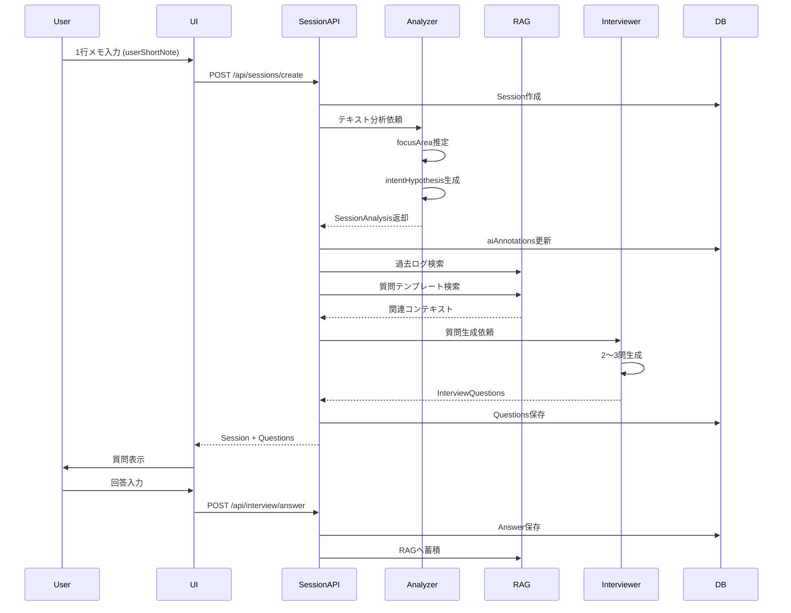

# MUEDnote Session/Interview 機能実装計画書

**バージョン**: 1.0.0
**作成日**: 2025-11-19
**対象**: Phase 1.1 → MVP (v0) への移行
**想定期間**: 4週間

---

## エグゼクティブサマリー

本計画書は、MUEDnote企画書に基づき、既存のテキストベースログ記録システム（Phase 1.1）から、Session概念とAI Interview機能を備えたMVP（v0）へ段階的に移行するための詳細実装計画です。

### 主要目標

1. **Session概念の導入**: 制作セッションごとにログをグループ化
2. **Analyzer実装**: userShortNoteからfocusArea/intentHypothesisを推定（テキストベース）
3. **Interviewer LLM**: 2〜3問の質問を生成
4. **RAG統合**: 過去ログ + 質問テンプレートの検索

### 現状分析

**実装済み（Phase 1.1）**:
- チャット型UI（ChatContainer, ChatInput, ChatMessage）
- テキストベースのログ記録（log_entries テーブル）
- AI整形・タグ付け・コメント生成
- タグフィルタリング
- タイムライン表示

**技術スタック**:
- Frontend: Next.js 15.5.4, React 19, TailwindCSS 4
- Backend: Clerk認証, Neon PostgreSQL, Drizzle ORM
- AI: OpenAI GPT-5系（本番）/ Claude Sonnet 4.5（開発・管理者モード）

---

## 1. システムアーキテクチャ設計

### 1.1 全体構成図

```mermaid
graph TB
    subgraph "Frontend Layer"
        UI[Chat UI]
        SessionUI[Session Sidebar]
        TimelineUI[Timeline View]
    end

    subgraph "API Layer"
        SessionAPI[/api/sessions]
        InterviewAPI[/api/interview]
        LogsAPI[/api/logs]
        AnalyzerAPI[/api/analyzer]
    end

    subgraph "Service Layer"
        SessionSvc[SessionService]
        AnalyzerSvc[AnalyzerService]
        InterviewerSvc[InterviewerService]
        RAGSvc[RAGService]
    end

    subgraph "Repository Layer"
        SessionRepo[SessionRepository]
        InterviewRepo[InterviewRepository]
        LogRepo[LogRepository]
        RAGRepo[RAGRepository]
    end

    subgraph "Database Layer"
        Sessions[(sessions)]
        Interviews[(interview_questions<br/>interview_answers)]
        Logs[(log_entries)]
        RAG[(rag_embeddings)]
    end

    subgraph "AI Layer"
        OpenAI[OpenAI GPT-5]
        Claude[Claude MCP]
        Embeddings[OpenAI Embeddings]
    end

    UI --> SessionAPI
    UI --> InterviewAPI
    SessionUI --> SessionAPI
    TimelineUI --> LogsAPI

    SessionAPI --> SessionSvc
    InterviewAPI --> InterviewerSvc
    LogsAPI --> SessionSvc
    AnalyzerAPI --> AnalyzerSvc

    SessionSvc --> SessionRepo
    AnalyzerSvc --> OpenAI
    InterviewerSvc --> RAGSvc
    InterviewerSvc --> OpenAI
    RAGSvc --> Embeddings
    RAGSvc --> RAGRepo

    SessionRepo --> Sessions
    InterviewRepo --> Interviews
    LogRepo --> Logs
    RAGRepo --> RAG
```

### 1.2 データフロー図



---

## 2. データベーススキーマ設計

### 2.1 新規テーブル定義

#### sessions テーブル

```typescript
// db/schema/sessions.ts

export const sessions = pgTable('sessions', {
  id: uuid('id').primaryKey().defaultRandom(),
  userId: uuid('user_id').notNull(),

  // Session種別
  type: sessionTypeEnum('type').notNull(),
  // 'composition' | 'practice' | 'mix' | 'ear_training' | 'listening' | 'theory' | 'other'

  // 基本情報
  title: text('title').notNull(),              // 1行タイトル
  userShortNote: text('user_short_note').notNull(), // 最初の短文

  // プロジェクト情報（オプション）
  projectId: uuid('project_id'),
  projectName: text('project_name'),

  // DAWメタデータ（オプション - MVP後）
  dawMeta: jsonb('daw_meta').$type<DAWMeta>(),

  // AI解析結果
  aiAnnotations: jsonb('ai_annotations').$type<AIAnnotations>(),

  // Session状態
  isActive: boolean('is_active').default(true).notNull(),
  isArchived: boolean('is_archived').default(false).notNull(),

  // 統計
  messageCount: integer('message_count').default(0).notNull(),
  questionCount: integer('question_count').default(0).notNull(),
  answerCount: integer('answer_count').default(0).notNull(),

  // タイムスタンプ
  createdAt: timestamp('created_at').defaultNow().notNull(),
  updatedAt: timestamp('updated_at').defaultNow().notNull(),
  lastActivityAt: timestamp('last_activity_at').defaultNow().notNull(),
}, (table) => ({
  userIdx: index('idx_sessions_user').on(table.userId),
  typeIdx: index('idx_sessions_type').on(table.type),
  activeIdx: index('idx_sessions_active').on(table.isActive),
  lastActivityIdx: index('idx_sessions_last_activity').on(table.lastActivityAt),
  userActiveIdx: index('idx_sessions_user_active').on(table.userId, table.isActive),
}));

// 型定義
export type SessionType =
  | 'composition'
  | 'practice'
  | 'mix'
  | 'ear_training'
  | 'listening'
  | 'theory'
  | 'other';

export type DAWMeta = {
  dawName?: string;
  tempo?: number;
  timeSignature?: string;
  keyEstimate?: string;
  barsTouched?: { from: number; to: number };
};

export type AIAnnotations = {
  focusArea?: string;        // harmony | melody | rhythm | mix | emotion | structure
  intentHypothesis?: string; // 推定意図
  confidence?: number;       // 0.0-1.0
  extractedAt?: string;      // ISO 8601
};
```

#### interview_questions テーブル

```typescript
// db/schema/interviews.ts

export const interviewQuestions = pgTable('interview_questions', {
  id: uuid('id').primaryKey().defaultRandom(),
  sessionId: uuid('session_id').notNull(),
  userId: uuid('user_id').notNull(),

  // 質問内容
  text: text('text').notNull(),
  focus: focusTypeEnum('focus').notNull(),
  // 'harmony' | 'melody' | 'rhythm' | 'mix' | 'emotion' | 'image' | 'structure'
  depth: depthEnum('depth').notNull(),
  // 'shallow' | 'medium' | 'deep'

  // 順序とグループ
  questionOrder: integer('question_order').notNull(), // 1, 2, 3...
  questionGroup: text('question_group'),              // 同時生成されたグループID

  // 回答状態
  isAnswered: boolean('is_answered').default(false).notNull(),
  answeredAt: timestamp('answered_at'),

  // タイムスタンプ
  createdAt: timestamp('created_at').defaultNow().notNull(),
}, (table) => ({
  sessionIdx: index('idx_interview_questions_session').on(table.sessionId),
  userIdx: index('idx_interview_questions_user').on(table.userId),
  answeredIdx: index('idx_interview_questions_answered').on(table.isAnswered),
  sessionOrderIdx: index('idx_interview_questions_session_order').on(
    table.sessionId,
    table.questionOrder
  ),
}));
```

#### interview_answers テーブル

```typescript
export const interviewAnswers = pgTable('interview_answers', {
  id: uuid('id').primaryKey().defaultRandom(),
  sessionId: uuid('session_id').notNull(),
  questionId: uuid('question_id').notNull(),
  userId: uuid('user_id').notNull(),

  // 回答内容
  text: text('text').notNull(),

  // 処理結果
  processedText: text('processed_text'),     // AI整形後
  tags: jsonb('tags').$type<string[]>(),
  extractedInsights: jsonb('extracted_insights').$type<string[]>(),

  // タイムスタンプ
  createdAt: timestamp('created_at').defaultNow().notNull(),
  updatedAt: timestamp('updated_at').defaultNow().notNull(),
}, (table) => ({
  sessionIdx: index('idx_interview_answers_session').on(table.sessionId),
  questionIdx: index('idx_interview_answers_question').on(table.questionId),
  userIdx: index('idx_interview_answers_user').on(table.userId),
}));
```

#### rag_embeddings テーブル（RAG用）

```typescript
// db/schema/rag.ts

export const ragEmbeddings = pgTable('rag_embeddings', {
  id: uuid('id').primaryKey().defaultRandom(),
  userId: uuid('user_id').notNull(),

  // ソース情報
  sourceType: sourceTypeEnum('source_type').notNull(),
  // 'session' | 'answer' | 'template' | 'knowledge'
  sourceId: uuid('source_id').notNull(),

  // コンテンツ
  content: text('content').notNull(),
  metadata: jsonb('metadata').$type<EmbeddingMetadata>(),

  // ベクトル埋め込み（PostgreSQL pgvector拡張使用）
  embedding: vector('embedding', { dimensions: 1536 }), // OpenAI ada-002

  // タイムスタンプ
  createdAt: timestamp('created_at').defaultNow().notNull(),
}, (table) => ({
  userIdx: index('idx_rag_embeddings_user').on(table.userId),
  sourceIdx: index('idx_rag_embeddings_source').on(table.sourceType, table.sourceId),
  // ベクトル検索用のインデックスはマイグレーションで追加
}));

export type EmbeddingMetadata = {
  sessionType?: string;
  focusArea?: string;
  tags?: string[];
  timestamp?: string;
};
```

### 2.2 既存テーブルとの関係

#### log_entries テーブルの拡張

```typescript
// db/schema/log-entries.ts に追加

export const logEntries = pgTable('log_entries', {
  // ... 既存フィールド

  // 新規追加: Session参照
  sessionId: uuid('session_id'), // NULLable（後方互換性）

  // ... 既存フィールド
}, (table) => ({
  // ... 既存インデックス

  // 新規インデックス
  sessionIdx: index('idx_log_entries_session').on(table.sessionId),
}));
```

**移行戦略**:
- 既存の `log_entries` はそのまま維持
- 新規ログには `sessionId` を付与
- 既存ログは `sessionId = NULL` として扱う
- 将来的にバッチ処理で既存ログをSessionにグループ化可能

---

## 3. API設計

### 3.1 新規エンドポイント一覧

#### Session管理 API

```typescript
// GET /api/sessions
// ユーザーのセッション一覧を取得
interface GetSessionsRequest {
  userId: string;
  type?: SessionType;
  isActive?: boolean;
  dateFrom?: string; // ISO 8601
  dateTo?: string;
  limit?: number;
  offset?: number;
}

interface GetSessionsResponse {
  sessions: Session[];
  total: number;
  hasMore: boolean;
}

// POST /api/sessions
// 新規セッション作成
interface CreateSessionRequest {
  type: SessionType;
  title: string;
  userShortNote: string;
  projectId?: string;
  projectName?: string;
}

interface CreateSessionResponse {
  session: Session;
  questions: InterviewQuestion[]; // 初回質問
}

// GET /api/sessions/:id
// セッション詳細取得
interface GetSessionResponse {
  session: Session;
  messages: LogEntry[];         // このセッションのログ
  questions: InterviewQuestion[];
  answers: InterviewAnswer[];
}

// PATCH /api/sessions/:id
// セッション更新
interface UpdateSessionRequest {
  title?: string;
  isActive?: boolean;
  isArchived?: boolean;
}

// DELETE /api/sessions/:id
// セッション削除（論理削除）
```

#### Interview API

```typescript
// POST /api/interview/questions
// 新規質問生成（追加質問）
interface GenerateQuestionsRequest {
  sessionId: string;
  count?: number; // デフォルト 2-3
  focusHint?: string; // オプション: 質問の焦点指定
}

interface GenerateQuestionsResponse {
  questions: InterviewQuestion[];
}

// POST /api/interview/answers
// 回答保存
interface SubmitAnswerRequest {
  sessionId: string;
  questionId: string;
  text: string;
}

interface SubmitAnswerResponse {
  answer: InterviewAnswer;
  nextQuestions?: InterviewQuestion[]; // 回答に応じた追加質問
}

// GET /api/interview/history
// ユーザーのインタビュー履歴
interface GetInterviewHistoryRequest {
  userId: string;
  sessionId?: string;
  dateFrom?: string;
  dateTo?: string;
}
```

#### Analyzer API

```typescript
// POST /api/analyzer/analyze
// テキスト分析（内部API）
interface AnalyzeRequest {
  sessionId: string;
  userShortNote: string;
  sessionType: SessionType;
  context?: {
    recentSessions?: Session[];
    userPreferences?: UserPreferences;
  };
}

interface AnalyzeResponse {
  focusArea: string;
  intentHypothesis: string;
  confidence: number;
  suggestedTags: string[];
}
```

#### RAG API

```typescript
// POST /api/rag/search
// 関連コンテンツ検索（内部API）
interface RAGSearchRequest {
  userId: string;
  query: string;
  filters?: {
    sourceType?: string[];
    dateFrom?: string;
    dateTo?: string;
  };
  limit?: number;
}

interface RAGSearchResponse {
  results: RAGResult[];
}

interface RAGResult {
  content: string;
  metadata: EmbeddingMetadata;
  similarity: number; // コサイン類似度
}
```

### 3.2 既存APIの拡張

#### /api/muednote/logs

```typescript
// 既存のログ保存APIを拡張
interface CreateLogRequest {
  // ... 既存フィールド

  // 新規追加
  sessionId?: string; // Session紐付け
}
```

---

## 4. Service層設計

### 4.1 SessionService

```typescript
// lib/services/session.service.ts

export class SessionService {
  constructor(
    private sessionRepo: SessionRepository,
    private analyzerService: AnalyzerService,
    private interviewerService: InterviewerService,
    private ragService: RAGService
  ) {}

  /**
   * 新規セッション作成フロー
   */
  async createSession(input: CreateSessionInput): Promise<SessionWithQuestions> {
    // 1. Session作成
    const session = await this.sessionRepo.create({
      userId: input.userId,
      type: input.type,
      title: input.title,
      userShortNote: input.userShortNote,
      projectId: input.projectId,
      projectName: input.projectName,
    });

    // 2. Analyzer実行
    const analysis = await this.analyzerService.analyze({
      sessionId: session.id,
      userShortNote: input.userShortNote,
      sessionType: input.type,
    });

    // 3. Session更新（AI解析結果）
    await this.sessionRepo.update(session.id, {
      aiAnnotations: {
        focusArea: analysis.focusArea,
        intentHypothesis: analysis.intentHypothesis,
        confidence: analysis.confidence,
        extractedAt: new Date().toISOString(),
      },
    });

    // 4. RAGから関連コンテキスト取得
    const ragContext = await this.ragService.searchRelevant({
      userId: input.userId,
      query: input.userShortNote,
      filters: {
        sourceType: ['session', 'answer', 'template'],
      },
      limit: 5,
    });

    // 5. Interview質問生成
    const questions = await this.interviewerService.generateQuestions({
      session,
      analysis,
      ragContext,
      count: 3, // MVP: 固定3問
    });

    // 6. 質問保存
    await this.interviewerService.saveQuestions(questions);

    return {
      session,
      questions,
    };
  }

  /**
   * セッション一覧取得
   */
  async listSessions(filters: SessionFilterParams): Promise<SessionList> {
    return this.sessionRepo.findMany(filters);
  }

  /**
   * セッション詳細取得
   */
  async getSessionDetails(sessionId: string): Promise<SessionDetails> {
    const session = await this.sessionRepo.findById(sessionId);
    const messages = await this.sessionRepo.getMessages(sessionId);
    const questions = await this.interviewerService.getQuestions(sessionId);
    const answers = await this.interviewerService.getAnswers(sessionId);

    return {
      session,
      messages,
      questions,
      answers,
    };
  }
}
```

### 4.2 AnalyzerService（MVP版: テキスト推定）

```typescript
// lib/services/analyzer.service.ts

export class AnalyzerService {
  constructor(
    private openai: OpenAI,
    private logger: Logger
  ) {}

  /**
   * MVP版: テキストベースの分析
   * 将来: MIDI/WAV差分解析へ拡張
   */
  async analyze(input: AnalyzeInput): Promise<SessionAnalysis> {
    const systemPrompt = `
あなたは音楽制作の専門分析AIです。
ユーザーが書いた短文から、以下を推定してください：

1. focusArea: この作業の音楽的焦点領域
   - harmony: 和声・コード進行
   - melody: メロディ・旋律
   - rhythm: リズム・ビート
   - mix: ミックス・バランス
   - sound_design: 音色設計
   - structure: 楽曲構成
   - emotion: 感情表現
   - image: イメージ・雰囲気

2. intentHypothesis: ユーザーの制作意図（推測）
   - 具体的かつ簡潔に
   - 「〜しようとしている」という表現

JSON形式で返してください。
    `.trim();

    const userPrompt = `
セッションタイプ: ${input.sessionType}
ユーザーメモ: ${input.userShortNote}
    `.trim();

    try {
      const response = await this.openai.chat.completions.create({
        model: 'gpt-5-mini',
        messages: [
          { role: 'system', content: systemPrompt },
          { role: 'user', content: userPrompt },
        ],
        response_format: { type: 'json_object' },
        temperature: 0.3, // 推定は保守的に
      });

      const result = JSON.parse(response.choices[0].message.content);

      return {
        focusArea: result.focusArea || 'other',
        intentHypothesis: result.intentHypothesis || '制作作業を進めている',
        confidence: this.calculateConfidence(input.userShortNote),
        suggestedTags: this.extractTags(result),
      };
    } catch (error) {
      this.logger.error('Analyzer failed', error);

      // フォールバック: ルールベース推定
      return this.fallbackAnalysis(input);
    }
  }

  /**
   * 信頼度計算
   */
  private calculateConfidence(text: string): number {
    const length = text.length;
    const hasSpecificTerms = /コード|メロディ|リズム|ミックス|音色/.test(text);

    if (length > 50 && hasSpecificTerms) return 0.8;
    if (length > 30 || hasSpecificTerms) return 0.6;
    return 0.4;
  }

  /**
   * フォールバック分析（ルールベース）
   */
  private fallbackAnalysis(input: AnalyzeInput): SessionAnalysis {
    const text = input.userShortNote.toLowerCase();

    let focusArea = 'other';

    if (/コード|和音|進行|ハーモニー/.test(text)) focusArea = 'harmony';
    else if (/メロ|旋律|フレーズ/.test(text)) focusArea = 'melody';
    else if (/リズム|ビート|ドラム|ベース/.test(text)) focusArea = 'rhythm';
    else if (/ミックス|バランス|音量|パン/.test(text)) focusArea = 'mix';
    else if (/音色|シンセ|音作り/.test(text)) focusArea = 'sound_design';
    else if (/構成|展開|セクション/.test(text)) focusArea = 'structure';

    return {
      focusArea,
      intentHypothesis: `${input.sessionType}の作業を進めている`,
      confidence: 0.3,
      suggestedTags: [],
    };
  }
}
```

### 4.3 InterviewerService

```typescript
// lib/services/interviewer.service.ts

export class InterviewerService {
  constructor(
    private openai: OpenAI,
    private questionRepo: InterviewQuestionRepository,
    private answerRepo: InterviewAnswerRepository,
    private logger: Logger
  ) {}

  /**
   * インタビュー質問生成
   */
  async generateQuestions(input: GenerateQuestionsInput): Promise<InterviewQuestion[]> {
    const systemPrompt = `
あなたは作曲家専門のインタビュアーAIです。
目的は、ユーザーが制作中に行った判断や感覚を、
自然な問いかけを通じて引き出すことです。

ルール:
- コードネームや理論用語を要求しない
- 「感触」「比喩」「方向性」で答えられる質問にする
- 一度に2〜3問だけ返す
- 抽象ではなく、今回のセッションに紐づく"具体的な変化"を基準にする
- 質問は自然な日本語で、友好的なトーンで

JSON形式で返してください:
{
  "questions": [
    {
      "text": "質問文",
      "focus": "harmony|melody|rhythm|mix|emotion|image|structure",
      "depth": "shallow|medium|deep"
    }
  ]
}
    `.trim();

    const userPrompt = `
セッション情報:
- タイプ: ${input.session.type}
- メモ: ${input.session.userShortNote}

AI分析結果:
- 焦点領域: ${input.analysis.focusArea}
- 推定意図: ${input.analysis.intentHypothesis}

関連コンテキスト:
${input.ragContext.map((ctx, i) => `${i + 1}. ${ctx.content.slice(0, 100)}...`).join('\n')}

このセッションに対して、2〜3問の質問を生成してください。
    `.trim();

    try {
      const response = await this.openai.chat.completions.create({
        model: 'gpt-5-mini',
        messages: [
          { role: 'system', content: systemPrompt },
          { role: 'user', content: userPrompt },
        ],
        response_format: { type: 'json_object' },
        temperature: 0.7, // 質問は多様性重視
      });

      const result = JSON.parse(response.choices[0].message.content);
      const questionGroup = randomUUID();

      return result.questions.map((q: any, index: number) => ({
        sessionId: input.session.id,
        userId: input.session.userId,
        text: q.text,
        focus: q.focus,
        depth: q.depth,
        questionOrder: index + 1,
        questionGroup,
        isAnswered: false,
      }));
    } catch (error) {
      this.logger.error('Question generation failed', error);

      // フォールバック: テンプレート質問
      return this.getTemplateQuestions(input.session, input.analysis);
    }
  }

  /**
   * テンプレート質問（フォールバック用）
   */
  private getTemplateQuestions(
    session: Session,
    analysis: SessionAnalysis
  ): InterviewQuestion[] {
    const templates = {
      harmony: [
        '今回のコードの響き、全体的にどんな感じがした？',
        'コード進行で特に印象に残った部分は？',
      ],
      melody: [
        'メロディのフレーズで気に入ったポイントは？',
        '今のメロディ、前より前に出てる感じ？それとも落ち着いた感じ？',
      ],
      rhythm: [
        'リズムのグルーヴ、今どんな感触？',
        'ビートで調整したい部分はある？',
      ],
      // ... 他のfocusAreaのテンプレート
    };

    const focusTemplates = templates[analysis.focusArea] || [
      '今日の作業で一番印象に残ったことは？',
      '次に試してみたいことはある？',
    ];

    const questionGroup = randomUUID();

    return focusTemplates.slice(0, 2).map((text, index) => ({
      sessionId: session.id,
      userId: session.userId,
      text,
      focus: analysis.focusArea,
      depth: 'medium',
      questionOrder: index + 1,
      questionGroup,
      isAnswered: false,
    }));
  }

  /**
   * 質問保存
   */
  async saveQuestions(questions: InterviewQuestion[]): Promise<void> {
    await this.questionRepo.createMany(questions);
  }

  /**
   * 回答保存 + RAG蓄積
   */
  async submitAnswer(input: SubmitAnswerInput): Promise<SubmitAnswerResult> {
    // 1. 回答保存
    const answer = await this.answerRepo.create({
      sessionId: input.sessionId,
      questionId: input.questionId,
      userId: input.userId,
      text: input.text,
    });

    // 2. 質問を「回答済み」に更新
    await this.questionRepo.update(input.questionId, {
      isAnswered: true,
      answeredAt: new Date(),
    });

    // 3. RAG蓄積（非同期）
    this.ragService.addEmbedding({
      userId: input.userId,
      sourceType: 'answer',
      sourceId: answer.id,
      content: `Q: ${input.questionText}\nA: ${input.text}`,
      metadata: {
        sessionType: input.sessionType,
        focusArea: input.focusArea,
        timestamp: new Date().toISOString(),
      },
    }).catch((error) => {
      this.logger.error('RAG embedding failed', error);
    });

    return { answer };
  }
}
```

### 4.4 RAGService

```typescript
// lib/services/rag.service.ts

export class RAGService {
  constructor(
    private openai: OpenAI,
    private ragRepo: RAGRepository,
    private logger: Logger
  ) {}

  /**
   * 埋め込みベクトル生成 + 保存
   */
  async addEmbedding(input: AddEmbeddingInput): Promise<void> {
    try {
      // 1. OpenAI Embeddingsで埋め込み生成
      const embeddingResponse = await this.openai.embeddings.create({
        model: 'text-embedding-ada-002',
        input: input.content,
      });

      const embedding = embeddingResponse.data[0].embedding;

      // 2. DB保存
      await this.ragRepo.create({
        userId: input.userId,
        sourceType: input.sourceType,
        sourceId: input.sourceId,
        content: input.content,
        metadata: input.metadata,
        embedding,
      });

      this.logger.info('Embedding added', { sourceId: input.sourceId });
    } catch (error) {
      this.logger.error('Embedding generation failed', error);
      throw error;
    }
  }

  /**
   * 類似度検索
   */
  async searchRelevant(input: RAGSearchInput): Promise<RAGResult[]> {
    try {
      // 1. クエリの埋め込み生成
      const queryEmbedding = await this.openai.embeddings.create({
        model: 'text-embedding-ada-002',
        input: input.query,
      });

      const embedding = queryEmbedding.data[0].embedding;

      // 2. pgvectorでコサイン類似度検索
      const results = await this.ragRepo.searchSimilar({
        userId: input.userId,
        embedding,
        filters: input.filters,
        limit: input.limit || 5,
      });

      return results.map((r) => ({
        content: r.content,
        metadata: r.metadata,
        similarity: r.similarity,
      }));
    } catch (error) {
      this.logger.error('RAG search failed', error);
      return [];
    }
  }

  /**
   * 質問テンプレート検索
   */
  async getQuestionTemplates(focusArea: string): Promise<string[]> {
    // MVP: ハードコードされたテンプレート
    // 将来: DBから動的に取得
    const templates = {
      harmony: [
        'コードの響きについて',
        'ハーモニーの進行について',
        '和声的な印象について',
      ],
      // ... 他のfocusArea
    };

    return templates[focusArea] || [];
  }
}
```

---

## 5. Repository層設計

### 5.1 SessionRepository

```typescript
// lib/repositories/session.repository.ts

export class SessionRepository {
  constructor(private db: DrizzleDB) {}

  async create(data: NewSession): Promise<Session> {
    const [session] = await this.db
      .insert(sessions)
      .values(data)
      .returning();

    return session;
  }

  async findById(id: string): Promise<Session | null> {
    const [session] = await this.db
      .select()
      .from(sessions)
      .where(eq(sessions.id, id))
      .limit(1);

    return session || null;
  }

  async findMany(filters: SessionFilterParams): Promise<SessionList> {
    const conditions = [
      eq(sessions.userId, filters.userId),
    ];

    if (filters.isActive !== undefined) {
      conditions.push(eq(sessions.isActive, filters.isActive));
    }

    if (filters.type) {
      conditions.push(eq(sessions.type, filters.type));
    }

    const query = this.db
      .select()
      .from(sessions)
      .where(and(...conditions))
      .orderBy(desc(sessions.lastActivityAt))
      .limit(filters.limit || 20)
      .offset(filters.offset || 0);

    const results = await query;
    const total = await this.countSessions(filters);

    return {
      sessions: results,
      total,
      hasMore: (filters.offset || 0) + results.length < total,
    };
  }

  async update(id: string, data: Partial<Session>): Promise<Session> {
    const [updated] = await this.db
      .update(sessions)
      .set({
        ...data,
        updatedAt: new Date(),
      })
      .where(eq(sessions.id, id))
      .returning();

    return updated;
  }

  async getMessages(sessionId: string): Promise<LogEntry[]> {
    return this.db
      .select()
      .from(logEntries)
      .where(eq(logEntries.sessionId, sessionId))
      .orderBy(asc(logEntries.createdAt));
  }

  private async countSessions(filters: SessionFilterParams): Promise<number> {
    const conditions = [eq(sessions.userId, filters.userId)];

    if (filters.isActive !== undefined) {
      conditions.push(eq(sessions.isActive, filters.isActive));
    }

    const [result] = await this.db
      .select({ count: sql<number>`count(*)` })
      .from(sessions)
      .where(and(...conditions));

    return result.count;
  }
}
```

### 5.2 InterviewQuestionRepository

```typescript
// lib/repositories/interview-question.repository.ts

export class InterviewQuestionRepository {
  constructor(private db: DrizzleDB) {}

  async createMany(questions: NewInterviewQuestion[]): Promise<void> {
    await this.db.insert(interviewQuestions).values(questions);
  }

  async findBySession(sessionId: string): Promise<InterviewQuestion[]> {
    return this.db
      .select()
      .from(interviewQuestions)
      .where(eq(interviewQuestions.sessionId, sessionId))
      .orderBy(asc(interviewQuestions.questionOrder));
  }

  async update(
    id: string,
    data: Partial<InterviewQuestion>
  ): Promise<InterviewQuestion> {
    const [updated] = await this.db
      .update(interviewQuestions)
      .set(data)
      .where(eq(interviewQuestions.id, id))
      .returning();

    return updated;
  }
}
```

### 5.3 RAGRepository

```typescript
// lib/repositories/rag.repository.ts

export class RAGRepository {
  constructor(private db: DrizzleDB) {}

  async create(data: NewRAGEmbedding): Promise<void> {
    await this.db.insert(ragEmbeddings).values(data);
  }

  /**
   * pgvectorを使ったコサイン類似度検索
   */
  async searchSimilar(input: SimilaritySearchInput): Promise<RAGSearchResult[]> {
    const conditions = [eq(ragEmbeddings.userId, input.userId)];

    if (input.filters?.sourceType) {
      conditions.push(
        inArray(ragEmbeddings.sourceType, input.filters.sourceType)
      );
    }

    // pgvector拡張を使用したコサイン類似度検索
    const results = await this.db
      .select({
        id: ragEmbeddings.id,
        content: ragEmbeddings.content,
        metadata: ragEmbeddings.metadata,
        similarity: sql<number>`1 - (${ragEmbeddings.embedding} <=> ${input.embedding})`,
      })
      .from(ragEmbeddings)
      .where(and(...conditions))
      .orderBy(sql`${ragEmbeddings.embedding} <=> ${input.embedding}`)
      .limit(input.limit);

    return results;
  }
}
```

---

## 6. コンポーネント設計

### 6.1 新規コンポーネント構成

```
/components/features/muednote/
├── sessions/
│   ├── SessionList.tsx          # セッション一覧
│   ├── SessionCard.tsx          # セッションカード
│   ├── SessionDetail.tsx        # セッション詳細
│   ├── CreateSessionModal.tsx   # セッション作成モーダル
│   └── SessionSidebar.tsx       # サイドバー統合
│
├── interview/
│   ├── InterviewPanel.tsx       # インタビューパネル
│   ├── QuestionCard.tsx         # 質問カード
│   ├── AnswerInput.tsx          # 回答入力フォーム
│   └── InterviewHistory.tsx     # Q&A履歴表示
│
└── timeline/
    ├── TimelineWithSessions.tsx # Session統合タイムライン
    └── SessionGroupHeader.tsx   # Sessionグループヘッダー
```

### 6.2 主要コンポーネント実装

#### SessionList.tsx

```typescript
// components/features/muednote/sessions/SessionList.tsx

'use client';

import { useState, useEffect } from 'react';
import { useUser } from '@clerk/nextjs';
import { Session } from '@/db/schema/sessions';
import { SessionCard } from './SessionCard';
import { CreateSessionModal } from './CreateSessionModal';
import { Button } from '@/components/ui/button';

export function SessionList() {
  const { user } = useUser();
  const [sessions, setSessions] = useState<Session[]>([]);
  const [isLoading, setIsLoading] = useState(true);
  const [isCreateModalOpen, setIsCreateModalOpen] = useState(false);

  useEffect(() => {
    if (!user) return;

    fetchSessions();
  }, [user]);

  const fetchSessions = async () => {
    try {
      const response = await fetch(`/api/sessions?userId=${user.id}`);
      const data = await response.json();
      setSessions(data.sessions);
    } catch (error) {
      console.error('Failed to fetch sessions', error);
    } finally {
      setIsLoading(false);
    }
  };

  const handleSessionCreated = (newSession: Session) => {
    setSessions([newSession, ...sessions]);
    setIsCreateModalOpen(false);
  };

  if (isLoading) {
    return <div className="p-4">読み込み中...</div>;
  }

  return (
    <div className="space-y-4">
      <div className="flex justify-between items-center">
        <h2 className="text-2xl font-bold">セッション</h2>
        <Button onClick={() => setIsCreateModalOpen(true)}>
          新規セッション
        </Button>
      </div>

      <div className="grid gap-4">
        {sessions.map((session) => (
          <SessionCard key={session.id} session={session} />
        ))}
      </div>

      {sessions.length === 0 && (
        <div className="text-center py-12 text-muted-foreground">
          まだセッションがありません。
          <br />
          新規セッションを作成して始めましょう！
        </div>
      )}

      <CreateSessionModal
        isOpen={isCreateModalOpen}
        onClose={() => setIsCreateModalOpen(false)}
        onSessionCreated={handleSessionCreated}
      />
    </div>
  );
}
```

#### CreateSessionModal.tsx

```typescript
// components/features/muednote/sessions/CreateSessionModal.tsx

'use client';

import { useState } from 'react';
import { useUser } from '@clerk/nextjs';
import {
  Dialog,
  DialogContent,
  DialogHeader,
  DialogTitle,
} from '@/components/ui/dialog';
import { Button } from '@/components/ui/button';
import { Input } from '@/components/ui/input';
import { Textarea } from '@/components/ui/textarea';
import {
  Select,
  SelectContent,
  SelectItem,
  SelectTrigger,
  SelectValue,
} from '@/components/ui/select';
import { SessionType } from '@/db/schema/sessions';

interface CreateSessionModalProps {
  isOpen: boolean;
  onClose: () => void;
  onSessionCreated: (session: any) => void;
}

export function CreateSessionModal({
  isOpen,
  onClose,
  onSessionCreated,
}: CreateSessionModalProps) {
  const { user } = useUser();
  const [isSubmitting, setIsSubmitting] = useState(false);
  const [formData, setFormData] = useState({
    type: 'composition' as SessionType,
    title: '',
    userShortNote: '',
  });

  const handleSubmit = async (e: React.FormEvent) => {
    e.preventDefault();
    if (!user) return;

    setIsSubmitting(true);

    try {
      const response = await fetch('/api/sessions', {
        method: 'POST',
        headers: { 'Content-Type': 'application/json' },
        body: JSON.stringify({
          userId: user.id,
          ...formData,
        }),
      });

      if (!response.ok) throw new Error('Failed to create session');

      const data = await response.json();
      onSessionCreated(data.session);

      // フォームリセット
      setFormData({
        type: 'composition',
        title: '',
        userShortNote: '',
      });
    } catch (error) {
      console.error('Session creation failed', error);
      alert('セッションの作成に失敗しました');
    } finally {
      setIsSubmitting(false);
    }
  };

  return (
    <Dialog open={isOpen} onOpenChange={onClose}>
      <DialogContent className="max-w-2xl">
        <DialogHeader>
          <DialogTitle>新規セッション作成</DialogTitle>
        </DialogHeader>

        <form onSubmit={handleSubmit} className="space-y-4">
          <div>
            <label className="block text-sm font-medium mb-2">
              セッション種別
            </label>
            <Select
              value={formData.type}
              onValueChange={(value) =>
                setFormData({ ...formData, type: value as SessionType })
              }
            >
              <SelectTrigger>
                <SelectValue />
              </SelectTrigger>
              <SelectContent>
                <SelectItem value="composition">作曲・制作</SelectItem>
                <SelectItem value="practice">練習</SelectItem>
                <SelectItem value="mix">ミックス</SelectItem>
                <SelectItem value="ear_training">耳トレーニング</SelectItem>
                <SelectItem value="listening">リスニング</SelectItem>
                <SelectItem value="theory">理論学習</SelectItem>
                <SelectItem value="other">その他</SelectItem>
              </SelectContent>
            </Select>
          </div>

          <div>
            <label className="block text-sm font-medium mb-2">
              タイトル（1行）
            </label>
            <Input
              value={formData.title}
              onChange={(e) =>
                setFormData({ ...formData, title: e.target.value })
              }
              placeholder="例: Dメジャーのバラード制作"
              required
            />
          </div>

          <div>
            <label className="block text-sm font-medium mb-2">
              今日やったこと・気づいたこと（1〜2行）
            </label>
            <Textarea
              value={formData.userShortNote}
              onChange={(e) =>
                setFormData({ ...formData, userShortNote: e.target.value })
              }
              placeholder="例: サビのコード進行を少し落ち着かせた。ストリングスの扱いが難しい。"
              rows={4}
              required
            />
          </div>

          <div className="flex justify-end gap-2">
            <Button type="button" variant="outline" onClick={onClose}>
              キャンセル
            </Button>
            <Button type="submit" disabled={isSubmitting}>
              {isSubmitting ? '作成中...' : 'セッション開始'}
            </Button>
          </div>
        </form>
      </DialogContent>
    </Dialog>
  );
}
```

#### InterviewPanel.tsx

```typescript
// components/features/muednote/interview/InterviewPanel.tsx

'use client';

import { useState, useEffect } from 'react';
import { InterviewQuestion, InterviewAnswer } from '@/db/schema/interviews';
import { QuestionCard } from './QuestionCard';
import { InterviewHistory } from './InterviewHistory';

interface InterviewPanelProps {
  sessionId: string;
}

export function InterviewPanel({ sessionId }: InterviewPanelProps) {
  const [questions, setQuestions] = useState<InterviewQuestion[]>([]);
  const [answers, setAnswers] = useState<InterviewAnswer[]>([]);
  const [isLoading, setIsLoading] = useState(true);

  useEffect(() => {
    fetchInterviewData();
  }, [sessionId]);

  const fetchInterviewData = async () => {
    try {
      const response = await fetch(`/api/sessions/${sessionId}`);
      const data = await response.json();

      setQuestions(data.questions || []);
      setAnswers(data.answers || []);
    } catch (error) {
      console.error('Failed to fetch interview data', error);
    } finally {
      setIsLoading(false);
    }
  };

  const handleAnswerSubmitted = (answer: InterviewAnswer) => {
    setAnswers([...answers, answer]);

    // 質問を「回答済み」に更新
    setQuestions(
      questions.map((q) =>
        q.id === answer.questionId
          ? { ...q, isAnswered: true, answeredAt: new Date() }
          : q
      )
    );
  };

  const unansweredQuestions = questions.filter((q) => !q.isAnswered);
  const answeredQuestions = questions.filter((q) => q.isAnswered);

  if (isLoading) {
    return <div className="p-4">読み込み中...</div>;
  }

  return (
    <div className="space-y-6">
      {/* 未回答の質問 */}
      {unansweredQuestions.length > 0 && (
        <div className="space-y-4">
          <h3 className="text-lg font-semibold">質問</h3>
          {unansweredQuestions.map((question) => (
            <QuestionCard
              key={question.id}
              question={question}
              sessionId={sessionId}
              onAnswerSubmitted={handleAnswerSubmitted}
            />
          ))}
        </div>
      )}

      {/* 回答済みの履歴 */}
      {answeredQuestions.length > 0 && (
        <InterviewHistory
          questions={answeredQuestions}
          answers={answers}
        />
      )}

      {questions.length === 0 && (
        <div className="text-center py-8 text-muted-foreground">
          まだ質問がありません
        </div>
      )}
    </div>
  );
}
```

---

## 7. 既存コードとの統合戦略

### 7.1 段階的移行アプローチ

#### フェーズ1: 並行運用（Week 1-2）

**目標**: 既存機能を壊さず、新機能を追加

```typescript
// 既存の /api/muednote/logs を維持
// 新規の /api/sessions を追加

// ログ作成時の挙動
async function createLog(data: CreateLogInput) {
  // 1. 既存のlog_entries保存（後方互換）
  const logEntry = await logRepo.create(data);

  // 2. sessionIdがあれば、Session統計を更新
  if (data.sessionId) {
    await sessionRepo.incrementMessageCount(data.sessionId);
    await sessionRepo.updateLastActivity(data.sessionId);
  }

  return logEntry;
}
```

#### フェーズ2: Session優先（Week 3-4）

**目標**: 新規ログは必ずSessionに紐付ける

```typescript
// UI側でSession選択を必須化
async function handleLogSubmit(content: string) {
  let sessionId = currentSessionId;

  // Sessionが未選択なら、デフォルトSession作成
  if (!sessionId) {
    const defaultSession = await createDefaultSession();
    sessionId = defaultSession.id;
  }

  await createLog({
    content,
    sessionId,
    // ...
  });
}
```

#### フェーズ3: 完全統合（Phase 1.2以降）

**目標**: 既存ログをSessionにマッピング

```typescript
// バッチ処理スクリプト
// scripts/migrate-logs-to-sessions.ts

async function migrateLogs() {
  // 1. sessionId = NULL のログを取得
  const orphanedLogs = await db
    .select()
    .from(logEntries)
    .where(isNull(logEntries.sessionId));

  // 2. ユーザー × 日付でグループ化
  const grouped = groupBy(orphanedLogs, (log) => ({
    userId: log.userId,
    date: formatDate(log.createdAt),
  }));

  // 3. 各グループをSessionに変換
  for (const [key, logs] of Object.entries(grouped)) {
    const session = await createSessionFromLogs(logs);

    // 4. ログにsessionIdを付与
    await db
      .update(logEntries)
      .set({ sessionId: session.id })
      .where(inArray(logEntries.id, logs.map(l => l.id)));
  }
}
```

### 7.2 データ整合性の保証

#### 外部キー制約の追加

```sql
-- db/migrations/0009_add_session_foreign_keys.sql

-- log_entriesにsessionId外部キー追加
ALTER TABLE log_entries
ADD CONSTRAINT fk_log_entries_session
FOREIGN KEY (session_id)
REFERENCES sessions(id)
ON DELETE SET NULL;  -- Session削除時は NULL に

-- interview_questionsにsessionId外部キー追加
ALTER TABLE interview_questions
ADD CONSTRAINT fk_interview_questions_session
FOREIGN KEY (session_id)
REFERENCES sessions(id)
ON DELETE CASCADE;  -- Session削除時は質問も削除

-- interview_answersにsessionId外部キー追加
ALTER TABLE interview_answers
ADD CONSTRAINT fk_interview_answers_session
FOREIGN KEY (session_id)
REFERENCES sessions(id)
ON DELETE CASCADE;
```

#### トランザクション管理

```typescript
// Session作成は必ずトランザクション内で
async function createSessionWithQuestions(input: CreateSessionInput) {
  return await db.transaction(async (tx) => {
    // 1. Session作成
    const session = await tx.insert(sessions).values(input).returning();

    // 2. Analyzer実行
    const analysis = await analyzerService.analyze({
      sessionId: session.id,
      userShortNote: input.userShortNote,
      sessionType: input.type,
    });

    // 3. Session更新
    await tx
      .update(sessions)
      .set({ aiAnnotations: analysis })
      .where(eq(sessions.id, session.id));

    // 4. 質問生成 & 保存
    const questions = await interviewerService.generateQuestions({
      session,
      analysis,
    });

    await tx.insert(interviewQuestions).values(questions);

    return { session, questions };
  });
}
```

---

## 8. マイルストーン定義

### Phase 1.2: Session基盤構築（Week 1-2）

**目標**: Session CRUD + 基本的なAnalyzer

```
Day 1-2: データベーススキーマ実装
- [ ] sessions テーブル作成
- [ ] interview_questions/answers テーブル作成
- [ ] マイグレーション実行
- [ ] リレーション定義

Day 3-4: Repository層実装
- [ ] SessionRepository
- [ ] InterviewQuestionRepository
- [ ] InterviewAnswerRepository
- [ ] 基本的なCRUDテスト

Day 5-7: Service層実装（Analyzer）
- [ ] AnalyzerService（MVP版: テキスト推定）
- [ ] SessionService（Session作成フロー）
- [ ] フォールバック処理
- [ ] ユニットテスト

Day 8-10: API実装
- [ ] POST /api/sessions（Session作成）
- [ ] GET /api/sessions（一覧取得）
- [ ] GET /api/sessions/:id（詳細取得）
- [ ] E2Eテスト
```

**成果物**:
- Session CRUD API が動作
- テキストベースのAnalyzerが機能
- 既存ログとの並行運用が可能

### Phase 1.3: Interview機能実装（Week 3-4）

**目標**: Interviewer LLM + RAG統合

```
Day 11-13: InterviewerService実装
- [ ] 質問生成ロジック
- [ ] テンプレート質問システム
- [ ] 質問保存処理
- [ ] フォールバック処理

Day 14-16: RAGService実装
- [ ] OpenAI Embeddings統合
- [ ] rag_embeddings テーブル作成
- [ ] pgvector拡張セットアップ
- [ ] 類似度検索実装

Day 17-18: Interview API実装
- [ ] POST /api/interview/questions（質問生成）
- [ ] POST /api/interview/answers（回答保存）
- [ ] GET /api/interview/history（履歴取得）
- [ ] E2Eテスト

Day 19-20: 統合テスト
- [ ] Session作成 → Analyzer → Interview フロー
- [ ] RAG蓄積 → 検索フロー
- [ ] パフォーマンステスト
```

**成果物**:
- AI Interview機能が動作
- RAG検索が機能
- 質問・回答の保存が可能

### Phase 1.4: UI統合（Week 5-6）

**目標**: Session UI + Interview UI

```
Day 21-23: Session UI実装
- [ ] SessionList コンポーネント
- [ ] SessionCard コンポーネント
- [ ] CreateSessionModal
- [ ] SessionSidebar統合

Day 24-26: Interview UI実装
- [ ] InterviewPanel コンポーネント
- [ ] QuestionCard コンポーネント
- [ ] AnswerInput コンポーネント
- [ ] InterviewHistory コンポーネント

Day 27-28: タイムライン統合
- [ ] TimelineWithSessions
- [ ] SessionGroupHeader
- [ ] 既存TimelineContainerの拡張
- [ ] タグフィルタリング連携

Day 29-30: 最終調整
- [ ] レスポンシブ対応確認
- [ ] アクセシビリティテスト
- [ ] ユーザビリティテスト
- [ ] バグ修正
```

**成果物**:
- チャットUIからSessionが作成可能
- Interviewパネルが表示・動作
- タイムライン表示がSession対応

---

## 9. リスク管理

### 技術リスク

| リスク | 影響度 | 確率 | 対策 | 責任者 |
|--------|--------|------|------|--------|
| **Analyzer精度不足** | 高 | 中 | フォールバック処理実装、ユーザーフィードバック収集 | AI Engineer |
| **RAG検索パフォーマンス低下** | 中 | 中 | インデックス最適化、キャッシング導入 | Backend Dev |
| **OpenAI APIコスト超過** | 高 | 低 | レート制限、使用量モニタリング、gpt-5-mini使用 | Tech Lead |
| **pgvector導入の複雑性** | 中 | 中 | Neon提供のpgvector拡張使用、代替案（Pinecone）準備 | DevOps |
| **既存ログとの統合不具合** | 高 | 低 | 段階的移行、トランザクション管理徹底 | Backend Dev |

### ビジネスリスク

| リスク | 影響度 | 確率 | 対策 | 責任者 |
|--------|--------|------|------|--------|
| **ユーザーがInterviewを面倒に感じる** | 高 | 中 | 質問頻度の調整機能、スキップ可能に | Product Manager |
| **Session概念が理解されにくい** | 中 | 中 | オンボーディング改善、ツアー機能追加 | UX Designer |
| **既存ユーザーの混乱** | 中 | 低 | 段階的ロールアウト、ドキュメント整備 | Product Manager |

### スケジュールリスク

| リスク | 影響度 | 確率 | 対策 | 責任者 |
|--------|--------|------|------|--------|
| **Analyzer実装の遅延** | 高 | 中 | シンプルなルールベース版を先行実装 | Tech Lead |
| **RAG統合の遅延** | 中 | 中 | MVP版ではRAGをオプションに、質問テンプレートで代替 | Tech Lead |
| **UI実装の遅延** | 中 | 低 | 既存コンポーネント最大限活用、スコープ調整 | Frontend Dev |

---

## 10. 成功指標（KPI）

### Phase 1.2 完了時点（Week 2）

| 指標 | 目標値 | 測定方法 |
|------|--------|----------|
| Session CRUD API成功率 | > 99% | APIログ分析 |
| Analyzer処理時間 | < 2秒 | パフォーマンス測定 |
| Session作成率 | 開発チームで10件/日 | DB統計 |
| テストカバレッジ | > 80% | Vitest レポート |

### Phase 1.3 完了時点（Week 4）

| 指標 | 目標値 | 測定方法 |
|------|--------|----------|
| Interview質問生成成功率 | > 95% | APIログ分析 |
| RAG検索レスポンス時間 | < 500ms | パフォーマンス測定 |
| 質問の適切性（主観評価） | > 70% | 内部レビュー |
| 回答保存成功率 | > 99% | DB統計 |

### Phase 1.4 完了時点（Week 6）

| 指標 | 目標値 | 測定方法 |
|------|--------|----------|
| Session作成完了率 | > 90% | ファネル分析 |
| Interview回答率 | > 60% | ユーザー行動分析 |
| UI操作エラー率 | < 5% | エラートラッキング |
| ベータユーザー満足度 | > 4.0/5.0 | アンケート |

---

## 11. 次のアクション

### 即時実行（今週中）

1. **データベーススキーマレビュー**
   - [ ] `sessions`, `interview_questions`, `interview_answers` スキーマ確認
   - [ ] Neon PostgreSQLでのpgvector拡張サポート確認
   - [ ] マイグレーション計画承認

2. **技術検証**
   - [ ] OpenAI Embeddings APIテスト
   - [ ] pgvectorのローカル環境セットアップ
   - [ ] Analyzer LLMプロンプトのプロトタイプ作成

3. **チーム編成**
   - [ ] 役割分担の最終確認
   - [ ] 週次レビュー会議の設定
   - [ ] ドキュメント共有環境の整備

### Week 1 タスク（11/25-29）

1. **データベース実装**
   - [ ] スキーマファイル作成（sessions.ts, interviews.ts, rag.ts）
   - [ ] マイグレーションファイル生成
   - [ ] ローカルDB適用 + 動作確認

2. **Repository層実装**
   - [ ] SessionRepository
   - [ ] InterviewQuestionRepository
   - [ ] InterviewAnswerRepository
   - [ ] ユニットテスト作成

3. **AnalyzerService基礎実装**
   - [ ] MVP版Analyzerプロンプト設計
   - [ ] テキスト分析ロジック実装
   - [ ] フォールバック処理実装
   - [ ] ユニットテスト作成

---

## 12. 付録

### A. 環境変数追加

```bash
# .env.local に追加

# RAG機能
OPENAI_EMBEDDINGS_MODEL=text-embedding-ada-002
RAG_SEARCH_LIMIT=5
RAG_SIMILARITY_THRESHOLD=0.7

# Analyzer設定
ANALYZER_MODEL=gpt-5-mini
ANALYZER_TEMPERATURE=0.3
ANALYZER_MAX_TOKENS=500

# Interviewer設定
INTERVIEWER_MODEL=gpt-5-mini
INTERVIEWER_TEMPERATURE=0.7
INTERVIEWER_QUESTIONS_COUNT=3
INTERVIEWER_MAX_TOKENS=1000

# Feature Flags
MUEDNOTE_SESSION_ENABLED=true
MUEDNOTE_INTERVIEW_ENABLED=true
MUEDNOTE_RAG_ENABLED=false  # MVP後に有効化
```

### B. デバッグ用スクリプト

```bash
# scripts/debug-session-flow.ts
# Session作成フロー全体をテスト

npx tsx scripts/debug-session-flow.ts \
  --userId "user_123" \
  --type "composition" \
  --note "サビのコード進行を落ち着かせた"
```

### C. 参考リンク

- [OpenAI Embeddings API](https://platform.openai.com/docs/guides/embeddings)
- [PostgreSQL pgvector](https://github.com/pgvector/pgvector)
- [Neon PostgreSQL Extensions](https://neon.tech/docs/extensions/pg-extensions)
- [Drizzle ORM Transactions](https://orm.drizzle.team/docs/transactions)

---

**ドキュメント終了**

最終更新: 2025-11-19
次回レビュー: 2025-11-25（Week 1完了時）
