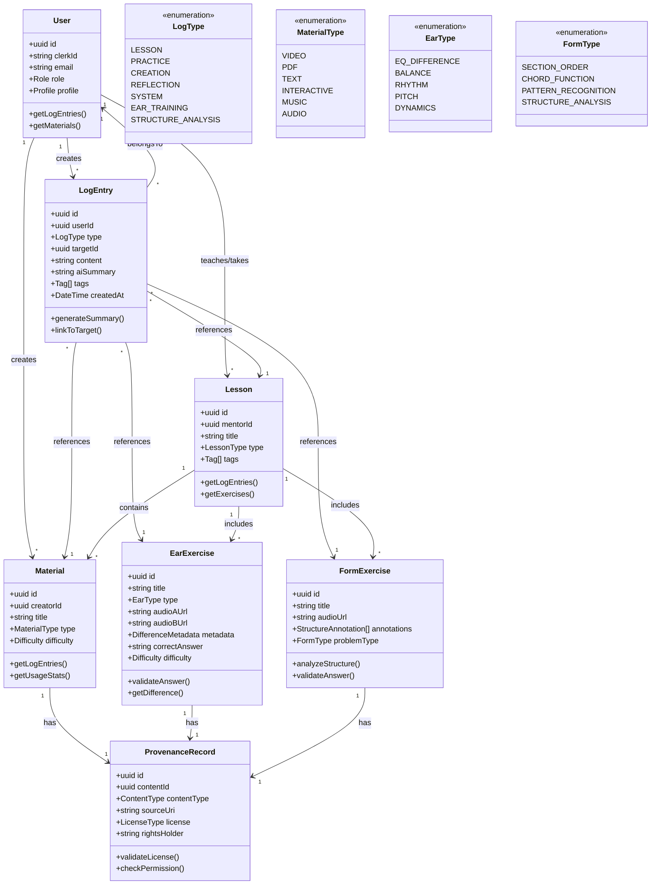
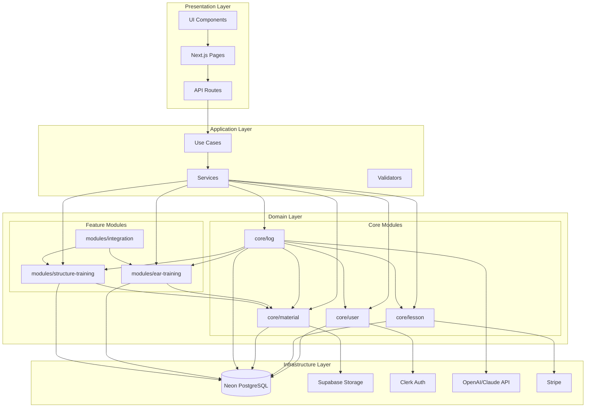
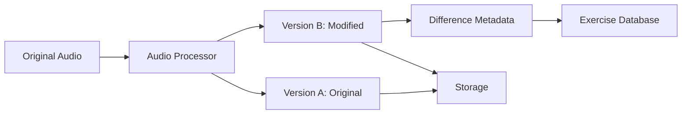
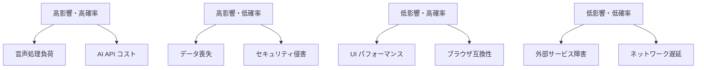
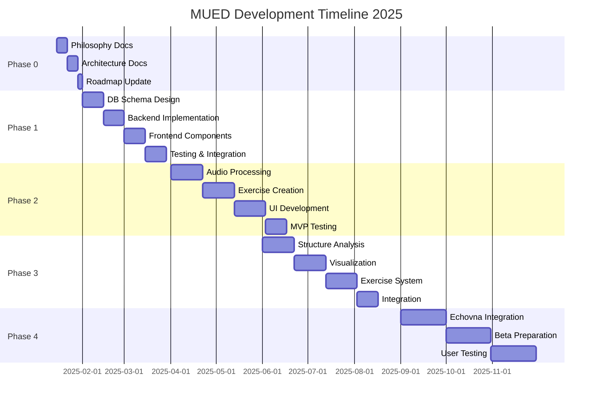

# MUED Implementation Plan 2025
## 音楽制作特化プラットフォームへの進化ロードマップ

**Version**: 1.0.0
**Date**: 2025-11-15
**Author**: MUED System Architecture Team

---

## Executive Summary

本ドキュメントは、MUED（Medical University Education）システムを現在の「AI付き汎用LMS」から「音楽制作特化プラットフォーム」へと進化させるための包括的な実装計画です。企画書の3本柱（Difference/Note/Form）を技術的に実現し、段階的なマイグレーション戦略に基づいて実装を進めます。

### Key Objectives
- **思想の統一**: Difference（耳）/ Note（制作・学習ログ）/ Form（構造）の3本柱をシステム全体に反映
- **MUEDnoteの実装**: あらゆる学習・制作活動を資産化するログシステム
- **専門機能の構築**: Ear Training（差分聴取）とStructure Training（構造分析）のMVP実装
- **外部連携**: Echovnaとの統合による物理空間との循環

---

## 1. アーキテクチャ設計

### 1.1 ドメインモデル設計



### 1.2 モジュール境界設計



### 1.3 データベーススキーマ設計

```typescript
// db/schema/log-entries.ts
import {
  pgTable,
  uuid,
  text,
  timestamp,
  jsonb,
  index,
  pgEnum,
} from 'drizzle-orm/pg-core';

// Enum definitions
export const logTypeEnum = pgEnum('log_type', [
  'lesson',
  'practice',
  'creation',
  'reflection',
  'system',
  'ear_training',
  'structure_analysis'
]);

export const targetTypeEnum = pgEnum('target_type', [
  'lesson',
  'material',
  'ear_exercise',
  'form_exercise',
  'reservation',
  'user_creation'
]);

// Log Entry table - MUEDnote core
export const logEntries = pgTable('log_entries', {
  id: uuid('id').primaryKey().defaultRandom(),
  userId: uuid('user_id').notNull().references(() => users.id),
  type: logTypeEnum('type').notNull(),

  // Polymorphic reference to target
  targetId: uuid('target_id'),
  targetType: targetTypeEnum('target_type'),

  // Content and AI processing
  content: text('content').notNull(), // Markdown format
  aiSummary: jsonb('ai_summary').$type<{
    keyPoints: string[];
    improvements: string[];
    keywords: string[];
    emotionalTone?: string;
  }>(),

  // Metadata
  tags: jsonb('tags').$type<string[]>(),
  difficulty: text('difficulty'), // perceived difficulty
  emotion: text('emotion'), // learning emotion tracking
  attachments: jsonb('attachments').$type<{
    type: string;
    url: string;
    name: string;
  }[]>(),

  // Privacy and sharing
  isPublic: boolean('is_public').default(false),
  shareWithMentor: boolean('share_with_mentor').default(true),

  createdAt: timestamp('created_at').defaultNow().notNull(),
  updatedAt: timestamp('updated_at').defaultNow().notNull()
}, (table) => ({
  userIdx: index('idx_log_entries_user').on(table.userId),
  typeIdx: index('idx_log_entries_type').on(table.type),
  targetIdx: index('idx_log_entries_target').on(table.targetId, table.targetType),
  createdAtIdx: index('idx_log_entries_created_at').on(table.createdAt),
  tagsIdx: index('idx_log_entries_tags').on(table.tags),
}));

// Ear Training Exercises table
export const earExercises = pgTable('ear_exercises', {
  id: uuid('id').primaryKey().defaultRandom(),
  creatorId: uuid('creator_id').notNull().references(() => users.id),

  // Basic info
  title: text('title').notNull(),
  description: text('description'),
  type: pgEnum('ear_type', ['eq', 'balance', 'rhythm', 'pitch', 'dynamics'])('type').notNull(),

  // Audio assets
  audioAUrl: text('audio_a_url').notNull(),
  audioBUrl: text('audio_b_url').notNull(),
  referenceUrl: text('reference_url'), // Original unprocessed audio

  // Difference metadata
  differenceMetadata: jsonb('difference_metadata').$type<{
    type: string;
    parameters: Record<string, any>;
    description: string;
    technicalDetails?: string;
  }>().notNull(),

  // Answer and explanation
  correctAnswer: text('correct_answer').notNull(), // 'A', 'B', 'same'
  explanation: text('explanation'),
  hints: jsonb('hints').$type<string[]>(),

  // Categorization
  difficulty: text('difficulty').notNull(), // beginner, intermediate, advanced
  tags: jsonb('tags').$type<string[]>(),
  instrument: text('instrument'), // piano, guitar, etc.
  genre: text('genre'), // classical, jazz, etc.

  // Statistics
  totalAttempts: integer('total_attempts').default(0),
  correctAttempts: integer('correct_attempts').default(0),
  averageTime: integer('average_time'), // seconds

  isPublic: boolean('is_public').default(true),
  createdAt: timestamp('created_at').defaultNow().notNull(),
  updatedAt: timestamp('updated_at').defaultNow().notNull()
}, (table) => ({
  creatorIdx: index('idx_ear_exercises_creator').on(table.creatorId),
  typeIdx: index('idx_ear_exercises_type').on(table.type),
  difficultyIdx: index('idx_ear_exercises_difficulty').on(table.difficulty),
  publicIdx: index('idx_ear_exercises_public').on(table.isPublic),
}));

// Structure/Form Exercises table
export const formExercises = pgTable('form_exercises', {
  id: uuid('id').primaryKey().defaultRandom(),
  creatorId: uuid('creator_id').notNull().references(() => users.id),

  // Basic info
  title: text('title').notNull(),
  description: text('description'),

  // Audio/MIDI assets
  audioUrl: text('audio_url'),
  midiUrl: text('midi_url'),
  scoreUrl: text('score_url'), // Sheet music if available

  // Structure annotations
  structureAnnotations: jsonb('structure_annotations').$type<{
    sections: Array<{
      id: string;
      name: string;
      startTime: number;
      endTime: number;
      type: string; // intro, verse, chorus, bridge, outro
    }>;
    chords?: Array<{
      time: number;
      chord: string;
      function?: string;
    }>;
    keySignature?: string;
    timeSignature?: string;
    tempo?: number;
  }>().notNull(),

  // Problem configuration
  problemType: pgEnum('form_problem_type', [
    'section_order',
    'chord_function',
    'pattern_recognition',
    'structure_analysis',
    'arrangement_comparison'
  ])('problem_type').notNull(),

  question: text('question').notNull(),
  options: jsonb('options').$type<any[]>(), // Problem-specific options
  correctAnswer: jsonb('correct_answer').$type<any>().notNull(),
  explanation: text('explanation'),

  // Categorization
  difficulty: text('difficulty').notNull(),
  tags: jsonb('tags').$type<string[]>(),
  genre: text('genre'),
  era: text('era'), // baroque, classical, romantic, etc.

  // Statistics
  totalAttempts: integer('total_attempts').default(0),
  correctAttempts: integer('correct_attempts').default(0),

  // AI Analysis cache
  aiAnalysis: jsonb('ai_analysis').$type<{
    structureSummary: string;
    keyCharacteristics: string[];
    similarPieces?: string[];
    analysisDate: string;
  }>(),

  isPublic: boolean('is_public').default(true),
  createdAt: timestamp('created_at').defaultNow().notNull(),
  updatedAt: timestamp('updated_at').defaultNow().notNull()
}, (table) => ({
  creatorIdx: index('idx_form_exercises_creator').on(table.creatorId),
  problemTypeIdx: index('idx_form_exercises_problem_type').on(table.problemType),
  difficultyIdx: index('idx_form_exercises_difficulty').on(table.difficulty),
  publicIdx: index('idx_form_exercises_public').on(table.isPublic),
}));

// User Exercise Attempts tracking
export const exerciseAttempts = pgTable('exercise_attempts', {
  id: uuid('id').primaryKey().defaultRandom(),
  userId: uuid('user_id').notNull().references(() => users.id),

  // Polymorphic reference
  exerciseId: uuid('exercise_id').notNull(),
  exerciseType: pgEnum('exercise_type', ['ear', 'form'])('exercise_type').notNull(),

  // Attempt details
  userAnswer: jsonb('user_answer').$type<any>().notNull(),
  isCorrect: boolean('is_correct').notNull(),
  timeSpent: integer('time_spent'), // seconds
  hintsUsed: integer('hints_used').default(0),

  // Learning insights
  confidence: integer('confidence'), // 1-5 scale
  notes: text('notes'), // User's reflection

  attemptedAt: timestamp('attempted_at').defaultNow().notNull()
}, (table) => ({
  userIdx: index('idx_exercise_attempts_user').on(table.userId),
  exerciseIdx: index('idx_exercise_attempts_exercise').on(table.exerciseId, table.exerciseType),
  attemptedAtIdx: index('idx_exercise_attempts_attempted_at').on(table.attemptedAt),
  userExerciseIdx: index('idx_exercise_attempts_user_exercise').on(
    table.userId,
    table.exerciseId,
    table.exerciseType
  ),
}));
```

### 1.4 API設計方針

```typescript
// lib/core/log/use-cases/create-log-entry.ts
export interface CreateLogEntryInput {
  userId: string;
  type: LogType;
  targetId?: string;
  targetType?: TargetType;
  content: string;
  tags?: string[];
  difficulty?: string;
  emotion?: string;
  attachments?: Attachment[];
  isPublic?: boolean;
}

export class CreateLogEntryUseCase {
  constructor(
    private logRepository: LogRepository,
    private aiService: AIService,
    private eventBus: EventBus
  ) {}

  async execute(input: CreateLogEntryInput): Promise<LogEntry> {
    // 1. Validate input
    const validated = await this.validate(input);

    // 2. Generate AI summary (async, non-blocking)
    const summaryPromise = this.aiService.generateSummary(validated.content);

    // 3. Create log entry
    const logEntry = await this.logRepository.create({
      ...validated,
      aiSummary: null, // Will be updated async
    });

    // 4. Update with AI summary when ready
    summaryPromise.then(async (summary) => {
      await this.logRepository.update(logEntry.id, {
        aiSummary: summary,
      });

      // 5. Emit event for other systems
      await this.eventBus.emit('log.created', {
        logEntry,
        summary,
      });
    });

    return logEntry;
  }

  private async validate(input: CreateLogEntryInput): Promise<CreateLogEntryInput> {
    // Validation logic
    return input;
  }
}

// lib/modules/ear-training/services/ear-exercise.service.ts
export class EarExerciseService {
  constructor(
    private repository: EarExerciseRepository,
    private audioProcessor: AudioProcessorService,
    private logService: LogService
  ) {}

  async attemptExercise(
    userId: string,
    exerciseId: string,
    answer: string
  ): Promise<AttemptResult> {
    const exercise = await this.repository.findById(exerciseId);
    const isCorrect = exercise.correctAnswer === answer;

    // Record attempt
    const attempt = await this.repository.recordAttempt({
      userId,
      exerciseId,
      userAnswer: answer,
      isCorrect,
    });

    // Auto-create log entry
    await this.logService.createEntry({
      userId,
      type: 'ear_training',
      targetId: exerciseId,
      targetType: 'ear_exercise',
      content: `Attempted ear training exercise: ${exercise.title}. Answer: ${answer} (${isCorrect ? 'Correct' : 'Incorrect'})`,
      tags: ['ear-training', exercise.type],
    });

    // Update statistics
    await this.repository.updateStatistics(exerciseId, isCorrect);

    return {
      isCorrect,
      explanation: exercise.explanation,
      attempt,
    };
  }
}
```

---

## 2. フェーズ別実装計画

### Phase 0: 思想・ドキュメント統合（〜1か月）

#### 2.1 ドキュメント作成タスク

**`/docs/PHILOSOPHY.md`の作成**
```markdown
# MUED Philosophy

## Core Pillars

### 1. Difference（差分を聴く耳）
音楽制作において最も重要なのは「違いを聴き分ける耳」です。
- EQの変化
- バランスの差異
- リズムの揺らぎ
- ピッチの微細な変動

### 2. Note（制作・学習ログ）
すべての学習と制作活動は「資産」として記録されるべきです。
- 練習の記録
- 気づきと発見
- 失敗と改善
- 成長の軌跡

### 3. Form（構造を理解する力）
音楽を構造的に理解し、分析する能力が創造性を支えます。
- セクション構成
- コード進行の機能
- アレンジメントパターン
- 楽曲の展開
```

**アーキテクチャドキュメントの更新**
- 新規ドメインモデルの定義追加
- モジュール境界の明確化
- 依存関係の整理

**ロードマップの再編成**
- 3本柱に沿った機能分類
- フェーズごとの成果物定義
- KPI設定

#### 2.2 Phase 0 タスクリスト

| Priority | Task | Effort | Dependencies |
|----------|------|--------|--------------|
| P0 | `/docs/PHILOSOPHY.md` 作成 | 2h | - |
| P0 | `/docs/architecture/domain-models.md` 作成 | 4h | PHILOSOPHY.md |
| P0 | `/docs/architecture/module-boundaries.md` 作成 | 3h | domain-models.md |
| P1 | `/docs/roadmap-2025.md` 更新 | 2h | PHILOSOPHY.md |
| P1 | README.md に哲学セクション追加 | 1h | PHILOSOPHY.md |
| P2 | 開発者オンボーディングガイド作成 | 4h | All above |

### Phase 1: MUEDnote基盤の実装（1〜3か月）

#### 2.3 実装タスクリスト

**Week 1-2: データベース準備**
| Task | Effort | Tech |
|------|--------|------|
| Drizzle スキーマ作成 (log_entries) | 4h | Drizzle ORM |
| マイグレーションファイル生成 | 2h | drizzle-kit |
| インデックス最適化設計 | 3h | PostgreSQL |
| テストデータ生成スクリプト | 2h | TypeScript |

**Week 3-4: バックエンド実装**
| Task | Effort | Tech |
|------|--------|------|
| LogRepository 実装 | 6h | TypeScript |
| CreateLogEntryUseCase 実装 | 4h | Clean Architecture |
| AI要約サービス実装 | 8h | OpenAI API |
| イベントバス実装 | 4h | EventEmitter |
| API エンドポイント実装 | 6h | Next.js API Routes |

**Week 5-6: フロントエンド実装**
| Task | Effort | Tech |
|------|--------|------|
| LogEditor コンポーネント | 8h | TipTap |
| LogTimeline コンポーネント | 6h | React |
| FilterPanel コンポーネント | 4h | shadcn/ui |
| AI要約表示コンポーネント | 3h | React |
| レッスン詳細へのログタブ追加 | 4h | Next.js |

**Week 7-8: 統合とテスト**
| Task | Effort | Tech |
|------|--------|------|
| ユニットテスト作成 | 8h | Vitest |
| 統合テスト作成 | 6h | Vitest |
| E2Eテスト作成 | 8h | Playwright |
| パフォーマンス最適化 | 6h | React Query |

#### 2.4 技術選定詳細

**Markdown エディタ: TipTap**
- 選定理由:
  - 豊富な拡張機能
  - Markdownショートカット対応
  - 双方向Markdown変換
  - 実績豊富（GitLab, Doist採用）

**AI要約: OpenAI GPT-5-mini**
- 選定理由:
  - 高速レスポンス
  - コスト効率
  - 日本語サポート
  - 既存実装との統合容易

**パフォーマンス対策**
```typescript
// インデックス設計
CREATE INDEX idx_log_entries_user_created
  ON log_entries(user_id, created_at DESC);

CREATE INDEX idx_log_entries_target
  ON log_entries(target_id, target_type)
  WHERE target_id IS NOT NULL;

// ページネーション
const PAGE_SIZE = 20;
const logs = await db
  .select()
  .from(logEntries)
  .where(eq(logEntries.userId, userId))
  .orderBy(desc(logEntries.createdAt))
  .limit(PAGE_SIZE)
  .offset(page * PAGE_SIZE);
```

### Phase 2: Ear Training MVP（3〜6か月）

#### 2.5 実装アプローチ

**音声処理パイプライン**


**実装優先順位**
1. EQ差分（最も基本的）
2. バランス差分（実用的）
3. ダイナミクス差分
4. ピッチ差分
5. リズム差分

#### 2.6 UI/UXコンポーネント

```typescript
// components/ear-training/ExercisePlayer.tsx
interface ExercisePlayerProps {
  exercise: EarExercise;
  onAnswer: (answer: string) => void;
}

export function ExercisePlayer({ exercise, onAnswer }: ExercisePlayerProps) {
  const [currentPlaying, setCurrentPlaying] = useState<'A' | 'B' | null>(null);
  const [selectedAnswer, setSelectedAnswer] = useState<string | null>(null);

  return (
    <div className="flex flex-col gap-4">
      <div className="grid grid-cols-2 gap-4">
        <AudioPlayer
          label="Version A"
          url={exercise.audioAUrl}
          isPlaying={currentPlaying === 'A'}
          onPlay={() => setCurrentPlaying('A')}
        />
        <AudioPlayer
          label="Version B"
          url={exercise.audioBUrl}
          isPlaying={currentPlaying === 'B'}
          onPlay={() => setCurrentPlaying('B')}
        />
      </div>

      <QuestionPanel
        question={exercise.question}
        options={exercise.options}
        onSelect={setSelectedAnswer}
      />

      <Button
        onClick={() => onAnswer(selectedAnswer!)}
        disabled={!selectedAnswer}
      >
        Submit Answer
      </Button>
    </div>
  );
}
```

### Phase 3: Structure Training MVP（6〜9か月）

#### 2.7 構造解析アーキテクチャ

**AI解析サービス抽象化**
```typescript
// lib/modules/structure-training/services/structure-analyzer.ts
interface StructureAnalyzer {
  analyzeSections(audioUrl: string): Promise<Section[]>;
  analyzeChords(audioUrl: string): Promise<ChordProgression>;
  compareStructures(url1: string, url2: string): Promise<Comparison>;
}

// 実装切り替え可能
class OpenAIStructureAnalyzer implements StructureAnalyzer { }
class ClaudeStructureAnalyzer implements StructureAnalyzer { }
class MidiLLMAnalyzer implements StructureAnalyzer { }
```

**可視化ライブラリ候補**
- WaveSurfer.js: 波形表示
- Tone.js: 音楽タイミング制御
- D3.js: カスタム構造図

---

## 3. テスト戦略

### 3.1 Phase別テスト計画

```typescript
// Phase 1: MUEDnote Tests
describe('LogEntry', () => {
  // Unit Tests
  it('should create log entry with valid data');
  it('should generate AI summary asynchronously');
  it('should link to target entities correctly');

  // Integration Tests
  it('should save log entry to database');
  it('should trigger event after creation');

  // E2E Tests
  it('should allow user to create and view logs');
  it('should filter logs by date and type');
});

// Phase 2: Ear Training Tests
describe('EarExercise', () => {
  // Unit Tests
  it('should validate answer correctly');
  it('should calculate statistics');

  // Integration Tests
  it('should play audio files');
  it('should record attempt history');

  // E2E Tests
  it('should complete exercise flow');
  it('should show results and explanation');
});
```

### 3.2 テストカバレッジ目標

| Phase | Unit | Integration | E2E |
|-------|------|-------------|-----|
| Phase 0 | N/A | N/A | N/A |
| Phase 1 | 80% | 70% | Core flows |
| Phase 2 | 80% | 70% | Core flows |
| Phase 3 | 80% | 70% | Core flows |

---

## 4. マイグレーション戦略

### 4.1 Neon PostgreSQL段階的移行

**Phase 1 マイグレーション**
```sql
-- migrations/0009_add_log_entries.sql
DO $$
BEGIN
  -- Create log_type enum if not exists
  IF NOT EXISTS (SELECT 1 FROM pg_type WHERE typname = 'log_type') THEN
    CREATE TYPE log_type AS ENUM (
      'lesson', 'practice', 'creation',
      'reflection', 'system', 'ear_training',
      'structure_analysis'
    );
  END IF;

  -- Create target_type enum if not exists
  IF NOT EXISTS (SELECT 1 FROM pg_type WHERE typname = 'target_type') THEN
    CREATE TYPE target_type AS ENUM (
      'lesson', 'material', 'ear_exercise',
      'form_exercise', 'reservation', 'user_creation'
    );
  END IF;
END $$;

-- Create log_entries table
CREATE TABLE IF NOT EXISTS log_entries (
  id UUID PRIMARY KEY DEFAULT gen_random_uuid(),
  user_id UUID NOT NULL REFERENCES users(id) ON DELETE CASCADE,
  type log_type NOT NULL,
  target_id UUID,
  target_type target_type,
  content TEXT NOT NULL,
  ai_summary JSONB,
  tags JSONB,
  difficulty TEXT,
  emotion TEXT,
  attachments JSONB,
  is_public BOOLEAN DEFAULT FALSE,
  share_with_mentor BOOLEAN DEFAULT TRUE,
  created_at TIMESTAMP DEFAULT NOW(),
  updated_at TIMESTAMP DEFAULT NOW()
);

-- Create indexes
CREATE INDEX IF NOT EXISTS idx_log_entries_user
  ON log_entries(user_id);
CREATE INDEX IF NOT EXISTS idx_log_entries_type
  ON log_entries(type);
CREATE INDEX IF NOT EXISTS idx_log_entries_target
  ON log_entries(target_id, target_type);
CREATE INDEX IF NOT EXISTS idx_log_entries_created_at
  ON log_entries(created_at DESC);
```

### 4.2 ロールバック計画

```typescript
// scripts/rollback-phase1.ts
import { sql } from '@neondatabase/serverless';

export async function rollbackPhase1() {
  const client = await sql.connect();

  try {
    await client`DROP TABLE IF EXISTS log_entries CASCADE`;
    await client`DROP TYPE IF EXISTS log_type CASCADE`;
    await client`DROP TYPE IF EXISTS target_type CASCADE`;

    console.log('Phase 1 rollback completed');
  } catch (error) {
    console.error('Rollback failed:', error);
  }
}
```

### 4.3 データ移行リスク評価

| Risk | Impact | Likelihood | Mitigation |
|------|--------|------------|------------|
| スキーマ競合 | High | Low | DO $$ ブロックで存在チェック |
| パフォーマンス劣化 | Medium | Medium | インデックス事前作成 |
| データ不整合 | High | Low | トランザクション制御 |
| ダウンタイム | Medium | Low | オフピーク実行 |

---

## 5. 技術的リスクと対策

### 5.1 リスクマトリクス



### 5.2 主要リスクと対策

**1. 音声処理負荷**
- **リスク**: 大量の音声ファイル処理によるサーバー負荷
- **対策**:
  - バックグラウンドジョブキュー（Bull/BullMQ）導入
  - CDN活用（Cloudflare）
  - 音声処理の外部サービス化検討

**2. AI APIコスト**
- **リスク**: ログ要約の大量生成によるコスト増大
- **対策**:
  - バッチ処理による効率化
  - キャッシュ戦略の実装
  - 要約のオプトイン化

**3. スケーラビリティ**
- **リスク**: ログエントリの増大によるDB性能劣化
- **対策**:
  - パーティショニング戦略
  - 読み取り専用レプリカ活用
  - アーカイブ戦略（古いログの別テーブル化）

---

## 6. 開発スケジュール

### 6.1 マイルストーン



### 6.2 リソース配分

| Phase | Backend Dev | Frontend Dev | AI/ML | QA | Total |
|-------|------------|--------------|-------|-----|-------|
| Phase 0 | 0.5 | 0.5 | 0 | 0 | 1.0 |
| Phase 1 | 2.0 | 2.0 | 1.0 | 1.0 | 6.0 |
| Phase 2 | 2.0 | 2.0 | 2.0 | 1.0 | 7.0 |
| Phase 3 | 2.0 | 2.0 | 2.0 | 1.0 | 7.0 |
| Phase 4 | 1.0 | 1.0 | 1.0 | 2.0 | 5.0 |

### 6.3 成功指標（KPI）

**Phase 1 完了時**
- ✅ 100+ ログエントリ作成
- ✅ AI要約生成率 > 80%
- ✅ ページロード時間 < 2秒

**Phase 2 完了時**
- ✅ 50+ Ear Exercises 作成
- ✅ 平均正答率データ収集
- ✅ ユーザー満足度 > 4.0/5.0

**Phase 3 完了時**
- ✅ 30+ Form Exercises 作成
- ✅ 構造解析精度 > 85%
- ✅ 学習継続率 > 60%

**Phase 4 完了時**
- ✅ Echovna連携成功率 > 95%
- ✅ β版ユーザー 50+
- ✅ NPS スコア > 40

---

## 7. 次のステップ

### 即座に実行可能なアクション

1. **今週中**
   - [ ] PHILOSOPHY.md の作成開始
   - [ ] チーム内レビューの実施
   - [ ] Phase 0 タスクのチケット化

2. **来週**
   - [ ] Drizzle スキーマのプロトタイプ作成
   - [ ] TipTap エディタのPOC実装
   - [ ] AI要約プロンプトの設計

3. **今月中**
   - [ ] Phase 0 完了
   - [ ] Phase 1 詳細設計レビュー
   - [ ] 開発環境セットアップ

### 継続的改善

- 週次進捗レビュー
- 隔週アーキテクチャレビュー
- 月次KPI評価
- 四半期ロードマップ見直し

---

## Appendix

### A. 技術スタック詳細

| Category | Technology | Version | Purpose |
|----------|------------|---------|---------|
| Framework | Next.js | 15.5.4 | Full-stack React framework |
| UI | React | 19.0.0 | Component library |
| Styling | TailwindCSS | 4.0.0 | Utility-first CSS |
| Database | Neon PostgreSQL | Latest | Serverless Postgres |
| ORM | Drizzle | Latest | Type-safe ORM |
| Auth | Clerk | Latest | Authentication |
| Payment | Stripe | Latest | Payment processing |
| AI | OpenAI GPT-5 | Latest | Content generation |
| Editor | TipTap | 2.x | Rich text editing |
| Testing | Vitest/Playwright | Latest | Testing framework |

### B. 参考リンク

- [Drizzle ORM Documentation](https://orm.drizzle.team/)
- [Neon PostgreSQL Guide](https://neon.tech/docs)
- [TipTap Editor](https://tiptap.dev/)
- [Next.js 15 Documentation](https://nextjs.org/docs)
- [Clerk Authentication](https://clerk.com/docs)

### C. 用語集

| Term | Definition |
|------|------------|
| MUEDnote | 学習・制作ログを記録する中核システム |
| LogEntry | 個々のログエントリを表すドメインモデル |
| EarExercise | 聴覚トレーニング用の練習問題 |
| FormExercise | 構造分析トレーニング用の練習問題 |
| Provenance | データの出所・権利を追跡する仕組み |
| Echovna | 連携予定の物理スタジオ空間 |

---

**Document Version**: 1.0.0
**Last Updated**: 2025-11-15
**Status**: Draft for Review

このドキュメントは生きたドキュメントとして、プロジェクトの進行に応じて継続的に更新されます。