# MUED ビジネスロジック定義書

## 📌 ドキュメント情報

- **作成日**: 2025年10月1日
- **バージョン**: 1.0
- **目的**: MUEDプラットフォームの詳細なビジネスルールとワークフローの定義
- **対象読者**: 開発チーム、プロダクトマネージャー、ステークホルダー

---

## 🎯 概要

本文書は、MUEDプラットフォームの全ビジネスロジックを詳細に定義し、実装の指針となるワークフロー、データフロー、エラーハンドリング、トランザクション管理を規定します。

---

## 📊 コアビジネスエンティティ

### 主要エンティティ関係図

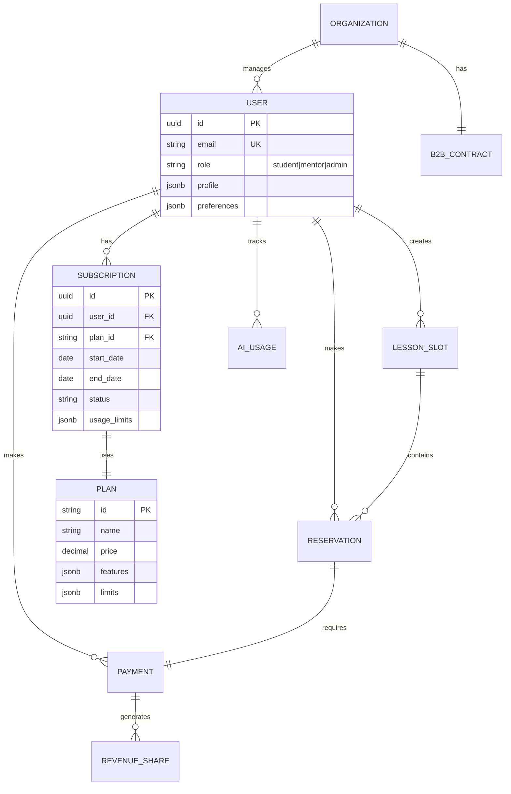

---

## 💰 1. サブスクリプション管理

### 1.1 プラン定義

| プラン | 月額料金 | AI教材制限 | レッスン予約 | 特典 |
|-------|---------|-----------|-------------|------|
| **フリーミアム** | ¥0 | 3本/月 | 1件/月 | 広告表示 |
| **Starter** | ¥500 | 3本/月 | 1件/月 | 広告表示 |
| **Basic** | ¥2,480 | 無制限 | 5件/月 | チャットサポート |
| **Premium** | ¥5,980 | 無制限+PDF | 無制限 | 優先マッチング |

### 1.2 プラン変更ワークフロー

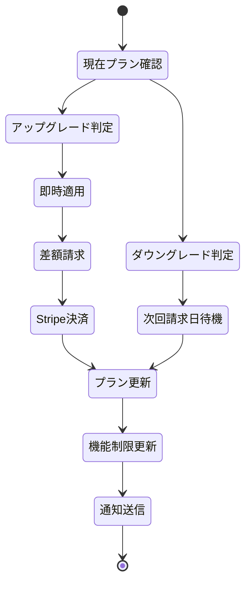

### 1.3 使用量制限ロジック

```typescript
interface UsageLimit {
  planId: string;
  limits: {
    aiMaterials: number | 'unlimited';
    monthlyReservations: number | 'unlimited';
    pdfImport: boolean;
    priorityMatching: boolean;
    adsDisplay: boolean;
  };
}

class UsageTracker {
  async checkLimit(userId: string, feature: string): Promise<boolean> {
    const subscription = await getActiveSubscription(userId);
    const usage = await getCurrentMonthUsage(userId, feature);
    const limit = subscription.plan.limits[feature];

    if (limit === 'unlimited') return true;
    if (usage >= limit) {
      await logLimitExceeded(userId, feature);
      return false;
    }
    return true;
  }

  async incrementUsage(userId: string, feature: string): Promise<void> {
    await db.transaction(async (tx) => {
      const current = await tx.select(usage).where(eq(usage.userId, userId));
      await tx.update(usage).set({
        [feature]: current[feature] + 1,
        lastUpdated: new Date()
      });
    });
  }
}
```

---

## 🎓 2. レッスン予約システム

### 2.1 予約作成フロー

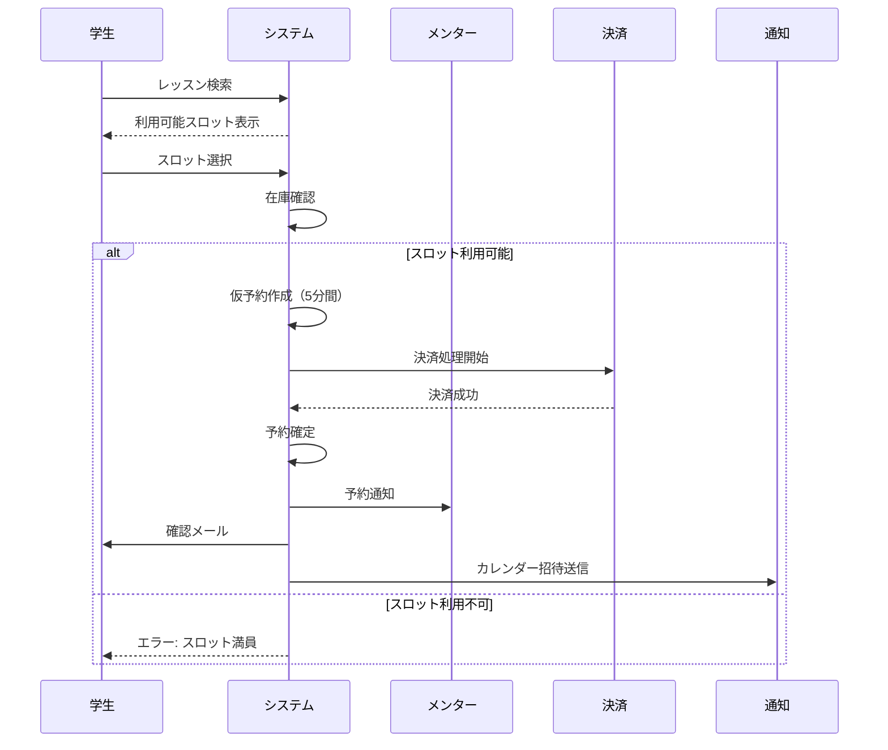

### 2.2 予約ステータス管理

```typescript
enum ReservationStatus {
  PENDING = 'pending',           // 仮予約（決済待ち）
  CONFIRMED = 'confirmed',       // 確定
  CANCELLED = 'cancelled',       // キャンセル済み
  COMPLETED = 'completed',       // 完了
  NO_SHOW = 'no_show',          // 無断欠席
  REFUNDED = 'refunded'         // 返金済み
}

interface ReservationRules {
  // 仮予約の有効期限（分）
  pendingTimeout: 5;

  // キャンセル可能期限（時間前）
  cancellationDeadline: 24;

  // 返金ルール
  refundPolicy: {
    '48h': 1.0,    // 48時間前: 100%返金
    '24h': 0.5,    // 24時間前: 50%返金
    '0h': 0.0      // 当日: 返金なし
  };
}
```

### 2.3 キャンセル処理

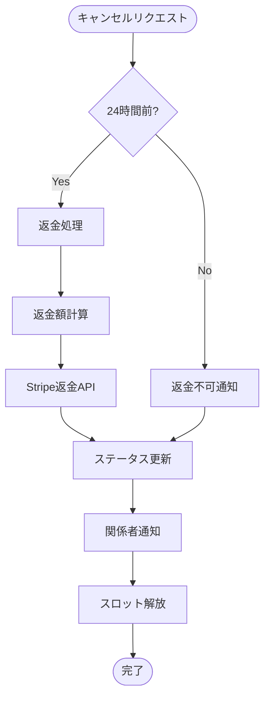

---

## 💳 3. 決済・レベニューシェア

### 3.1 決済フロー

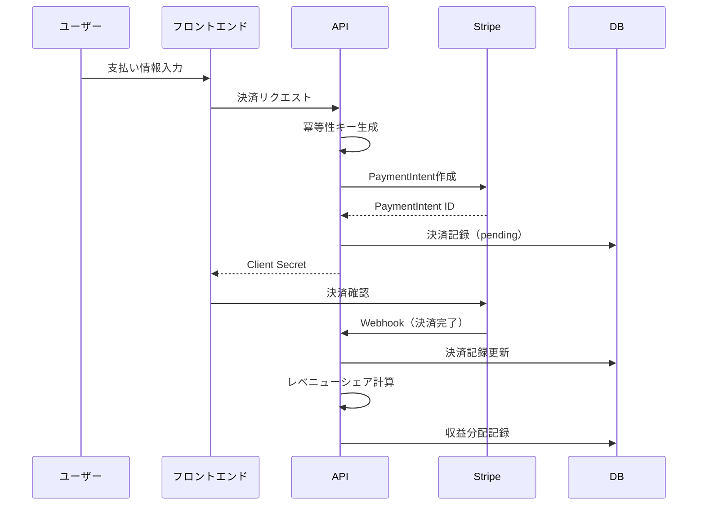

### 3.2 レベニューシェア計算

```typescript
interface RevenueShareConfig {
  mentorShare: 0.7;        // メンター取り分: 70%
  platformShare: 0.3;      // プラットフォーム: 30%
  stripeFeePayer: 'platform';  // Stripe手数料負担者
}

class RevenueCalculator {
  calculate(lessonPrice: number): RevenueBreakdown {
    const stripeFee = lessonPrice * 0.036 + 30;  // 3.6% + ¥30
    const netAmount = lessonPrice - stripeFee;

    return {
      grossAmount: lessonPrice,
      stripeFee: stripeFee,
      mentorRevenue: netAmount * 0.7,
      platformRevenue: netAmount * 0.3,
      paymentSchedule: this.getPaymentSchedule()
    };
  }

  private getPaymentSchedule(): PaymentSchedule {
    return {
      mentor: '月末締め翌月15日払い',
      minimumPayout: 5000,  // 最低支払額
      method: 'bank_transfer'
    };
  }
}
```

### 3.3 支払いスケジュール

```mermaid
gantt
    title 月次支払いサイクル
    dateFormat  DD
    axisFormat  %d日

    section レッスン実施
    レッスン期間           :01, 30d

    section 集計・処理
    売上集計              :31, 3d
    支払い計算            :33, 2d
    承認プロセス          :35, 2d

    section 支払い実行
    メンター振込          :15, 1d
    支払い通知            :15, 1d
```

---

## 🤖 4. AI機能管理

### 4.1 AI教材生成フロー

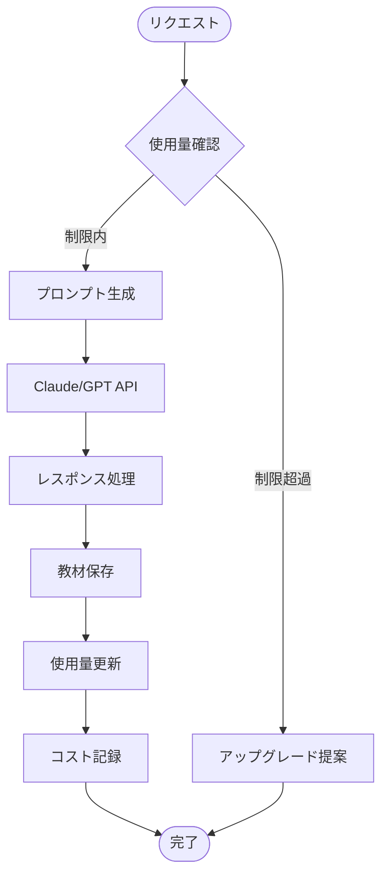

### 4.2 AI使用量管理

```typescript
interface AIUsageTracking {
  userId: string;
  month: Date;
  usage: {
    materials: {
      count: number;
      tokens: number;
      cost: number;
    };
    matching: {
      requests: number;
      cost: number;
    };
  };
  limits: {
    materials: number | 'unlimited';
    dailyTokens: number;
  };
}

class AIQuotaManager {
  async canGenerate(userId: string): Promise<QuotaStatus> {
    const subscription = await getSubscription(userId);
    const currentUsage = await getMonthlyUsage(userId);

    if (subscription.plan === 'freemium' || subscription.plan === 'starter') {
      if (currentUsage.materials >= 3) {
        return {
          allowed: false,
          reason: 'monthly_limit_exceeded',
          upgradeRequired: true
        };
      }
    }

    // トークン制限チェック
    if (currentUsage.dailyTokens >= MAX_DAILY_TOKENS) {
      return {
        allowed: false,
        reason: 'daily_token_limit',
        resetAt: getTomorrowMidnight()
      };
    }

    return { allowed: true };
  }
}
```

### 4.3 メンターマッチングアルゴリズム

```typescript
interface MatchingCriteria {
  subject: string;
  level: 'beginner' | 'intermediate' | 'advanced';
  availability: TimeSlot[];
  priceRange: { min: number; max: number };
  preferredLanguage: string;
  teachingStyle: string[];
}

class MentorMatcher {
  async findMatches(criteria: MatchingCriteria, isPremium: boolean): Promise<Mentor[]> {
    let query = db.select()
      .from(mentors)
      .where(
        and(
          eq(mentors.subject, criteria.subject),
          gte(mentors.price, criteria.priceRange.min),
          lte(mentors.price, criteria.priceRange.max)
        )
      );

    // プレミアムユーザーは優先マッチング
    if (isPremium) {
      query = query.orderBy(
        desc(mentors.rating),
        desc(mentors.responseRate),
        asc(mentors.price)
      );
    } else {
      query = query.orderBy(
        desc(mentors.rating),
        asc(mentors.price)
      );
    }

    const results = await query.limit(isPremium ? 20 : 10);
    return this.scoreAndRank(results, criteria);
  }
}
```

---

## 🏢 5. B2B機能

### 5.1 組織管理構造

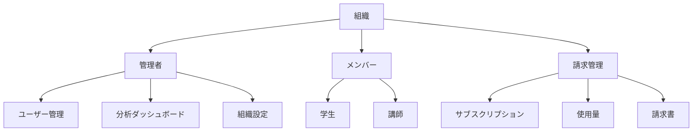

### 5.2 API使用量課金

```typescript
interface APIUsageBilling {
  organizationId: string;
  billingPeriod: {
    start: Date;
    end: Date;
  };
  usage: {
    requests: {
      count: number;
      breakdown: {
        endpoint: string;
        count: number;
        cost: number;
      }[];
    };
    dataTransfer: {
      gb: number;
      cost: number;
    };
  };
  pricing: {
    model: 'payAsYouGo' | 'committed' | 'enterprise';
    rates: {
      request: number;      // ¥/リクエスト
      dataTransfer: number; // ¥/GB
    };
    commitment?: {
      monthly: number;
      included: {
        requests: number;
        dataTransfer: number;
      };
    };
  };
}

class APIBillingCalculator {
  calculate(usage: APIUsageBilling): Invoice {
    let total = 0;

    if (usage.pricing.model === 'payAsYouGo') {
      total = usage.usage.requests.count * usage.pricing.rates.request
            + usage.usage.dataTransfer.gb * usage.pricing.rates.dataTransfer;
    } else if (usage.pricing.model === 'committed') {
      const overageRequests = Math.max(0,
        usage.usage.requests.count - usage.pricing.commitment.included.requests
      );
      const overageData = Math.max(0,
        usage.usage.dataTransfer.gb - usage.pricing.commitment.included.dataTransfer
      );

      total = usage.pricing.commitment.monthly
            + overageRequests * usage.pricing.rates.request * 1.5  // 超過分は1.5倍
            + overageData * usage.pricing.rates.dataTransfer * 1.5;
    }

    return {
      organizationId: usage.organizationId,
      amount: total,
      breakdown: this.generateBreakdown(usage),
      dueDate: this.calculateDueDate()
    };
  }
}
```

### 5.3 SSO/SAML統合

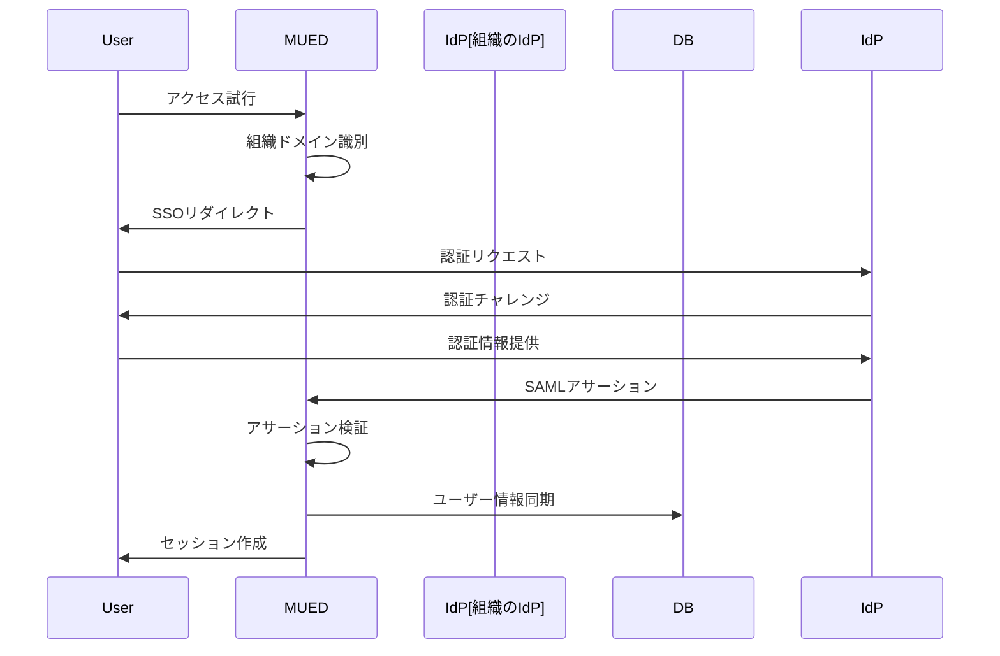

---

## 🔄 6. トランザクション管理

### 6.1 重要トランザクションの定義

```typescript
interface CriticalTransactions {
  // 決済関連は必ず分散トランザクション
  payment: {
    isolation: 'SERIALIZABLE';
    timeout: 30000;  // 30秒
    retries: 3;
    compensationAction: 'refund';
  };

  // 予約作成は楽観的ロック
  reservation: {
    isolation: 'READ_COMMITTED';
    timeout: 10000;  // 10秒
    retries: 5;
    conflictResolution: 'optimistic_lock';
  };

  // レベニューシェアは遅延実行
  revenueShare: {
    isolation: 'READ_COMMITTED';
    execution: 'deferred';  // バッチ処理
    schedule: 'daily_02:00';
  };
}
```

### 6.2 Sagaパターン実装

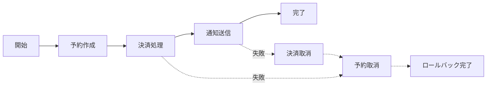

---

## ⚠️ 7. エラーハンドリング

### 7.1 エラー分類と対応

| エラータイプ | コード範囲 | リトライ | ユーザー表示 | ログレベル |
|------------|-----------|---------|------------|-----------|
| **検証エラー** | 400-409 | なし | 詳細メッセージ | INFO |
| **認証エラー** | 401-403 | なし | 一般メッセージ | WARN |
| **ビジネスエラー** | 422 | なし | 詳細メッセージ | INFO |
| **一時的エラー** | 503 | 自動3回 | リトライ中 | WARN |
| **システムエラー** | 500-502 | なし | 一般メッセージ | ERROR |

### 7.2 エラー処理フロー

```typescript
class ErrorHandler {
  async handle(error: AppError): Promise<ErrorResponse> {
    // ロギング
    await this.log(error);

    // 通知（重大度による）
    if (error.severity >= ErrorSeverity.HIGH) {
      await this.notifyOps(error);
    }

    // 補償処理
    if (error.requiresCompensation) {
      await this.compensate(error);
    }

    // ユーザー応答
    return {
      code: error.code,
      message: this.getUserMessage(error),
      retryAfter: error.retryAfter,
      supportId: error.trackingId
    };
  }
}
```

---

## 📈 8. 分析・レポーティング

### 8.1 KPIトラッキング

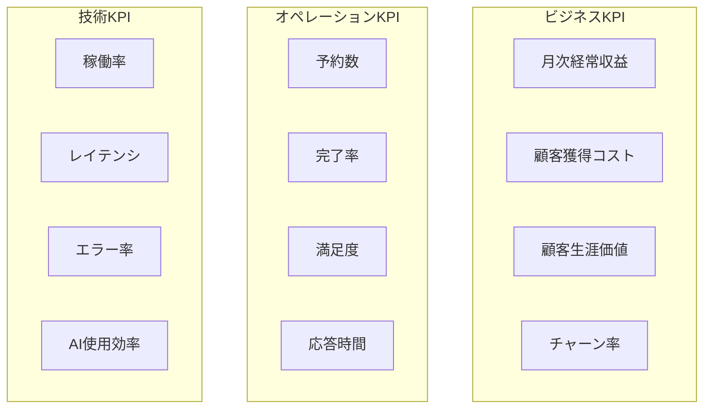

### 8.2 自動レポート生成

```typescript
interface ReportSchedule {
  daily: {
    time: '09:00';
    reports: ['bookings', 'revenue', 'errors'];
    recipients: ['ops-team'];
  };

  weekly: {
    day: 'monday';
    time: '10:00';
    reports: ['kpi-summary', 'mentor-performance', 'user-growth'];
    recipients: ['management'];
  };

  monthly: {
    day: 1;
    time: '11:00';
    reports: ['financial', 'growth-metrics', 'ai-usage-cost'];
    recipients: ['executives', 'investors'];
  };
}
```

---

## 🔐 9. セキュリティポリシー

### 9.1 データアクセス制御

```typescript
interface AccessControl {
  roles: {
    student: {
      read: ['own_profile', 'lessons', 'materials'];
      write: ['own_profile', 'reservations', 'reviews'];
      delete: ['own_reservations'];
    };

    mentor: {
      read: ['own_profile', 'own_lessons', 'student_profiles', 'analytics'];
      write: ['own_profile', 'lesson_slots', 'materials'];
      delete: ['own_lessons', 'own_materials'];
    };

    admin: {
      read: ['*'];
      write: ['*'];
      delete: ['*'];
      audit: true;
    };
  };
}
```

### 9.2 データ暗号化

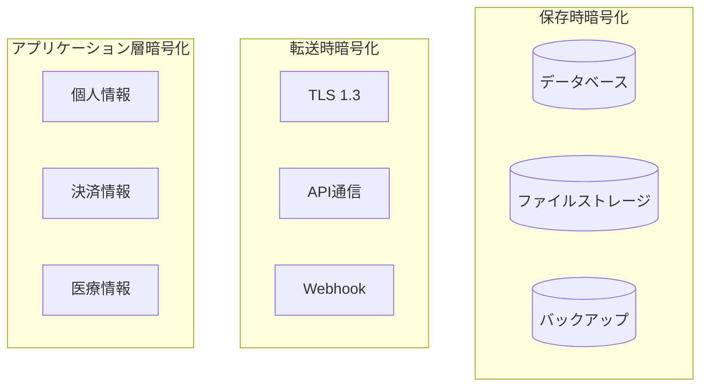

---

## 📋 10. コンプライアンス要件

### 10.1 個人情報保護

| 要件 | 実装 | 監査頻度 |
|------|------|---------|
| **データ最小化** | 必要最小限の情報のみ収集 | 四半期 |
| **同意管理** | 明示的な同意取得・記録 | 月次 |
| **アクセス権** | ユーザーデータのエクスポート機能 | 随時 |
| **削除権** | アカウント削除・データ消去 | 随時 |
| **暗号化** | AES-256による暗号化 | 年次 |

### 10.2 決済セキュリティ（PCI-DSS）

```typescript
interface PCICompliance {
  // カード情報は保存しない
  cardDataStorage: 'none';

  // Stripeトークン化を使用
  tokenization: 'stripe';

  // 監査ログ
  auditLogging: {
    retention: '7years';
    encryption: true;
    immutable: true;
  };

  // セキュリティスキャン
  scanning: {
    frequency: 'quarterly';
    scope: ['network', 'application'];
  };
}
```

---

## 🚀 実装優先順位

### フェーズ1: 基本収益機能（1-2週間）

1. サブスクリプション管理
2. レベニューシェア計算
3. AI使用量制限

### フェーズ2: 拡張機能（1ヶ月）

4. B2B API基盤
5. 高度な分析機能
6. マーケティング統合

### フェーズ3: エンタープライズ（3ヶ月）

7. SSO/SAML統合
8. ホワイトラベル機能
9. 高度なコンプライアンス

---

## 📝 改訂履歴

| バージョン | 日付 | 変更内容 | 承認者 |
|-----------|------|---------|--------|
| 1.0 | 2025-10-01 | 初版作成 | システムアーキテクチャチーム |

---

**次回レビュー予定**: 2025年10月15日

*この文書は実装の進捗に応じて継続的に更新されます*