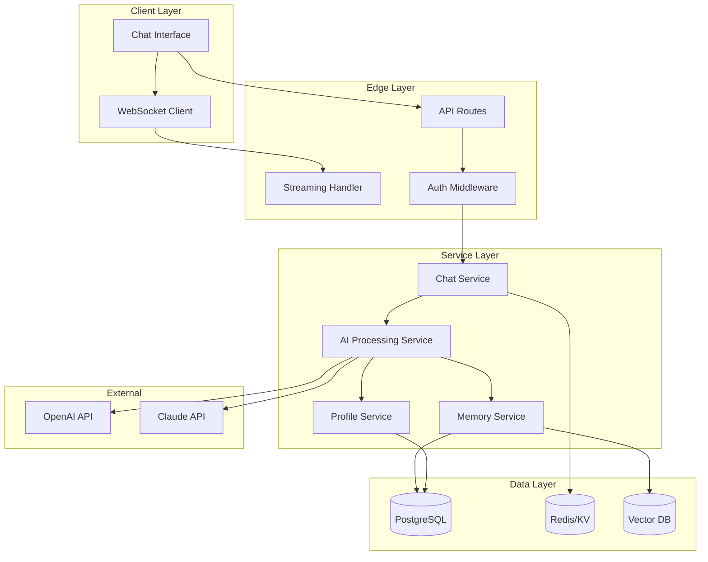
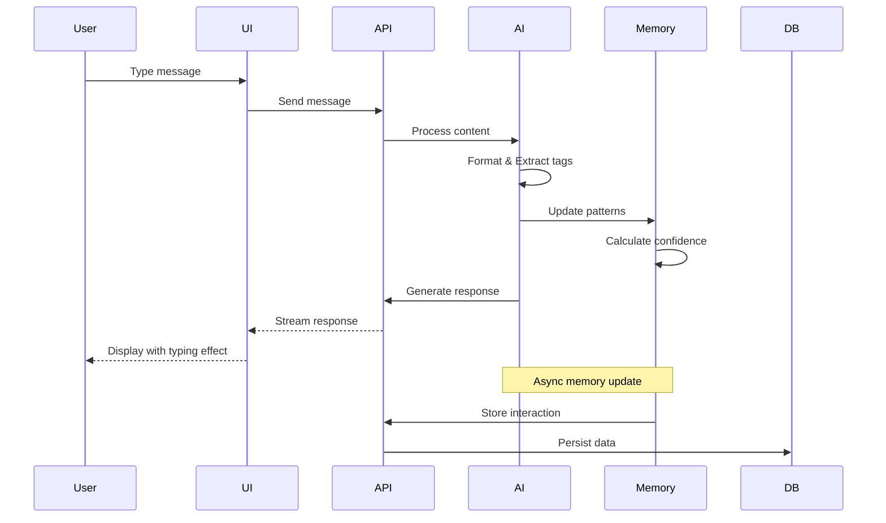
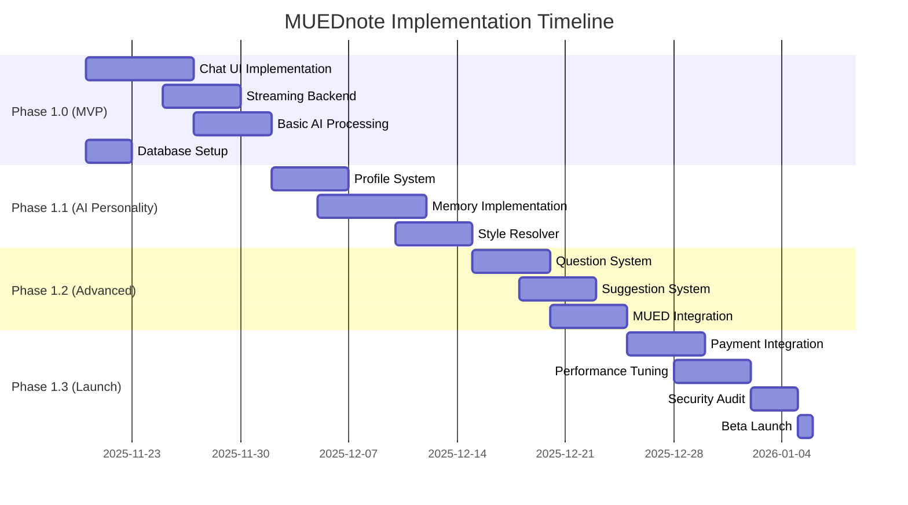
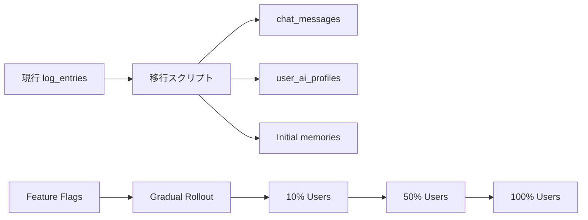

# MUEDnote 統合仕様書 v2.0

**バージョン**: 2.0
**作成日**: 2025-11-19
**ステータス**: FINAL DRAFT
**対象リリース**: 2025 Q1

---

## 1. プロダクトビジョン

### 1.1 ミッションステートメント

**MUEDnoteは、音楽学習者と制作者のための「考えを整理してくれるAIチャット」です。**

書き散らした練習記録、制作メモ、学習内容を自然言語で投げ込むだけで、AIが整形・タグ付け・整理し、必要に応じて質問や提案を返してくれます。MUED本体の重厚な教育システムへの入口として、まず「記録する習慣」を楽しく身につけられるツールを目指します。

### 1.2 コアバリュー

1. **シンプルさ**: チャット画面一枚で完結
2. **即時価値**: 入力した瞬間から整理される
3. **パーソナライズ**: ユーザーごとに適応するAI人格
4. **独立性**: 単体で価値を提供、MUED本体は必須ではない

### 1.3 ターゲットユーザー

- **プライマリ**: 音楽学習者（初級〜中級）
- **セカンダリ**: DTM制作者、作曲家
- **ターシャリ**: 音楽教師、メンター

---

## 2. システムアーキテクチャ

### 2.1 技術スタック

```yaml
Frontend:
  Framework: Next.js 15.5.4 (App Router)
  UI Library: React 19
  Styling: TailwindCSS 4 + shadcn/ui
  State: React Query + Zustand
  Streaming: Vercel AI SDK

Backend:
  Runtime: Node.js (Edge Runtime for streaming)
  Database: Neon PostgreSQL
  ORM: Drizzle ORM
  Authentication: Clerk

AI:
  Primary: OpenAI GPT-5-mini (production)
  Secondary: Claude Sonnet 4.5 (via MCP for dev/admin)
  Memory: Custom implementation (Mem0-inspired)

Infrastructure:
  Hosting: Vercel
  Storage: Supabase Storage (for attachments)
  Monitoring: Sentry
  Analytics: PostHog
```

### 2.2 システム構成図



### 2.3 データフロー

```typescript
// 1. ユーザー入力
UserInput -> ChatInterface -> WebSocket -> StreamingHandler

// 2. AI処理パイプライン
StreamingHandler -> AIProcessingService -> {
  ContentFormatter,     // テキスト整形
  TagExtractor,        // タグ抽出
  CommentGenerator,    // コメント生成
  InteractionDecider   // 質問・提案判定
}

// 3. メモリ更新
AIResponse -> MemoryService -> {
  PatternExtractor,    // パターン抽出
  ConfidenceUpdater,   // 信頼度更新
  MemoryDecay         // 古いメモリの減衰
}

// 4. レスポンス生成
StyleResolver -> ResponseGenerator -> StreamingResponse -> Client
```

---

## 3. 機能仕様

### 3.1 コア機能（MVP）

#### 3.1.1 チャットインターフェース

```typescript
interface ChatInterface {
  // 基本機能
  sendMessage(content: string): Promise<StreamingResponse>;
  displayMessage(message: ChatMessage): void;
  showTypingIndicator(): void;

  // セッション管理
  createNewSession(): Promise<Session>;
  loadSession(sessionId: string): Promise<void>;
  listSessions(): Promise<Session[]>;

  // UI要素
  messageInput: TextArea;
  sendButton: Button;
  sessionList: Sidebar;
  messageHistory: ScrollableList;
}
```

#### 3.1.2 AI整形機能

```typescript
interface ContentProcessor {
  // 整形ルール
  formatContent(raw: string): string {
    // 1. 改行・空白の正規化
    // 2. 箇条書きの整形
    // 3. 音楽用語の統一
    // 4. 時系列情報の抽出
    return formatted;
  }

  // タグ抽出
  extractTags(content: string): string[] {
    // 音楽ジャンル、楽器、技術、理論等
    return ['コード進行', 'ギター', '練習'];
  }

  // メタデータ生成
  generateMetadata(content: string): Metadata {
    return {
      difficulty: 'medium',
      category: 'practice',
      instruments: ['guitar'],
      concepts: ['chord-progression']
    };
  }
}
```

#### 3.1.3 リアルタイムコメント

```typescript
interface CommentGenerator {
  generate(
    content: ProcessedContent,
    profile: UserProfile,
    memory: RecentMemory[]
  ): Comment {
    // パーソナリティに基づくトーン調整
    const tone = this.resolveTone(profile, memory);

    // コメントタイプの決定
    const type = this.selectCommentType(content);

    // コメント生成
    return {
      text: this.generateText(content, tone, type),
      emotion: 'encouraging', // encouraging, neutral, thoughtful
      length: 'short' // short, medium, long
    };
  }
}
```

### 3.2 AI人格システム

#### 3.2.1 プロファイル構造

```typescript
interface UserAIProfile {
  id: string;
  userId: string;

  // 基本設定
  personalityPreset: PersonalityPreset;
  responseLength: 'concise' | 'standard' | 'detailed';
  formalityLevel: 1-5; // 1:カジュアル 〜 5:フォーマル

  // インタラクション設定
  questionFrequency: 1-5;     // 質問の頻度
  suggestionFrequency: 1-5;    // 提案の頻度
  encouragementLevel: 1-5;     // 励ましの強さ

  // カスタム設定
  customPreferences: {
    avoidTopics?: string[];    // 避けるトピック
    focusAreas?: string[];     // 重点領域
    preferredExamples?: string[]; // 好みの例示スタイル
  };
}

type PersonalityPreset =
  | 'friendly-mentor'      // フレンドリーな指導者
  | 'professional-coach'   // プロフェッショナルコーチ
  | 'peer-learner'        // 仲間の学習者
  | 'strict-teacher'      // 厳格な教師
  | 'creative-partner';   // 創造的パートナー
```

#### 3.2.2 メモリシステム

```typescript
interface MemorySystem {
  // メモリタイプ
  types: {
    preference: PreferenceMemory;   // 好み・嗜好
    pattern: PatternMemory;         // 行動パターン
    feedback: FeedbackMemory;       // フィードバック履歴
    knowledge: KnowledgeMemory;     // 知識レベル
  };

  // メモリ操作
  store(memory: Memory): Promise<void>;
  retrieve(query: MemoryQuery): Promise<Memory[]>;
  update(id: string, updates: Partial<Memory>): Promise<void>;
  decay(threshold: Date): Promise<void>;

  // パターン認識
  extractPatterns(interactions: Interaction[]): Pattern[];
  updateConfidence(pattern: Pattern, feedback: Feedback): void;
}

interface Memory {
  id: string;
  userId: string;
  type: MemoryType;
  key: string;
  value: any;
  confidence: number; // 0.0 - 1.0
  frequency: number;
  lastAccessed: Date;
  createdAt: Date;
}
```

#### 3.2.3 スタイル解決システム

```typescript
class StyleResolver {
  resolve(
    context: ConversationContext,
    profile: UserAIProfile,
    memories: Memory[]
  ): ResponseStyle {
    // 1. ベーススタイル決定
    const base = this.getBaseStyle(profile.personalityPreset);

    // 2. コンテキスト分析
    const contextualAdjustments = this.analyzeContext(context);

    // 3. メモリベース調整
    const memoryAdjustments = this.applyMemories(memories);

    // 4. 統合
    return this.mergeStyles(base, contextualAdjustments, memoryAdjustments);
  }
}

interface ResponseStyle {
  tone: 'casual' | 'neutral' | 'formal';
  length: 'brief' | 'standard' | 'detailed';
  emotionalTone: 'encouraging' | 'neutral' | 'challenging';
  includeEmoji: boolean;
  useMusicalTerms: boolean;
  exampleStyle: 'practical' | 'theoretical' | 'mixed';
}
```

### 3.3 質問・提案システム

#### 3.3.1 質問生成

```typescript
interface QuestionGenerator {
  shouldAskQuestion(context: Context): boolean {
    // 頻度設定チェック
    if (!this.checkFrequency(context.profile.questionFrequency)) {
      return false;
    }

    // コンテキスト適切性
    if (!this.isAppropriateContext(context)) {
      return false;
    }

    // 最近の質問からの経過時間
    if (!this.checkTimeSinceLastQuestion(context)) {
      return false;
    }

    return true;
  }

  generateQuestion(content: ProcessedContent): Question {
    const type = this.selectQuestionType(content);

    switch(type) {
      case 'clarification':
        return this.generateClarificationQuestion(content);
      case 'depth':
        return this.generateDepthQuestion(content);
      case 'next-step':
        return this.generateNextStepQuestion(content);
    }
  }
}

type QuestionType = 'clarification' | 'depth' | 'next-step';
```

#### 3.3.2 提案生成

```typescript
interface SuggestionGenerator {
  generateSuggestion(
    content: ProcessedContent,
    history: ChatHistory,
    knowledge: KnowledgeGraph
  ): Suggestion {
    // 提案タイプの選択
    const type = this.selectSuggestionType(content, history);

    // 関連知識の取得
    const relatedKnowledge = knowledge.query(content.concepts);

    // 提案生成
    return {
      type,
      content: this.generateContent(type, relatedKnowledge),
      confidence: this.calculateConfidence(relatedKnowledge),
      reasoning: this.explainReasoning(type, content)
    };
  }
}

type SuggestionType =
  | 'next-action'      // 次のアクション
  | 'related-concept'  // 関連概念
  | 'practice-method'  // 練習方法
  | 'resource';       // 参考リソース
```

---

## 4. データベース設計

### 4.1 スキーマ定義（Drizzle ORM）

```typescript
// chat_sessions.ts
export const chatSessions = pgTable('chat_sessions', {
  id: uuid('id').primaryKey().defaultRandom(),
  userId: uuid('user_id').notNull().references(() => users.id),
  title: text('title'),
  summary: jsonb('summary').$type<SessionSummary>(),
  isActive: boolean('is_active').default(true),
  lastMessageAt: timestamp('last_message_at'),
  createdAt: timestamp('created_at').defaultNow(),
  updatedAt: timestamp('updated_at').defaultNow()
});

// chat_messages.ts
export const chatMessages = pgTable('chat_messages', {
  id: uuid('id').primaryKey().defaultRandom(),
  sessionId: uuid('session_id').notNull().references(() => chatSessions.id),
  userId: uuid('user_id').notNull().references(() => users.id),
  role: text('role', { enum: ['user', 'assistant'] }).notNull(),
  content: text('content').notNull(),
  processedContent: text('processed_content'),
  tags: jsonb('tags').$type<string[]>().default([]),
  metadata: jsonb('metadata').$type<MessageMetadata>(),
  createdAt: timestamp('created_at').defaultNow()
});

// user_ai_profiles.ts
export const userAIProfiles = pgTable('user_ai_profiles', {
  id: uuid('id').primaryKey().defaultRandom(),
  userId: uuid('user_id').notNull().references(() => users.id).unique(),
  personalityPreset: text('personality_preset').notNull(),
  responseLength: text('response_length').notNull(),
  formalityLevel: integer('formality_level').notNull(),
  questionFrequency: integer('question_frequency').notNull(),
  suggestionFrequency: integer('suggestion_frequency').notNull(),
  encouragementLevel: integer('encouragement_level').notNull(),
  customPreferences: jsonb('custom_preferences').$type<CustomPreferences>(),
  createdAt: timestamp('created_at').defaultNow(),
  updatedAt: timestamp('updated_at').defaultNow()
});

// user_ai_memories.ts
export const userAIMemories = pgTable('user_ai_memories', {
  id: uuid('id').primaryKey().defaultRandom(),
  userId: uuid('user_id').notNull().references(() => users.id),
  memoryType: text('memory_type', {
    enum: ['preference', 'pattern', 'feedback', 'knowledge']
  }).notNull(),
  key: text('key').notNull(),
  value: jsonb('value').notNull(),
  confidence: decimal('confidence', { precision: 3, scale: 2 }).default('0.50'),
  frequency: integer('frequency').default(1),
  lastAccessed: timestamp('last_accessed'),
  expiresAt: timestamp('expires_at'),
  createdAt: timestamp('created_at').defaultNow(),
  updatedAt: timestamp('updated_at').defaultNow()
});

// インデックス
export const indexes = {
  sessionUserIdx: index('idx_sessions_user').on(chatSessions.userId),
  sessionActiveIdx: index('idx_sessions_active').on(chatSessions.isActive),
  messageSessionIdx: index('idx_messages_session').on(chatMessages.sessionId),
  messageCreatedIdx: index('idx_messages_created').on(chatMessages.createdAt),
  memoryUserTypeIdx: index('idx_memory_user_type').on(
    userAIMemories.userId,
    userAIMemories.memoryType
  ),
  memoryConfidenceIdx: index('idx_memory_confidence').on(userAIMemories.confidence)
};
```

### 4.2 マイグレーション戦略

```sql
-- Phase 1: 新規テーブル作成（既存に影響なし）
CREATE TABLE chat_sessions ...
CREATE TABLE chat_messages ...
CREATE TABLE user_ai_profiles ...
CREATE TABLE user_ai_memories ...

-- Phase 2: 既存log_entriesからのデータ移行（オプション）
INSERT INTO chat_messages (user_id, content, tags, created_at)
SELECT user_id, content, tags, created_at
FROM log_entries
WHERE type IN ('reflection', 'practice', 'creation');

-- Phase 3: 既存テーブルの非活性化（後日判断）
-- ALTER TABLE log_entries RENAME TO log_entries_archived;
```

---

## 5. API仕様

### 5.1 エンドポイント一覧

```typescript
// Chat API
POST   /api/chat/messages          // メッセージ送信（ストリーミング）
GET    /api/chat/sessions          // セッション一覧
POST   /api/chat/sessions          // 新規セッション作成
GET    /api/chat/sessions/:id      // セッション詳細
DELETE /api/chat/sessions/:id      // セッション削除
GET    /api/chat/sessions/:id/export // エクスポート

// Profile API
GET    /api/user/ai-profile        // プロファイル取得
PATCH  /api/user/ai-profile        // プロファイル更新
POST   /api/user/ai-profile/reset  // デフォルトに戻す

// Memory API (内部用)
GET    /api/user/memories          // メモリ一覧
POST   /api/user/memories/feedback // フィードバック記録
```

### 5.2 ストリーミングレスポンス仕様

```typescript
// POST /api/chat/messages
interface StreamingRequest {
  sessionId: string;
  content: string;
  attachments?: Attachment[];
}

interface StreamingResponse {
  // Server-Sent Events形式
  event: 'message' | 'tags' | 'metadata' | 'done' | 'error';
  data: {
    chunk?: string;        // message event
    tags?: string[];       // tags event
    metadata?: Metadata;   // metadata event
    error?: string;        // error event
  };
}

// 実装例
export async function POST(request: Request) {
  const encoder = new TextEncoder();

  const stream = new ReadableStream({
    async start(controller) {
      // OpenAI streaming
      const completion = await openai.chat.completions.create({
        model: 'gpt-5-mini',
        messages,
        stream: true
      });

      for await (const chunk of completion) {
        const text = chunk.choices[0]?.delta?.content || '';
        controller.enqueue(
          encoder.encode(`data: ${JSON.stringify({
            event: 'message',
            data: { chunk: text }
          })}\n\n`)
        );
      }

      controller.enqueue(
        encoder.encode(`data: ${JSON.stringify({
          event: 'done'
        })}\n\n`)
      );
      controller.close();
    }
  });

  return new Response(stream, {
    headers: {
      'Content-Type': 'text/event-stream',
      'Cache-Control': 'no-cache',
      'Connection': 'keep-alive'
    }
  });
}
```

---

## 6. UI/UXデザイン

### 6.1 画面構成

```
┌─────────────────────────────────────────────┐
│  MUEDnote  [New Session] [Settings] [User]  │
├────────────┬────────────────────────────────┤
│            │                                 │
│ Sessions   │      Current Session            │
│            │                                 │
│ ┌────────┐ │  ┌──────────────────────────┐  │
│ │Today    │ │  │ AI: こんにちは！今日は  │  │
│ │2 msgs   │ │  │ 何を記録しましょうか？  │  │
│ └────────┘ │  └──────────────────────────┘  │
│            │                                 │
│ ┌────────┐ │  ┌──────────────────────────┐  │
│ │Nov 18   │ │  │ You: ギターの練習をした │  │
│ │5 msgs   │ │  │ コード進行が難しい      │  │
│ └────────┘ │  └──────────────────────────┘  │
│            │                                 │
│ ┌────────┐ │  ┌──────────────────────────┐  │
│ │Nov 17   │ │  │ AI: ギターの練習お疲れ  │  │
│ │3 msgs   │ │  │ さま。コード進行のどの  │  │
│ └────────┘ │  │ 部分が難しかった？      │  │
│            │  │ #ギター #練習 #コード   │  │
│            │  └──────────────────────────┘  │
│            │                                 │
│            │  ┌──────────────────────────┐  │
│            │  │ Type your message...     │  │
│            │  │                     Send │  │
│            │  └──────────────────────────┘  │
└────────────┴────────────────────────────────┘
```

### 6.2 インタラクションフロー



---

## 7. 実装計画

### 7.1 フェーズ分割



### 7.2 詳細タスクリスト

#### Phase 1.0: MVP（2週間）

**Week 1: 基盤構築**
```
Day 1-2: プロジェクトセットアップ
- [ ] 新規ブランチ作成
- [ ] 依存関係インストール（Vercel AI SDK等）
- [ ] 環境変数設定
- [ ] データベーススキーマ作成

Day 3-4: チャットUI実装
- [ ] ChatInterface コンポーネント
- [ ] MessageList コンポーネント
- [ ] MessageInput コンポーネント
- [ ] SessionSidebar コンポーネント

Day 5: バックエンド基礎
- [ ] Chat API エンドポイント
- [ ] Session management
- [ ] Authentication middleware
```

**Week 2: コア機能実装**
```
Day 6-7: ストリーミング実装
- [ ] SSE/WebSocket設定
- [ ] Streaming response handler
- [ ] Error handling
- [ ] Retry logic

Day 8-9: AI処理基礎
- [ ] Content formatter
- [ ] Tag extractor
- [ ] Basic comment generator
- [ ] OpenAI integration

Day 10: 統合テスト
- [ ] End-to-end flow test
- [ ] Performance baseline
- [ ] Bug fixes
```

---

## 8. セキュリティ考慮事項

### 8.1 データ保護

```typescript
// データ暗号化
- ユーザーメッセージ: at-rest encryption (Neon)
- AI memories: 個人識別情報の匿名化
- API keys: 環境変数 + Vercel secrets

// アクセス制御
- Row-level security (RLS)
- Session-based authentication
- Rate limiting per user

// プライバシー
- GDPR compliance
- Data retention policy (90 days default)
- User data export capability
- Right to deletion
```

### 8.2 API セキュリティ

```typescript
// Rate Limiting
const rateLimiter = {
  messages: '10 per minute per user',
  sessions: '50 per day per user',
  aiRequests: '100 per hour per user'
};

// Input Validation
const validator = {
  messageLength: 'max 2000 characters',
  sessionCount: 'max 100 active sessions',
  fileSize: 'max 10MB per attachment'
};

// CORS Policy
const cors = {
  origin: process.env.ALLOWED_ORIGINS?.split(','),
  credentials: true,
  methods: ['GET', 'POST', 'PATCH', 'DELETE']
};
```

---

## 9. パフォーマンス目標

### 9.1 レスポンスタイム

| メトリクス | 目標値 | 測定方法 |
|-----------|--------|----------|
| First Byte (TTFB) | < 200ms | Streaming start |
| Message Send | < 100ms | API response |
| AI Processing | < 2s | Complete response |
| Session Load | < 500ms | Full render |
| Tag Extraction | < 300ms | Processing time |

### 9.2 スケーラビリティ

```yaml
Concurrent Users: 1,000
Messages/Second: 100
Database Connections: 50 (pooled)
Memory Usage: < 512MB per instance
CPU Usage: < 70% average
Storage Growth: ~1GB per 10,000 messages
```

---

## 10. モニタリング計画

### 10.1 ビジネスメトリクス

```typescript
const businessMetrics = {
  userEngagement: {
    dailyActiveUsers: 'count unique users per day',
    messagesPerUser: 'average messages per user per day',
    sessionDuration: 'average session length in minutes',
    retentionRate: '7-day and 30-day retention'
  },

  aiQuality: {
    responseRelevance: 'user feedback score',
    tagAccuracy: 'manual validation sampling',
    questionEngagement: 'response rate to AI questions',
    suggestionAdoption: 'acted upon suggestions'
  },

  revenue: {
    conversionRate: 'free to paid conversion',
    churnRate: 'monthly subscription cancellation',
    lifetimeValue: 'average revenue per user',
    paymentSuccess: 'successful payment rate'
  }
};
```

### 10.2 技術メトリクス

```typescript
const technicalMetrics = {
  performance: {
    apiLatency: 'p50, p95, p99 percentiles',
    streamingLatency: 'time to first byte',
    errorRate: 'failed requests percentage',
    uptime: '99.9% target'
  },

  infrastructure: {
    cpuUsage: 'average and peak',
    memoryUsage: 'heap and RSS',
    databaseConnections: 'active and idle',
    cacheHitRate: 'Redis/KV cache efficiency'
  },

  aiUsage: {
    tokenConsumption: 'OpenAI API tokens per day',
    costPerUser: 'average AI cost per user',
    modelPerformance: 'response generation time',
    memoryGrowth: 'memory entries per user'
  }
};
```

---

## 11. 移行計画

### 11.1 既存システムからの移行



### 11.2 ロールアウト戦略

```yaml
Week 1:
  - Internal testing
  - Staff accounts only

Week 2:
  - 10% of users (feature flag)
  - Monitor metrics

Week 3:
  - 50% of users
  - A/B testing

Week 4:
  - 100% rollout
  - Deprecate old system
```

---

## 12. 成功指標

### 12.1 MVP成功条件（Phase 1.0）

- ✅ 基本的なチャット機能が動作
- ✅ AIによる整形・タグ付けが機能
- ✅ 10人のテストユーザーが継続利用
- ✅ レスポンスタイム < 3秒

### 12.2 商用リリース条件（Phase 1.3）

- ✅ 100人のアクティブユーザー
- ✅ 有料プラン転換率 > 5%
- ✅ NPS スコア > 40
- ✅ 月次解約率 < 10%
- ✅ サポートチケット < 5件/週

---

## 13. リスクと対策

### 13.1 技術リスク

| リスク | 影響 | 確率 | 対策 |
|--------|------|------|------|
| AI APIコスト超過 | 高 | 中 | トークン制限、キャッシング、使用量モニタリング |
| ストリーミング不安定 | 中 | 低 | フォールバック、再接続ロジック、エラーハンドリング |
| メモリ肥大化 | 中 | 中 | 定期的な減衰、上限設定、アーカイブ機能 |
| パフォーマンス劣化 | 高 | 低 | インデックス最適化、CDN活用、Edge Functions |

### 13.2 ビジネスリスク

| リスク | 影響 | 確率 | 対策 |
|--------|------|------|------|
| 低い有料転換率 | 高 | 中 | 価格調整、付加価値機能、無料枠の最適化 |
| 競合の出現 | 中 | 高 | 差別化機能、迅速な機能追加、音楽特化の強み |
| MUED本体との混同 | 低 | 中 | 明確なポジショニング、UI/UXの差別化 |

---

## 14. 付録

### 14.1 用語集

```yaml
CoMT: Chain-of-Musical-Thought - 音楽特化の思考連鎖
StyleResolver: ユーザー別のAI応答スタイル決定システム
MemoryDecay: 古い記憶の信頼度を下げる仕組み
PersonalityPreset: AI人格の基本設定テンプレート
```

### 14.2 参考資料

- [Vercel AI SDK Documentation](https://sdk.vercel.ai)
- [Next.js 15.5 Streaming](https://nextjs.org/docs/app/building-your-application/routing/streaming)
- [Mem0 Memory System](https://github.com/mem0ai/mem0)
- [OpenAI GPT-5 Best Practices](https://platform.openai.com/docs)

### 14.3 更新履歴

| 日付 | バージョン | 変更内容 |
|------|------------|----------|
| 2025-11-19 | 2.0 | 初版作成、チャット型への完全移行 |

---

**END OF DOCUMENT**