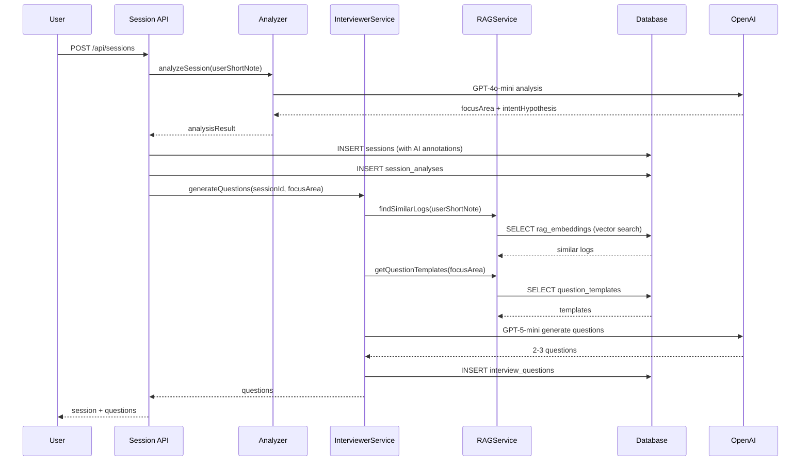

# MUEDnote Phase 1.3 実装計画書

**バージョン**: 1.0.0
**作成日**: 2025-11-20
**対象**: InterviewerService + RAGService + Interview API
**想定期間**: 10日間（Day 11-20）

---

## エグゼクティブサマリー

Phase 1.3では、Session/Analyzerの基盤の上に、AI Interview機能とRAG検索を実装します。

### 主要目標

1. **InterviewerService**: AnalyzerのfocusAreaに基づいた質問生成
2. **RAGService**: 過去ログとテンプレートの埋め込み検索
3. **Interview API**: 質問生成・回答保存・履歴取得
4. **統合**: Session → Analyzer → Interview の完全なフロー

### 前提条件（Phase 1.2で完了）

- ✅ AnalyzerService実装済み
- ✅ Session CRUD API実装済み
- ✅ データベーススキーマ（sessions, session_analyses）
- ✅ 41/41 tests passing

---

## 1. Phase 1.3 アーキテクチャ概要



---

## 2. 実装スコープ

### 2.1 InterviewerService

**ファイル**: `lib/services/interviewer.service.ts`

**機能**:
- focusAreaに基づいた質問生成
- RAGServiceとの統合（過去ログ検索）
- 質問テンプレートシステム
- フォールバック処理（API失敗時）

**入力**:
```typescript
interface GenerateQuestionsInput {
  sessionId: string;
  focusArea: 'harmony' | 'melody' | 'rhythm' | 'mix' | 'emotion' | 'image' | 'structure';
  intentHypothesis: string;
  userShortNote: string;
}
```

**出力**:
```typescript
interface GenerateQuestionsOutput {
  questions: InterviewQuestion[];
  confidence: number; // 0.0-1.0
  generationMethod: 'ai' | 'template' | 'fallback';
}
```

### 2.2 RAGService

**ファイル**: `lib/services/rag.service.ts`

**機能**:
- OpenAI Embeddings API統合
- 類似ログ検索（pgvector）
- 質問テンプレート検索
- 埋め込みキャッシュ

**主要メソッド**:
```typescript
class RAGService {
  async findSimilarLogs(query: string, limit: number = 5): Promise<SimilarLog[]>;
  async getQuestionTemplates(focusArea: string): Promise<QuestionTemplate[]>;
  async generateEmbedding(text: string): Promise<number[]>;
  async upsertEmbedding(logId: string, embedding: number[]): Promise<void>;
}
```

### 2.3 Interview API

#### POST /api/interview/questions

**目的**: セッションの質問を生成

**リクエスト**:
```json
{
  "sessionId": "uuid"
}
```

**レスポンス**:
```json
{
  "questions": [
    {
      "id": "uuid",
      "sessionId": "uuid",
      "text": "コード進行を変更した理由は何ですか？",
      "focus": "harmony",
      "depth": "medium",
      "order": 0
    }
  ],
  "generationMethod": "ai"
}
```

#### POST /api/interview/answers

**目的**: ユーザーの回答を保存

**リクエスト**:
```json
{
  "questionId": "uuid",
  "text": "サビへの流れを滑らかにするため"
}
```

**レスポンス**:
```json
{
  "answer": {
    "id": "uuid",
    "questionId": "uuid",
    "text": "サビへの流れを滑らかにするため",
    "aiInsights": {
      "keyPhrases": ["サビ", "流れ", "滑らか"],
      "emotionalTone": "analytical"
    }
  }
}
```

#### GET /api/interview/history

**目的**: セッションの質問・回答履歴取得

**Query Parameters**:
- `sessionId`: string (required)

**レスポンス**:
```json
{
  "qaPairs": [
    {
      "question": {...},
      "answer": {...}
    }
  ]
}
```

---

## 3. データベース拡張

### 3.1 rag_embeddings テーブル

```sql
CREATE TABLE IF NOT EXISTS rag_embeddings (
  id UUID PRIMARY KEY DEFAULT gen_random_uuid(),
  source_type TEXT NOT NULL, -- 'log_entry' | 'session' | 'template'
  source_id UUID NOT NULL,
  embedding VECTOR(1536), -- OpenAI ada-002 dimension
  metadata JSONB,
  created_at TIMESTAMPTZ DEFAULT NOW()
);

CREATE INDEX idx_rag_embeddings_source ON rag_embeddings(source_type, source_id);
CREATE INDEX idx_rag_embeddings_vector ON rag_embeddings USING ivfflat (embedding vector_cosine_ops);
```

### 3.2 question_templates テーブル

```sql
CREATE TABLE IF NOT EXISTS question_templates (
  id UUID PRIMARY KEY DEFAULT gen_random_uuid(),
  focus TEXT NOT NULL, -- harmony, melody, rhythm, etc.
  depth TEXT NOT NULL, -- shallow, medium, deep
  template_text TEXT NOT NULL,
  variables JSONB, -- {"{chord}": "placeholder for chord name"}
  priority INTEGER DEFAULT 0,
  created_at TIMESTAMPTZ DEFAULT NOW()
);

CREATE INDEX idx_question_templates_focus ON question_templates(focus, depth);
```

### 3.3 pgvector 拡張インストール

```sql
-- Neon PostgreSQL は標準で pgvector をサポート
CREATE EXTENSION IF NOT EXISTS vector;
```

---

## 4. 実装タスク一覧

### Day 11-13: InterviewerService実装

#### ✅ Task 1.1: InterviewerService基本構造
- [ ] `lib/services/interviewer.service.ts` 作成
- [ ] Zodスキーマ定義（入力・出力）
- [ ] シングルトンインスタンスエクスポート

#### ✅ Task 1.2: 質問生成ロジック
- [ ] OpenAI GPT-5-mini統合
- [ ] システムプロンプト設計（日本語）
- [ ] focusAreaベースの質問生成
- [ ] 2-3問の質問制限

#### ✅ Task 1.3: テンプレート質問システム
- [ ] question_templatesテーブルの初期データ作成
- [ ] テンプレート検索ロジック
- [ ] 変数置換ロジック（{chord} → "Fメジャー"）

#### ✅ Task 1.4: フォールバック処理
- [ ] API失敗時のデフォルト質問
- [ ] confidence計算ロジック
- [ ] エラーロギング

#### ✅ Task 1.5: ユニットテスト
- [ ] 質問生成テスト（全7 focusArea）
- [ ] テンプレートシステムテスト
- [ ] フォールバックテスト
- [ ] エッジケーステスト

### Day 14-16: RAGService実装

#### ✅ Task 2.1: RAGService基本構造
- [ ] `lib/services/rag.service.ts` 作成
- [ ] OpenAI Embeddings API統合
- [ ] エラーハンドリング

#### ✅ Task 2.2: データベーススキーマ
- [ ] `db/migrations/0012_add_rag_embeddings.sql` 作成
- [ ] `db/migrations/0013_add_question_templates.sql` 作成
- [ ] マイグレーション実行スクリプト

#### ✅ Task 2.3: 埋め込み生成
- [ ] `generateEmbedding(text: string)` 実装
- [ ] レート制限対応
- [ ] キャッシング戦略

#### ✅ Task 2.4: 類似度検索
- [ ] `findSimilarLogs(query: string)` 実装
- [ ] pgvector クエリ最適化
- [ ] 結果フィルタリング

#### ✅ Task 2.5: ユニットテスト
- [ ] 埋め込み生成テスト
- [ ] 類似度検索テスト
- [ ] テンプレート検索テスト

### Day 17-18: Interview API実装

#### ✅ Task 3.1: POST /api/interview/questions
- [ ] `app/api/interview/questions/route.ts` 作成
- [ ] InterviewerServiceとの統合
- [ ] バリデーション（sessionId存在チェック）
- [ ] レスポンス形式

#### ✅ Task 3.2: POST /api/interview/answers
- [ ] `app/api/interview/answers/route.ts` 作成
- [ ] 回答保存ロジック
- [ ] AI insights生成（キーフレーズ抽出）
- [ ] トランザクション処理

#### ✅ Task 3.3: GET /api/interview/history
- [ ] `app/api/interview/history/route.ts` 作成
- [ ] Q&Aペア結合クエリ
- [ ] ページネーション対応

#### ✅ Task 3.4: 統合テスト
- [ ] `tests/integration/api/interview-api.test.ts` 作成
- [ ] 質問生成APIテスト
- [ ] 回答保存APIテスト
- [ ] 履歴取得APIテスト

### Day 19-20: 統合テスト

#### ✅ Task 4.1: エンドツーエンドフロー
- [ ] Session作成 → Analyzer → Interview フロー
- [ ] RAG蓄積 → 検索フロー
- [ ] `tests/e2e/muednote-phase1.3.spec.ts` 作成

#### ✅ Task 4.2: パフォーマンステスト
- [ ] RAG検索レスポンス時間測定（< 500ms）
- [ ] 質問生成時間測定（< 3秒）
- [ ] データベースクエリ最適化

#### ✅ Task 4.3: ドキュメント
- [ ] API仕様書更新
- [ ] README.md更新
- [ ] 実装サマリー作成

---

## 5. 技術仕様

### 5.1 質問生成プロンプト（日本語）

```typescript
const INTERVIEWER_SYSTEM_PROMPT = `あなたは音楽制作プロセスを深掘りするAIインタビュアーです。

**役割**:
ユーザーが記録した制作ログから、2〜3問の質問を生成してください。

**質問設計の原則**:
1. **focusAreaに沿った質問**:
   - harmony: コード進行、調性、和音の選択理由
   - melody: フレーズ、音域、メロディラインの意図
   - rhythm: グルーブ、リズムパターン、テンポの変更理由
   - mix: 音量バランス、EQ、エフェクトの狙い
   - emotion: 表現したい感情、雰囲気、聴き手の反応
   - image: 音像、空間、広がりのイメージ
   - structure: 構成、展開、セクション配置の意図

2. **深さのバランス**:
   - 1問目: shallow（事実確認）
   - 2問目: medium（意図確認）
   - 3問目: deep（哲学的問い）

3. **自然な日本語**:
   - 親しみやすく、威圧的でない
   - 開かれた質問（Yes/Noで答えられない）

**出力形式**:
必ずJSON形式で以下を返してください：
{
  "questions": [
    {
      "text": "質問文",
      "focus": "harmony",
      "depth": "medium"
    }
  ]
}`;
```

### 5.2 エラーハンドリング

```typescript
// InterviewerService
try {
  const questions = await generateQuestionsWithAI(...);
  return { questions, generationMethod: 'ai', confidence: 0.85 };
} catch (error) {
  logger.error('[InterviewerService] AI generation failed', { error });

  // Fallback: Use template questions
  const templates = await ragService.getQuestionTemplates(focusArea);
  if (templates.length > 0) {
    return { questions: templates, generationMethod: 'template', confidence: 0.5 };
  }

  // Fallback: Default generic questions
  return { questions: DEFAULT_QUESTIONS, generationMethod: 'fallback', confidence: 0.3 };
}
```

---

## 6. 成功指標（KPI）

| 指標 | 目標値 | 測定方法 |
|------|--------|----------|
| Interview質問生成成功率 | > 95% | APIログ分析 |
| RAG検索レスポンス時間 | < 500ms | パフォーマンス測定 |
| 質問の適切性（主観評価） | > 70% | 内部レビュー |
| 回答保存成功率 | > 99% | DB統計 |
| テストカバレッジ | > 80% | Vitest レポート |

---

## 7. リスク管理

### 技術リスク

| リスク | 対策 |
|--------|------|
| pgvector パフォーマンス低下 | インデックス最適化、キャッシング導入 |
| OpenAI APIコスト超過 | レート制限、使用量モニタリング |
| 質問の質が低い | テンプレートシステムのフォールバック |

### スケジュールリスク

| リスク | 対策 |
|--------|------|
| RAG統合の遅延 | MVP版ではRAGをオプションに |
| InterviewerService実装の遅延 | テンプレート質問で先行実装 |

---

## 8. 次のステップ（Phase 1.4）

Phase 1.3完了後、Phase 1.4でUI統合を実施：
- SessionList コンポーネント
- InterviewPanel コンポーネント
- TimelineWithSessions 統合

---

**作成者**: Claude Code
**最終更新**: 2025-11-20
