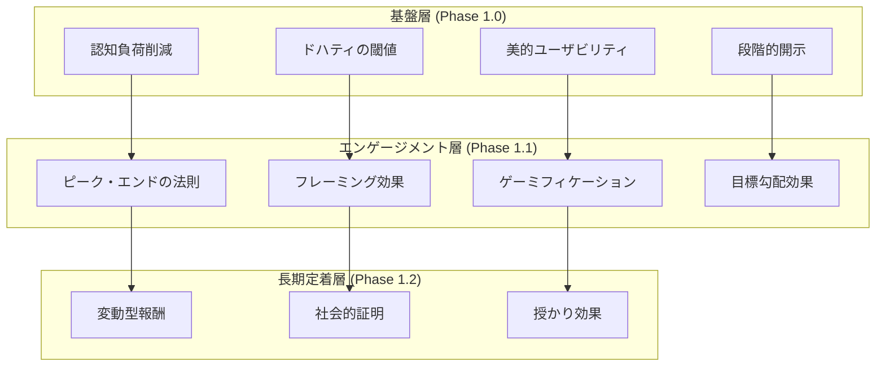
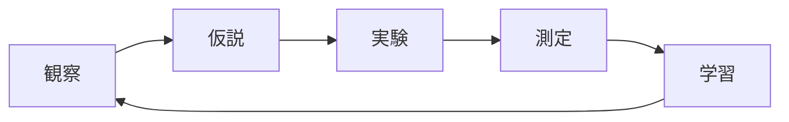
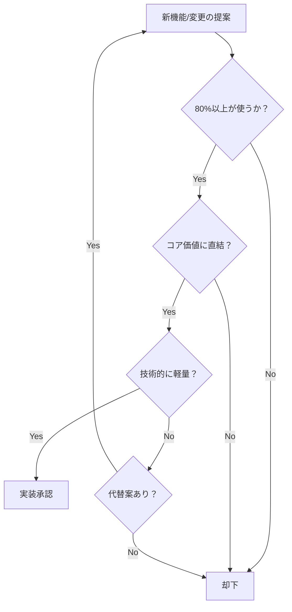

# MUEDnote UX設計原則

**Version**: 1.0.0
**Date**: 2025-11-19
**Status**: Design Guidelines
**Project**: MUEDnote チャット型音楽学習ログシステム

---

## 1. 基本理念

### 1.1 デザインビジョン

**「音楽学習を、もっと自然に、もっと楽しく」**

MUEDnoteは、音楽学習者の思考の流れを妨げることなく、自然に記録と整理ができる環境を提供します。

### 1.2 3つの柱

```
      シンプリシティ
           △
          /│\
         / │ \
        /  │  \
       /   │   \
      /    │    \
     /     │     \
    /      │      \
   /       │       \
  /_______|_______\
即時価値        感情的つながり
```

---

## 2. コア設計原則

### 2.1 シンプリシティ・ファースト

#### 原則
**「機能追加より機能削減を優先する」**

#### 実装指針

```typescript
// ❌ 避けるべき複雑な設計
interface ComplexInterface {
  title: string;
  category: Category;
  subcategory: Subcategory;
  tags: Tag[];
  priority: Priority;
  deadline: Date;
  assignee: User;
  // ... 20個以上のプロパティ
}

// ✅ 推奨するシンプルな設計
interface SimpleInterface {
  content: string;           // ユーザー入力
  timestamp: Date;          // 自動
  formattedContent?: string; // AI処理結果
}
```

#### 判断基準
- この機能は80%以上のユーザーが使うか？
- この機能なしでコア価値は提供できるか？
- 2クリック以内でアクセスできるか？

### 2.2 即時価値の提供

#### 原則
**「最初の10秒で価値を体感させる」**

#### 実装指針

1. **ゼロ設定スタート**
   ```typescript
   // ユーザー登録直後から即座に使える
   const QuickStart = () => {
     // 設定不要、説明不要
     return <ChatInput placeholder="さっそく記録を始めましょう" />;
   };
   ```

2. **0.4秒ルールの厳守**
   ```typescript
   // すべてのインタラクションは0.4秒以内にフィードバック
   const RESPONSE_DEADLINE = 400; // ms

   const handleUserAction = async (action: Action) => {
     const timer = setTimeout(() => {
       showLoadingIndicator();
     }, RESPONSE_DEADLINE);

     const result = await processAction(action);
     clearTimeout(timer);
     return result;
   };
   ```

3. **初回成功体験の演出**
   ```typescript
   // 最初の入力に対して特別な演出
   if (isFirstMessage) {
     return {
       response: formattedContent,
       celebration: "素晴らしい第一歩です！🎵",
       hint: "このように、あなたの記録が整理されます"
     };
   }
   ```

### 2.3 感情的つながりの創出

#### 原則
**「AIを道具ではなくパートナーとして感じさせる」**

#### 実装指針

1. **パーソナライズされた応答**
   ```typescript
   const generateResponse = (user: User, content: string) => {
     const personality = user.aiPersonality || 'friendly';
     const history = user.interactionHistory;

     return {
       content: formatWithPersonality(content, personality),
       tone: adaptToneBasedOnHistory(history),
       encouragement: generatePersonalEncouragement(user.progress)
     };
   };
   ```

2. **成長の可視化**
   ```typescript
   const GrowthVisualization = ({ progress }: Props) => {
     return (
       <div className="growth-chart">
         {/* 過去から現在への成長を美しく表現 */}
         <AnimatedChart data={progress} />
         <Milestone recent={progress.recentMilestone} />
         <NextGoal suggestion={progress.nextSuggestion} />
       </div>
     );
   };
   ```

---

## 3. 心理効果の戦略的活用

### 3.1 採用する心理効果マップ



### 3.2 効果の組み合わせ戦略

#### シナジー効果を生む組み合わせ

1. **認知負荷削減 × ドハティの閾値**
   - シンプルなUIで理解が早い
   - 高速レスポンスで思考が途切れない

2. **ピーク・エンド × フレーミング**
   - ポジティブな締めくくり
   - 前向きな表現で次回への期待

3. **ゲーミフィケーション × 目標勾配**
   - 進捗の可視化でモチベーション向上
   - ゴール近くでの加速感

---

## 4. アンチパターンと回避策

### 4.1 絶対に避けるべきダークパターン

#### ❌ 強制的な継続課金
```typescript
// 悪い例: キャンセルを困難にする
const BadCancellation = () => {
  // 10ステップ以上の確認
  // 感情的な脅し
  // 隠されたキャンセルボタン
};

// ✅ 良い例: 透明で公正な選択
const GoodCancellation = () => {
  return (
    <div>
      <Button variant="primary">継続する</Button>
      <Button variant="secondary">キャンセル</Button>
      <p>いつでも再開できます</p>
    </div>
  );
};
```

#### ❌ 偽の希少性
```typescript
// 悪い例: 嘘の在庫表示
const FakeScarcity = () => {
  return <Alert>残り3名！（実際は無制限）</Alert>;
};

// ✅ 良い例: 真実の価値提供
const RealValue = () => {
  return <Info>現在1,234名が利用中です</Info>;
};
```

#### ❌ 意図的な混乱
```typescript
// 悪い例: 紛らわしいボタン配置
const ConfusingButtons = () => {
  return (
    <>
      <Button color="gray">購入する</Button>
      <Button color="primary">キャンセル</Button>
    </>
  );
};
```

### 4.2 ユーザーの信頼を損なうパターン

| パターン | 問題点 | 代替策 |
|---------|-------|-------|
| 過度な通知 | 疲れとイライラ | スマート通知（重要度判定） |
| 強制チュートリアル | 離脱を招く | スキップ可能、段階的 |
| 過剰なゲーミフィケーション | 本質を見失う | 控えめで意味のある報酬 |
| 複雑な設定 | 使用開始の障壁 | デフォルトで最適化 |

---

## 5. アクセシビリティ原則

### 5.1 インクルーシブデザイン

```typescript
// すべてのユーザーが使えるデザイン
const AccessibleComponent = () => {
  return (
    <button
      aria-label="練習記録を送信"
      role="button"
      tabIndex={0}
      onKeyDown={handleKeyboard}
      className="focus:outline-2 focus:outline-blue-500"
    >
      <Icon aria-hidden="true" />
      <span>送信</span>
    </button>
  );
};
```

### 5.2 WCAG 2.1 AA準拠

- **色のコントラスト比**: 4.5:1以上
- **テキストサイズ**: 最小14px
- **タッチターゲット**: 最小44x44px
- **キーボード操作**: 100%対応

---

## 6. デバイス別最適化

### 6.1 モバイルファースト

```css
/* モバイルを基準に設計 */
.chat-container {
  /* モバイル (基準) */
  padding: 1rem;
  font-size: 16px; /* ズーム防止 */

  /* タブレット */
  @media (min-width: 768px) {
    padding: 2rem;
    max-width: 600px;
    margin: 0 auto;
  }

  /* デスクトップ */
  @media (min-width: 1024px) {
    max-width: 800px;
  }
}
```

### 6.2 タッチ最適化

```typescript
// タッチデバイスへの配慮
const TouchOptimized = () => {
  return (
    <div
      className="min-h-[44px] min-w-[44px]" // タッチターゲット
      onClick={handleClick}
      onTouchStart={handleTouchStart}
      onTouchEnd={handleTouchEnd}
    >
      {/* スワイプやジェスチャーへの対応 */}
    </div>
  );
};
```

---

## 7. パフォーマンス原則

### 7.1 Core Web Vitals最適化

| 指標 | 目標値 | 実装方法 |
|-----|-------|---------|
| LCP (Largest Contentful Paint) | < 2.5s | 画像最適化、CDN活用 |
| FID (First Input Delay) | < 100ms | メインスレッドの最適化 |
| CLS (Cumulative Layout Shift) | < 0.1 | サイズ予約、フォント最適化 |

### 7.2 体感速度の向上

```typescript
// 楽観的UI更新
const OptimisticUpdate = () => {
  const [messages, setMessages] = useState<Message[]>([]);

  const sendMessage = async (content: string) => {
    // 即座にUIを更新
    const tempMessage = { id: 'temp', content, status: 'sending' };
    setMessages(prev => [...prev, tempMessage]);

    try {
      const result = await api.send(content);
      // 成功時に正式なデータに置換
      setMessages(prev =>
        prev.map(m => m.id === 'temp' ? result : m)
      );
    } catch {
      // 失敗時はロールバック
      setMessages(prev => prev.filter(m => m.id !== 'temp'));
    }
  };
};
```

---

## 8. 測定と改善

### 8.1 KPIマトリクス

| カテゴリ | KPI | 目標値 | 測定方法 |
|---------|-----|-------|---------|
| **使いやすさ** | タスク完了率 | > 80% | ファネル分析 |
| **速度** | 体感速度スコア | > 90/100 | Lighthouse |
| **満足度** | NPS | > 50 | アンケート |
| **定着** | 7日リテンション | > 40% | コホート分析 |

### 8.2 継続的改善プロセス



---

## 9. デザインシステム

### 9.1 デザイントークン

```typescript
// design-tokens.ts
export const tokens = {
  // 色彩
  colors: {
    primary: {
      50: 'hsl(225, 73%, 97%)',
      500: 'hsl(225, 73%, 57%)',
      900: 'hsl(225, 73%, 20%)'
    },
    semantic: {
      success: 'hsl(142, 71%, 45%)',
      warning: 'hsl(38, 92%, 50%)',
      error: 'hsl(0, 84%, 60%)'
    }
  },

  // スペーシング（8pxグリッド）
  spacing: {
    xs: '0.5rem',  // 8px
    sm: '1rem',    // 16px
    md: '1.5rem',  // 24px
    lg: '2rem',    // 32px
    xl: '3rem'     // 48px
  },

  // タイポグラフィ
  typography: {
    fontFamily: {
      sans: 'Inter, system-ui, sans-serif',
      mono: 'JetBrains Mono, monospace'
    },
    fontSize: {
      xs: '0.75rem',   // 12px
      sm: '0.875rem',  // 14px
      base: '1rem',    // 16px
      lg: '1.125rem',  // 18px
      xl: '1.25rem'    // 20px
    }
  },

  // アニメーション
  animation: {
    duration: {
      instant: '100ms',
      fast: '200ms',
      normal: '300ms',
      slow: '500ms'
    },
    easing: {
      ease: 'cubic-bezier(0.4, 0, 0.2, 1)',
      easeIn: 'cubic-bezier(0.4, 0, 1, 1)',
      easeOut: 'cubic-bezier(0, 0, 0.2, 1)'
    }
  }
};
```

### 9.2 コンポーネントライブラリ

```typescript
// 一貫性のあるコンポーネント設計
export const Button = styled.button<{ variant: Variant }>`
  /* ベーススタイル */
  padding: ${tokens.spacing.sm} ${tokens.spacing.md};
  font-size: ${tokens.typography.fontSize.base};
  transition: all ${tokens.animation.duration.fast} ${tokens.animation.easing.ease};

  /* バリアント */
  ${props => props.variant === 'primary' && css`
    background: ${tokens.colors.primary[500]};
    color: white;

    &:hover {
      background: ${tokens.colors.primary[600]};
    }
  `}
`;
```

---

## 10. チーム向けガイドライン

### 10.1 デザインレビューチェックリスト

- [ ] シンプリシティ: 不要な要素はないか？
- [ ] 即時価値: 10秒以内に価値を提供できるか？
- [ ] 感情的つながり: ユーザーに共感を生むか？
- [ ] アクセシビリティ: すべてのユーザーが使えるか？
- [ ] パフォーマンス: 0.4秒ルールを守れているか？
- [ ] 一貫性: デザインシステムに準拠しているか？

### 10.2 意思決定フレームワーク



---

## 11. 参考資料とインスピレーション

### 11.1 推奨書籍
- 『Don't Make Me Think』- Steve Krug
- 『The Design of Everyday Things』- Don Norman
- 『Atomic Design』- Brad Frost

### 11.2 参考サービス
- **Notion**: シンプルさと機能性の両立
- **Linear**: 高速レスポンスの極致
- **Discord**: 感情的つながりの創出

### 11.3 デザインリソース
- [Laws of UX](https://lawsofux.com)
- [Refactoring UI](https://refactoringui.com)
- [Tailwind UI](https://tailwindui.com)

---

**作成者**: MUEDnote UXチーム
**承認者**: プロダクトオーナー
**最終更新**: 2025-11-19
**次回レビュー**: 2025-12-01

> "シンプルさは究極の洗練である" - レオナルド・ダ・ヴィンチ