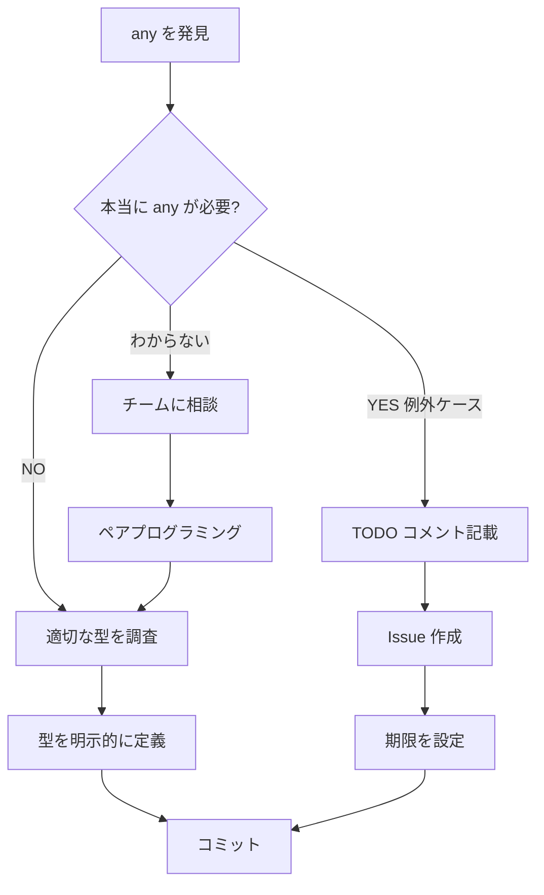

# TypeScript 厳格ルール

## 🚨 絶対禁止事項

### 1. `any` 型の使用禁止

**❌ 絶対にやってはいけないこと:**
```typescript
// ❌ BAD: とりあえず any で誤魔化す
handleSubmit(e as any);

// ❌ BAD: エラーを無視するための any
const data: any = await fetchData();

// ❌ BAD: 型定義が面倒だから any
function process(item: any) {
  // ...
}
```

**✅ 正しいアプローチ:**
```typescript
// ✅ GOOD: 適切な型を調査して使用
const form = e.currentTarget.form;
if (form) {
  form.requestSubmit();
}

// ✅ GOOD: 明示的な型定義
interface FetchResponse {
  data: UserData[];
  status: number;
}
const response: FetchResponse = await fetchData();

// ✅ GOOD: ジェネリクスまたは Union 型
function process<T extends BaseItem>(item: T) {
  // ...
}
```

---

## 📋 any を見つけたら即座に修正

### コーディング中

```bash
# リアルタイムで any をチェック
npm run lint -- --fix

# IDE 設定: any 使用時に赤線を表示
# .vscode/settings.json
{
  "typescript.tsdk": "node_modules/typescript/lib",
  "editor.codeActionsOnSave": {
    "source.fixAll.eslint": true
  }
}
```

### コミット前

```bash
# Pre-commit hook で any を検出
# .husky/pre-commit
#!/bin/sh
if git diff --cached --name-only | grep -E '\.(ts|tsx)$' | xargs grep -n 'any' --color; then
  echo "❌ ERROR: 'any' type found in staged files!"
  echo "Please replace 'any' with proper types before committing."
  exit 1
fi
```

### PR レビュー時

```yaml
# GitHub Actions で any を検出
- name: Check for any types
  run: |
    if grep -r "any" --include="*.ts" --include="*.tsx" --exclude-dir="node_modules" .; then
      echo "::error::Found 'any' types in codebase"
      exit 1
    fi
```

---

## 🎯 any の正しい代替パターン

### Pattern 1: イベントハンドラの型キャスト

```typescript
// ❌ BAD
handleSubmit(e as any);

// ✅ GOOD: 適切なイベントを使用
const form = e.currentTarget.form;
if (form) {
  form.requestSubmit();
}

// ✅ GOOD: 型ガードを使用
if (e.target instanceof HTMLFormElement) {
  handleSubmit(e);
}
```

### Pattern 2: 外部ライブラリの型不明

```typescript
// ❌ BAD
const result: any = externalLib.doSomething();

// ✅ GOOD: unknown を使用してから型ガード
const result: unknown = externalLib.doSomething();
if (isValidResult(result)) {
  // result は ValidResult 型として扱える
}

// ✅ GOOD: 型定義を作成
interface ExternalLibResult {
  status: 'success' | 'error';
  data?: string;
}
const result: ExternalLibResult = externalLib.doSomething();
```

### Pattern 3: 動的なプロパティアクセス

```typescript
// ❌ BAD
const value = (obj as any)[dynamicKey];

// ✅ GOOD: Record 型を使用
const obj: Record<string, unknown> = { ... };
const value = obj[dynamicKey];

// ✅ GOOD: 型安全な keyof を使用
function getValue<T, K extends keyof T>(obj: T, key: K): T[K] {
  return obj[key];
}
```

### Pattern 4: テストのモック

```typescript
// ❌ BAD
const mockFn: any = vi.fn();

// ✅ GOOD: 明示的な型を指定
const mockFn: ReturnType<typeof vi.fn<[string], Promise<void>>> = vi.fn();

// ✅ GOOD: jest/vitest の型ヘルパーを使用
const mockFn = vi.fn<[string], Promise<void>>();
```

---

## 🔍 any が許される例外ケース（超限定的）

### 例外1: 外部ライブラリの型定義が壊れている場合

```typescript
// ⚠️ 例外: 外部ライブラリのバグで型が正しくない
// TODO コメントと issue リンク必須
// TODO: Replace with proper type when library fixes https://github.com/lib/issue/123
const result = externalLib.brokenMethod() as any as CorrectType;
```

### 例外2: 段階的な移行中（一時的）

```typescript
// ⚠️ 例外: レガシーコードの段階的移行
// FIXME: Remove 'any' by 2025-12-31
// Migration ticket: JIRA-1234
type LegacyData = any; // 一時的な型エイリアス
```

**重要: 例外ケースでも必ず以下を記載:**
- `TODO` または `FIXME` コメント
- 期限または issue リンク
- 理由の明記

---

## 📊 定期的な any 監査

### 週次チェック

```bash
# any の使用箇所を集計
grep -r "any" --include="*.ts" --include="*.tsx" --exclude-dir="node_modules" . | wc -l

# ファイル別の any 使用数
grep -r "any" --include="*.ts" --include="*.tsx" --exclude-dir="node_modules" . \
  | cut -d: -f1 | sort | uniq -c | sort -rn | head -20
```

### 目標

| 期間 | 目標 |
|------|------|
| 即座 | 新規コードで any 禁止 |
| 1週間 | 既存の any を 50% 削減 |
| 1ヶ月 | any の完全排除（例外除く） |

---

## 🎓 学習リソース

- [TypeScript Deep Dive - Type System](https://basarat.gitbook.io/typescript/)
- [Effective TypeScript: 62 Specific Ways](https://effectivetypescript.com/)
- [TypeScript Handbook - Narrowing](https://www.typescriptlang.org/docs/handbook/2/narrowing.html)

---

## 💡 any を見つけたときの行動フロー



---

**最終更新**: 2025-11-19
**作成理由**: `any` による技術的負債の蓄積を防ぐため
**適用範囲**: 全 TypeScript/React コード
**違反時の対応**: PR レビューで即座に修正要求
