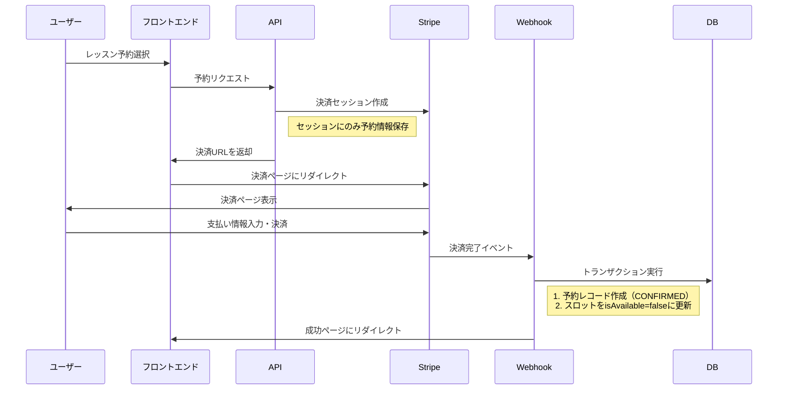
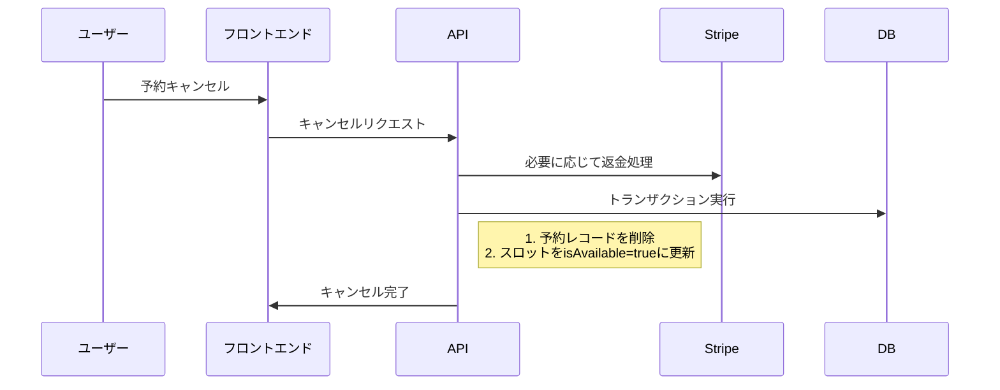

# 予約システム設計原則 (Reservation Schema)

## 基本原則

1. **予約と決済の同時処理**：
   - 予約完了 = 決済完了
   - 決済が完了しない限り、予約レコードは作成されない

2. **シンプルな状態管理**：
   - 予約状態は `CONFIRMED`（確定済み）と `COMPLETED`（完了）のみ
   - 支払い状態は不要（予約存在 = 支払い済み）

3. **スロット可用性の一元管理**：
   - レッスンスロットの `isAvailable` フラグのみで予約可能性を判断
   - キャンセル = スロットの `isAvailable` を `true` に戻す

## データモデル

```prisma
// 予約状態の簡素化
enum ReservationStatus {
  CONFIRMED  // 支払い完了 = 予約確定
  COMPLETED  // レッスン完了
}

model LessonSlot {
  id            String       @id @default(cuid())
  teacherId     String      
  teacher       User         @relation("TeacherSlots", fields: [teacherId], references: [id])
  startTime     DateTime    
  endTime       DateTime    
  isAvailable   Boolean      @default(true)  // 予約可能状態フラグ
  createdAt     DateTime     @default(now())
  updatedAt     DateTime     @updatedAt
  reservations  Reservation[]
  
  @@index([teacherId])
  @@index([startTime, endTime])
  @@map("lesson_slots")
}

model Reservation {
  id          String            @id @default(cuid())
  slotId      String           
  slot        LessonSlot        @relation(fields: [slotId], references: [id])
  studentId   String           
  student     User              @relation("StudentReservations", fields: [studentId], references: [id])
  status      ReservationStatus @default(CONFIRMED)  // 初期値は常にCONFIRMED
  paymentId   String            // Stripe PaymentIntent ID
  notes       String?           @db.Text
  createdAt   DateTime          @default(now())
  updatedAt   DateTime          @updatedAt
  
  @@index([slotId])
  @@index([studentId])
  @@index([status])
  @@map("reservations")
}
```

## 実装フロー

### 1. 予約プロセス



### 2. キャンセルプロセス



## 実装計画

1. **スキーマ変更**:
   - Prismaスキーマの更新（ReservationStatusの簡素化）
   - マイグレーション作成と適用

2. **API層の更新**:
   - 予約API（`POST /api/reservations`）の修正
   - Webhookハンドラ（`POST /api/webhooks/stripe`）の修正
   - キャンセルAPI（`DELETE /api/reservations/:id`）の実装

3. **フロントエンド更新**:
   - 予約フローのUI調整
   - 予約キャンセル機能の実装
   - 予約状態表示の簡素化

4. **テスト**:
   - エンドツーエンドの予約フローテスト
   - キャンセルフローテスト
   - エラー処理とエッジケースのテスト

## 主要変更点

1. **予約作成ロジック**:
   ```typescript
   // 変更前：予約を作成してから決済
   // 変更後：決済成功時のみ予約作成
   ```

2. **予約状態**:
   ```typescript
   // 変更前：PENDING, CONFIRMED, CANCELLED, COMPLETED
   // 変更後：CONFIRMED, COMPLETED のみ
   ```

3. **支払い状態**:
   ```typescript
   // 変更前：UNPAID, PROCESSING, PAID, REFUNDED, FAILED
   // 変更後：削除（予約存在 = 支払い済み）
   ```

4. **キャンセルロジック**:
   ```typescript
   // 変更前：予約を CANCELLED 状態に更新
   // 変更後：予約レコードを削除し、スロットを available に戻す
   ```
