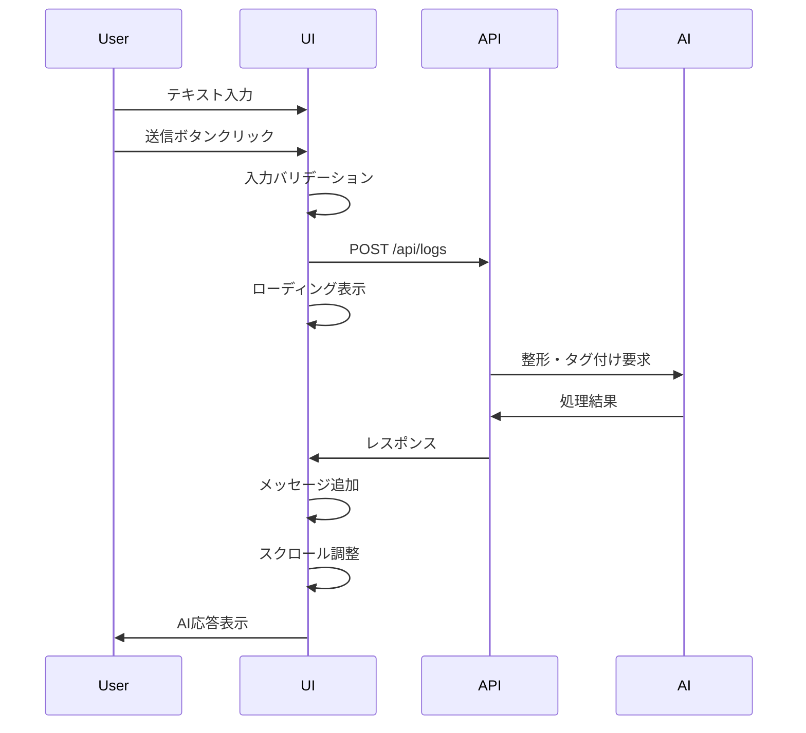

# MUEDnote チャットUI詳細設計書

**Version**: 1.0.0
**Date**: 2025-11-19
**Status**: Design Specification

---

## 1. デザイン理念

### 1.1 コアコンセプト

**「チャット一枚で完結する音楽学習ログ」**

- **Zero Learning Curve**: 説明不要の直感的インターフェース
- **Instant Value**: 入力した瞬間から価値を提供
- **Mobile First**: スマートフォンでの使い勝手を最優先

### 1.2 デザイン原則

1. **シンプルさ**: 機能を増やさず、本質に集中
2. **レスポンシブ**: あらゆるデバイスで快適に
3. **アクセシビリティ**: 誰もが使いやすく
4. **一貫性**: MUED全体のデザイン言語と調和

---

## 2. UIコンポーネント構成

### 2.1 全体レイアウト

```
┌─────────────────────────────────────────────────┐
│  Header                                         │
│  ┌───────────────────────────────────────────┐ │
│  │ MUEDnote          [人格設定] [メニュー]    │ │
│  └───────────────────────────────────────────┘ │
├─────────────────────────────────────────────────┤
│  Chat Area                                      │
│  ┌───────────────────────────────────────────┐ │
│  │                                           │ │
│  │  Message History (Scrollable)             │ │
│  │                                           │ │
│  │  ┌────────────────────────────────┐      │ │
│  │  │ User: 今日はコード進行の練習... │      │ │
│  │  └────────────────────────────────┘      │ │
│  │                                           │ │
│  │  ┌────────────────────────────────┐      │ │
│  │  │ AI: 整形済みテキスト           │      │ │
│  │  │ Tags: [コード進行] [練習]      │      │ │
│  │  │ コメント: いい進捗ですね       │      │ │
│  │  └────────────────────────────────┘      │ │
│  │                                           │ │
│  └───────────────────────────────────────────┘ │
├─────────────────────────────────────────────────┤
│  Input Area                                     │
│  ┌───────────────────────────────────────────┐ │
│  │ [入力フィールド]                   [送信] │ │
│  └───────────────────────────────────────────┘ │
└─────────────────────────────────────────────────┘
```

### 2.2 コンポーネント階層

```typescript
<ChatContainer>
  <ChatHeader>
    <Logo />
    <PersonalityButton />
    <MenuButton />
  </ChatHeader>

  <ChatBody>
    <MessageList>
      <MessageBubble type="user">
        <MessageText />
        <Timestamp />
      </MessageBubble>

      <MessageBubble type="ai">
        <FormattedText />
        <TagList />
        <AIComment />
        <QuestionPrompt />
        <Suggestion />
      </MessageBubble>
    </MessageList>
  </ChatBody>

  <ChatFooter>
    <InputField />
    <SendButton />
    <VoiceInputButton /> // 将来実装
  </ChatFooter>
</ChatContainer>
```

---

## 3. レスポンシブデザイン

### 3.1 ブレークポイント

| Device | Width | Layout | 特徴 |
|--------|-------|--------|------|
| Mobile S | 320px | Single | 最小限UI |
| Mobile M | 375px | Single | 標準モバイル |
| Mobile L | 425px | Single | 大画面モバイル |
| Tablet | 768px | Single+ | 拡張表示エリア |
| Laptop | 1024px | Dual | サイドバー追加 |
| Desktop | 1440px | Dual+ | フル機能 |

### 3.2 モバイルファースト設計

```css
/* Mobile First Base Styles */
.chat-container {
  display: flex;
  flex-direction: column;
  height: 100vh;
  width: 100%;
}

.chat-body {
  flex: 1;
  overflow-y: auto;
  padding: 1rem;
}

.chat-input {
  position: sticky;
  bottom: 0;
  padding: 1rem;
  background: white;
  border-top: 1px solid #e5e7eb;
}

/* Tablet and above */
@media (min-width: 768px) {
  .chat-body {
    padding: 2rem;
    max-width: 800px;
    margin: 0 auto;
  }
}

/* Desktop */
@media (min-width: 1024px) {
  .chat-container {
    display: grid;
    grid-template-columns: 300px 1fr;
  }

  .sidebar {
    display: block;
  }
}
```

---

## 4. インタラクション設計

### 4.1 メッセージ送信フロー



### 4.2 アニメーション仕様

```typescript
// メッセージ出現アニメーション
const messageAnimation = {
  initial: { opacity: 0, y: 20 },
  animate: { opacity: 1, y: 0 },
  transition: { duration: 0.3, ease: "easeOut" }
}

// タイピングインジケーター
const typingIndicator = {
  animate: {
    opacity: [0.4, 1, 0.4],
    transition: {
      duration: 1.5,
      repeat: Infinity,
      ease: "easeInOut"
    }
  }
}
```

---

## 5. カラーシステム

### 5.1 ライトテーマ

```css
:root {
  /* Primary Colors */
  --primary: #75bc11;        /* MUEDグリーン */
  --primary-hover: #65a20f;
  --primary-active: #559308;

  /* Message Colors */
  --user-bubble: #f3f4f6;
  --ai-bubble: #ffffff;
  --user-text: #111827;
  --ai-text: #374151;

  /* Background */
  --bg-primary: #ffffff;
  --bg-secondary: #f9fafb;

  /* Borders */
  --border-light: #e5e7eb;
  --border-medium: #d1d5db;

  /* Tags */
  --tag-bg: #e0f2fe;
  --tag-text: #0c4a6e;

  /* Status */
  --success: #10b981;
  --warning: #f59e0b;
  --error: #ef4444;
}
```

### 5.2 ダークテーマ（将来実装）

```css
[data-theme="dark"] {
  --primary: #86dc3d;
  --user-bubble: #374151;
  --ai-bubble: #1f2937;
  --bg-primary: #111827;
  --bg-secondary: #1f2937;
  --border-light: #374151;
  --user-text: #f9fafb;
  --ai-text: #e5e7eb;
}
```

---

## 6. タイポグラフィ

### 6.1 フォント階層

```css
/* Font Families */
--font-sans: -apple-system, BlinkMacSystemFont, "Segoe UI",
             "Hiragino Sans", "Yu Gothic", sans-serif;
--font-mono: "SF Mono", Monaco, Consolas, monospace;

/* Font Sizes */
--text-xs: 0.75rem;    /* 12px */
--text-sm: 0.875rem;   /* 14px */
--text-base: 1rem;     /* 16px */
--text-lg: 1.125rem;   /* 18px */
--text-xl: 1.25rem;    /* 20px */

/* Line Heights */
--leading-tight: 1.25;
--leading-normal: 1.5;
--leading-relaxed: 1.75;

/* Font Weights */
--font-normal: 400;
--font-medium: 500;
--font-semibold: 600;
--font-bold: 700;
```

### 6.2 使用例

```css
.message-text {
  font-family: var(--font-sans);
  font-size: var(--text-base);
  line-height: var(--leading-relaxed);
  color: var(--user-text);
}

.tag {
  font-family: var(--font-sans);
  font-size: var(--text-sm);
  font-weight: var(--font-medium);
  color: var(--tag-text);
}

.timestamp {
  font-family: var(--font-mono);
  font-size: var(--text-xs);
  color: var(--text-muted);
}
```

---

## 7. アクセシビリティ

### 7.1 WCAG 2.1 準拠

- **レベルAA準拠**: すべてのコア機能
- **キーボードナビゲーション**: 完全対応
- **スクリーンリーダー**: ARIA属性適切に設定
- **カラーコントラスト**: 4.5:1以上（通常テキスト）

### 7.2 ARIA実装例

```html
<!-- チャット入力 -->
<div role="textbox"
     aria-label="音楽活動を記録"
     aria-multiline="true"
     contenteditable="true">
</div>

<!-- メッセージリスト -->
<div role="log"
     aria-live="polite"
     aria-label="チャット履歴">
  <div role="article"
       aria-label="ユーザーメッセージ">
    <!-- content -->
  </div>
</div>

<!-- 送信ボタン -->
<button type="submit"
        aria-label="メッセージを送信"
        aria-keyshortcuts="Enter">
  送信
</button>
```

---

## 8. パフォーマンス最適化

### 8.1 仮想スクロール

```typescript
// 大量メッセージ対応
import { VirtualList } from '@tanstack/react-virtual';

function MessageList({ messages }) {
  const virtualizer = useVirtualizer({
    count: messages.length,
    getScrollElement: () => parentRef.current,
    estimateSize: () => 100, // 推定メッセージ高さ
    overscan: 5
  });

  return (
    <div ref={parentRef} className="chat-body">
      <div style={{ height: virtualizer.getTotalSize() }}>
        {virtualizer.getVirtualItems().map(virtualItem => (
          <MessageBubble
            key={virtualItem.key}
            message={messages[virtualItem.index]}
            style={{
              transform: `translateY(${virtualItem.start}px)`
            }}
          />
        ))}
      </div>
    </div>
  );
}
```

### 8.2 画像最適化

```typescript
// Next.js Image Optimization
import Image from 'next/image';

function UserAvatar({ src, alt }) {
  return (
    <Image
      src={src}
      alt={alt}
      width={40}
      height={40}
      quality={85}
      loading="lazy"
      placeholder="blur"
    />
  );
}
```

---

## 9. エラーハンドリング

### 9.1 エラー状態UI

```typescript
interface ErrorState {
  type: 'network' | 'validation' | 'ai' | 'rate-limit';
  message: string;
  retry?: () => void;
}

function ErrorMessage({ error }: { error: ErrorState }) {
  return (
    <div className="error-message" role="alert">
      <Icon name={getErrorIcon(error.type)} />
      <p>{error.message}</p>
      {error.retry && (
        <button onClick={error.retry}>
          再試行
        </button>
      )}
    </div>
  );
}
```

### 9.2 フォールバック処理

```typescript
// オフライン時のローカル保存
function saveToLocalStorage(message: string) {
  const pendingMessages = JSON.parse(
    localStorage.getItem('pendingMessages') || '[]'
  );
  pendingMessages.push({
    content: message,
    timestamp: new Date().toISOString()
  });
  localStorage.setItem('pendingMessages', JSON.stringify(pendingMessages));
}
```

---

## 10. テスト戦略

### 10.1 コンポーネントテスト

```typescript
// Vitest + Testing Library
describe('ChatInput', () => {
  it('should handle text input', async () => {
    const { getByRole } = render(<ChatInput />);
    const input = getByRole('textbox');

    await userEvent.type(input, 'テスト入力');
    expect(input).toHaveValue('テスト入力');
  });

  it('should submit on Enter key', async () => {
    const onSubmit = vi.fn();
    const { getByRole } = render(<ChatInput onSubmit={onSubmit} />);

    const input = getByRole('textbox');
    await userEvent.type(input, 'テスト{enter}');

    expect(onSubmit).toHaveBeenCalledWith('テスト');
  });
});
```

### 10.2 E2Eテスト

```typescript
// Playwright
test('complete chat flow', async ({ page }) => {
  await page.goto('/muednote');

  // メッセージ送信
  await page.fill('[role="textbox"]', '今日はコード進行の練習');
  await page.click('[aria-label="送信"]');

  // AI応答を待つ
  await page.waitForSelector('.ai-message', { timeout: 5000 });

  // タグが生成されていることを確認
  const tags = await page.$$('.tag');
  expect(tags.length).toBeGreaterThan(0);
});
```

---

## 改訂履歴

- v1.0.0 (2025-11-19): 初版作成

## 関連ドキュメント

- [MUEDnote_Specification_v2.md](../business/MUEDnote_Specification_v2.md)
- [muednote-ai-personality.md](./muednote-ai-personality.md)
- [PHASE1_CHECKLIST.md](../implementation/PHASE1_CHECKLIST.md)