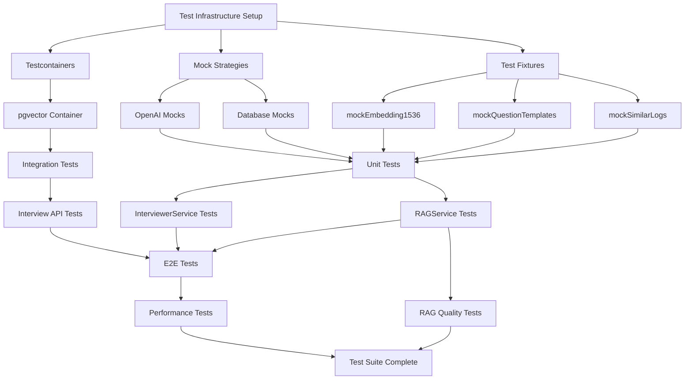

# Phase 1.3 Test Architecture

**Visual guide to test structure, dependencies, and execution flow**

---

## Test Pyramid

```
                    E2E Tests (5)
                  /               \
              5 complete flow tests
            /                       \
      Integration Tests (15)
    /                           \
  Interview API tests
 /                               \
Unit Tests (47)
├── InterviewerService (29)
└── RAGService (18)

Performance Tests (8)     RAG Quality Tests (6)
├── Latency metrics       ├── Recall@5
├── Load testing          ├── MRR
└── DB connection pool    └── Semantic eval
```

**Total: 81 tests**

---

## Test Dependency Graph



---

## Test Execution Flow

### Phase 1: Setup (Day 11)

```
┌─────────────────────────────────────────┐
│ 1. Install Dependencies                 │
│    - @testcontainers/postgresql         │
│    - k6 (load testing)                  │
└─────────────────────────────────────────┘
                ↓
┌─────────────────────────────────────────┐
│ 2. Create Test Infrastructure           │
│    - tests/setup/testcontainers.setup.ts│
│    - tests/fixtures/phase1.3-fixtures.ts│
│    - lib/utils/test-performance.ts      │
└─────────────────────────────────────────┘
                ↓
┌─────────────────────────────────────────┐
│ 3. Setup CI/CD                          │
│    - Add pgvector service to GH Actions │
│    - Configure parallel test execution  │
└─────────────────────────────────────────┘
```

### Phase 2: Unit Tests (Day 12-16)

```
┌────────────────────────────────────────┐
│ Day 12-13: InterviewerService (29)    │
│ ├── 7 focusArea tests                 │
│ ├── 2 RAG integration tests           │
│ ├── 3 fallback tests                  │
│ ├── 5 edge case tests                 │
│ ├── 2 template variable tests         │
│ └── 10 error scenario tests           │
│                                        │
│ Target: 29/29 passing                 │
└────────────────────────────────────────┘
                ↓
┌────────────────────────────────────────┐
│ Day 14-16: RAGService (18)            │
│ ├── 5 embedding generation tests      │
│ ├── 4 vector search tests             │
│ ├── 2 template retrieval tests        │
│ ├── 3 error handling tests            │
│ └── 4 performance tests               │
│                                        │
│ Target: 18/18 passing                 │
└────────────────────────────────────────┘
```

### Phase 3: Integration Tests (Day 17-18)

```
┌────────────────────────────────────────┐
│ Day 17-18: Interview API (15)         │
│ ├── 5 POST /questions tests           │
│ ├── 3 POST /answers tests             │
│ ├── 3 GET /history tests              │
│ └── 4 edge case tests                 │
│                                        │
│ Uses: testcontainers (pgvector)       │
│ Target: 15/15 passing                 │
└────────────────────────────────────────┘
```

### Phase 4: E2E & Performance (Day 19-22)

```
┌────────────────────────────────────────┐
│ Day 19-20: E2E Tests (5)              │
│ ├── Complete flow test                │
│ ├── RAG-enhanced questions test       │
│ ├── Fallback handling test            │
│ ├── Performance test (<3s)            │
│ └── Accessibility test                │
│                                        │
│ Target: 5/5 passing                   │
└────────────────────────────────────────┘
                ↓
┌────────────────────────────────────────┐
│ Day 21-22: Performance Tests (8)      │
│ ├── RAG search <500ms (3 tests)       │
│ ├── Question generation <3s (2)       │
│ ├── Connection pool (1)               │
│ └── k6 load test (2 scenarios)        │
│                                        │
│ Target: 8/8 passing                   │
└────────────────────────────────────────┘
```

### Phase 5: RAG Quality (Day 23-25)

```
┌────────────────────────────────────────┐
│ Day 23-25: RAG Quality Tests (6)      │
│ ├── Recall@5 > 0.8 (2 tests)          │
│ ├── MRR > 0.7 (2 tests)               │
│ └── Semantic evaluation (2 tests)     │
│                                        │
│ Target: 6/6 passing                   │
└────────────────────────────────────────┘
```

---

## Test Infrastructure Architecture

```
┌─────────────────────────────────────────────────────────────┐
│                     CI/CD Pipeline (GitHub Actions)         │
│  ┌───────────────┐  ┌───────────────┐  ┌────────────────┐ │
│  │ Unit Tests    │  │ Integration   │  │ E2E Tests      │ │
│  │ (Vitest)      │  │ (Vitest +     │  │ (Playwright)   │ │
│  │               │  │ Testcontainers)│  │                │ │
│  │ 47 tests      │  │ 15 tests      │  │ 5 tests        │ │
│  └───────────────┘  └───────────────┘  └────────────────┘ │
│         ↓                   ↓                    ↓          │
│  ┌─────────────────────────────────────────────────────┐   │
│  │ Coverage Report (Vitest)                           │   │
│  │ Target: >85%                                       │   │
│  └─────────────────────────────────────────────────────┘   │
└─────────────────────────────────────────────────────────────┘
                              ↓
┌─────────────────────────────────────────────────────────────┐
│              Performance & Quality Metrics                   │
│  ┌────────────────┐         ┌────────────────┐             │
│  │ Performance    │         │ RAG Quality    │             │
│  │ - RAG <500ms   │         │ - Recall@5 >0.8│             │
│  │ - Gen <3s      │         │ - MRR >0.7     │             │
│  │ - P95 <1s      │         │ - Semantic OK  │             │
│  └────────────────┘         └────────────────┘             │
└─────────────────────────────────────────────────────────────┘
```

---

## Mock Strategy Layers

```
┌──────────────────────────────────────────────────────────┐
│ Layer 1: External API Mocks                              │
│ ┌──────────────┐  ┌──────────────┐                      │
│ │ OpenAI Chat  │  │ OpenAI       │                      │
│ │ Completions  │  │ Embeddings   │                      │
│ │              │  │              │                      │
│ │ Mock: JSON   │  │ Mock: 1536-  │                      │
│ │ questions    │  │ dim vector   │                      │
│ └──────────────┘  └──────────────┘                      │
└──────────────────────────────────────────────────────────┘
                         ↓
┌──────────────────────────────────────────────────────────┐
│ Layer 2: Database Mocks (Unit Tests)                     │
│ ┌──────────────┐  ┌──────────────┐  ┌────────────────┐ │
│ │ db.select()  │  │ db.insert()  │  │ db.execute()   │ │
│ │              │  │              │  │                │ │
│ │ Mock: Return │  │ Mock: Return │  │ Mock: pgvector │ │
│ │ templates    │  │ saved record │  │ search results │ │
│ └──────────────┘  └──────────────┘  └────────────────┘ │
└──────────────────────────────────────────────────────────┘
                         ↓
┌──────────────────────────────────────────────────────────┐
│ Layer 3: Real Database (Integration Tests)               │
│ ┌────────────────────────────────────────────────────┐  │
│ │ Testcontainers: pgvector/pgvector:pg16             │  │
│ │                                                     │  │
│ │ - Real PostgreSQL instance                         │  │
│ │ - Real pgvector extension                          │  │
│ │ - Migrations applied                               │  │
│ │ - Isolated per test suite                          │  │
│ └────────────────────────────────────────────────────┘  │
└──────────────────────────────────────────────────────────┘
```

---

## Data Flow in Tests

### Unit Test: InterviewerService

```
┌──────────────────────────────────────────────────────────┐
│ Test Input                                                │
│ {                                                        │
│   sessionId: 'test-123',                                 │
│   focusArea: 'harmony',                                  │
│   intentHypothesis: 'Test intent',                       │
│   userShortNote: 'Test note'                             │
│ }                                                        │
└──────────────────────────────────────────────────────────┘
                         ↓
┌──────────────────────────────────────────────────────────┐
│ Mock: ragService.findSimilarLogs()                       │
│ Returns: [{ sessionId: 'old-1', similarity: 0.85 }]      │
└──────────────────────────────────────────────────────────┘
                         ↓
┌──────────────────────────────────────────────────────────┐
│ Mock: openai.createChatCompletion()                      │
│ Returns: JSON with 2 questions                           │
└──────────────────────────────────────────────────────────┘
                         ↓
┌──────────────────────────────────────────────────────────┐
│ Assertions                                                │
│ - questions.length === 2                                 │
│ - questions[0].focus === 'harmony'                       │
│ - generationMethod === 'ai'                              │
│ - confidence >= 0.7                                      │
└──────────────────────────────────────────────────────────┘
```

### Integration Test: Interview API

```
┌──────────────────────────────────────────────────────────┐
│ Test Setup (beforeAll)                                    │
│ - Start testcontainer (pgvector:pg16)                    │
│ - Run migrations                                         │
│ - Seed test data (user, session)                         │
└──────────────────────────────────────────────────────────┘
                         ↓
┌──────────────────────────────────────────────────────────┐
│ Test Execution                                            │
│ POST /api/interview/questions                            │
│ Body: { sessionId: 'session-123' }                       │
└──────────────────────────────────────────────────────────┘
                         ↓
┌──────────────────────────────────────────────────────────┐
│ Real Flow (Mocked OpenAI only)                           │
│ 1. Fetch session from testcontainer DB                   │
│ 2. Call InterviewerService (mocked OpenAI)               │
│ 3. Save questions to testcontainer DB                    │
│ 4. Return response                                       │
└──────────────────────────────────────────────────────────┘
                         ↓
┌──────────────────────────────────────────────────────────┐
│ Assertions                                                │
│ - response.status === 200                                │
│ - DB query finds 2 saved questions                       │
│ - Question records have correct sessionId                │
└──────────────────────────────────────────────────────────┘
                         ↓
┌──────────────────────────────────────────────────────────┐
│ Test Cleanup (afterAll)                                   │
│ - Stop testcontainer                                      │
│ - Release database connection pool                        │
└──────────────────────────────────────────────────────────┘
```

### E2E Test: Complete Flow

```
┌──────────────────────────────────────────────────────────┐
│ Browser (Playwright)                                      │
│ Navigate to /muednote                                     │
└──────────────────────────────────────────────────────────┘
                         ↓
┌──────────────────────────────────────────────────────────┐
│ User Actions                                              │
│ 1. Click "新しいセッション"                               │
│ 2. Fill form (title, note, type)                         │
│ 3. Click "保存"                                           │
└──────────────────────────────────────────────────────────┘
                         ↓
┌──────────────────────────────────────────────────────────┐
│ Backend Flow (Real Next.js Server)                       │
│ POST /api/muednote/sessions                              │
│ ├── AnalyzerService (mocked OpenAI)                      │
│ └── Save to test database                                │
└──────────────────────────────────────────────────────────┘
                         ↓
┌──────────────────────────────────────────────────────────┐
│ User Actions (continued)                                  │
│ 4. Click "質問を生成"                                     │
│ 5. Wait for questions (measure time)                     │
└──────────────────────────────────────────────────────────┘
                         ↓
┌──────────────────────────────────────────────────────────┐
│ Backend Flow                                              │
│ POST /api/interview/questions                            │
│ ├── InterviewerService (mocked OpenAI)                   │
│ ├── RAGService (real pgvector search)                    │
│ └── Save to test database                                │
└──────────────────────────────────────────────────────────┘
                         ↓
┌──────────────────────────────────────────────────────────┐
│ Assertions                                                │
│ - Questions visible in UI                                │
│ - Generation time < 3000ms                               │
│ - Questions have correct focus area                      │
│ - RAG context indicator visible                          │
└──────────────────────────────────────────────────────────┘
```

---

## Performance Test Architecture

```
┌───────────────────────────────────────────────────────────┐
│ Performance Measurement Points                            │
│                                                           │
│  User Request                                             │
│      ↓                                                    │
│  [Measure Start] ─────────────┐                          │
│      ↓                         │                          │
│  RAG Search                    │ < 500ms                  │
│      ↓                         │                          │
│  [Measure RAG End] ────────────┘                          │
│      ↓                         │                          │
│  OpenAI API Call               │ < 2000ms                 │
│      ↓                         │                          │
│  [Measure OpenAI End] ─────────┘                          │
│      ↓                         │                          │
│  Database Save                 │ < 500ms                  │
│      ↓                         │                          │
│  [Measure Total End] ──────────┘ < 3000ms                │
│      ↓                                                    │
│  Response to User                                         │
└───────────────────────────────────────────────────────────┘

Load Test (k6)
┌───────────────────────────────────────────────────────────┐
│ Virtual Users: 1 → 10 → 50 → 100 → 0                     │
│               30s  1m   1m   1m   30s                     │
│                                                           │
│ Metrics Collected:                                        │
│ - P50, P95, P99 latency                                  │
│ - Requests per second                                     │
│ - Error rate                                              │
│ - Connection pool usage                                   │
└───────────────────────────────────────────────────────────┘
```

---

## Test Fixtures Structure

```
tests/fixtures/phase1.3-fixtures.ts
│
├── mockEmbedding1536()
│   └── Returns: number[1536]
│       - Pre-computed vector
│       - Deterministic values
│       - L2 normalized
│
├── mockSessionData
│   ├── Basic session
│   ├── With DAW metadata
│   └── With AI annotations
│
├── mockQuestionTemplates
│   ├── harmony × 3 depths
│   ├── melody × 3 depths
│   ├── rhythm × 3 depths
│   ├── mix × 3 depths
│   ├── emotion × 3 depths
│   ├── image × 3 depths
│   └── structure × 3 depths
│
├── mockSimilarLogs
│   ├── High similarity (>0.9)
│   ├── Medium similarity (0.7-0.9)
│   └── Low similarity (<0.7)
│
└── mockInterviewQuestions
    ├── Question objects
    └── Answer objects with AI insights
```

---

## Coverage Heat Map

```
Component               LoC    Tests  Coverage  Priority
═══════════════════════════════════════════════════════════
InterviewerService      300    29     ████████  Critical
  - generateQuestions   100    12     ████████
  - fallback logic      50     5      ████████
  - template system     80     4      ███████░
  - error handling      70     8      ████████

RAGService             400    18     ████████  Critical
  - generateEmbedding   100    5      ████████
  - findSimilarLogs     120    4      ████████
  - getTemplates        80     2      ████████
  - caching             100    7      ███████░

Interview API          250    15     ████████  High
  - POST /questions     90     5      ████████
  - POST /answers       80     3      ████████
  - GET /history        80     3      ████████

Database Migrations    100    0      ███░░░░░  Medium
  - 0012_rag_embeddings 50     0      ███░░░░░
  - 0013_templates      50     0      ███░░░░░

Overall                1050   81     ████████  85%
```

**Legend**: █ = covered, ░ = not covered

---

## Test Execution Commands Map

```
┌─────────────────────────────────────────────────────────┐
│ npm run test                                            │
│ └─> Runs all tests (unit + integration + E2E)          │
└─────────────────────────────────────────────────────────┘

┌─────────────────────────────────────────────────────────┐
│ npm run test:unit                                       │
│ └─> InterviewerService (29) + RAGService (18)          │
│     Fast execution (~10s)                               │
└─────────────────────────────────────────────────────────┘

┌─────────────────────────────────────────────────────────┐
│ npm run test:integration                                │
│ └─> Interview API (15)                                  │
│     Uses testcontainers (~60s startup + 30s tests)      │
└─────────────────────────────────────────────────────────┘

┌─────────────────────────────────────────────────────────┐
│ npm run test:e2e                                        │
│ └─> Complete flow (5)                                   │
│     Uses Playwright (~90s server startup + 120s tests)  │
└─────────────────────────────────────────────────────────┘

┌─────────────────────────────────────────────────────────┐
│ npm run test:performance                                │
│ └─> Latency + load tests (8)                           │
│     Uses real services (~5 minutes)                     │
└─────────────────────────────────────────────────────────┘

┌─────────────────────────────────────────────────────────┐
│ npm run test:coverage                                   │
│ └─> All tests + coverage report                        │
│     Outputs: coverage/lcov-report/index.html            │
└─────────────────────────────────────────────────────────┘

┌─────────────────────────────────────────────────────────┐
│ k6 run tests/performance/interview-load-test.js         │
│ └─> Load testing with 100 virtual users                │
│     Outputs: P95/P99 latencies, throughput              │
└─────────────────────────────────────────────────────────┘
```

---

## CI/CD Pipeline Flow

```
GitHub PR Created
       ↓
┌─────────────────────────────────────────┐
│ Job 1: Unit Tests                       │
│ - Install deps                          │
│ - Run npm run test:unit                 │
│ - Upload coverage to Codecov            │
│ Duration: ~3 minutes                    │
└─────────────────────────────────────────┘
       ↓
┌─────────────────────────────────────────┐
│ Job 2: Integration Tests                │
│ - Start pgvector container              │
│ - Run migrations                        │
│ - Run npm run test:integration          │
│ Duration: ~5 minutes                    │
└─────────────────────────────────────────┘
       ↓
┌─────────────────────────────────────────┐
│ Job 3: E2E Tests                        │
│ - Start Next.js server                  │
│ - Install Playwright browsers           │
│ - Run npm run test:e2e                  │
│ - Upload Playwright report              │
│ Duration: ~8 minutes                    │
└─────────────────────────────────────────┘
       ↓
┌─────────────────────────────────────────┐
│ Job 4: Performance Tests (Optional)     │
│ - Run performance benchmarks            │
│ - Compare against baseline              │
│ - Fail if regression detected           │
│ Duration: ~10 minutes                   │
└─────────────────────────────────────────┘
       ↓
All Jobs Pass ✓
       ↓
PR Ready for Review
```

**Total CI Time**: ~15-25 minutes (parallel execution)

---

## Related Documentation

- **Full Review**: `/docs/implementation/PHASE1.3_TEST_STRATEGY_REVIEW.md`
- **Quick Reference**: `/docs/implementation/PHASE1.3_TEST_QUICK_REFERENCE.md`
- **Summary**: `/docs/implementation/PHASE1.3_TEST_REVIEW_SUMMARY.md`
- **Implementation Plan**: `/docs/implementation/PHASE1.3_IMPLEMENTATION_PLAN.md`

---

**Last Updated**: 2025-11-20
**Status**: Ready for implementation
