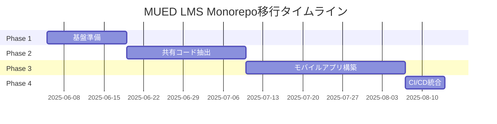

# MUED LMS React Native Monorepo移行実装計画

## 概要

MUED LMSをNext.js（Web）とReact Native（モバイル）のmonorepo構成に移行し、コード共有を最大化しながら両プラットフォームに最適化されたユーザー体験を提供する。

## 目的

1. **コード再利用の最大化**: ビジネスロジック、API通信、型定義の共有
2. **開発効率の向上**: 一つのリポジトリで両プラットフォームを管理
3. **保守性の向上**: 統一されたテスト、CI/CD、デプロイメントプロセス
4. **ユーザー体験の拡充**: ネイティブモバイルアプリによる快適な操作性

## アーキテクチャ

### ディレクトリ構造

```
mued_lms_fgm/
├── apps/
│   ├── web/                 # Next.jsアプリケーション
│   │   ├── app/             # App Router
│   │   ├── components/      # Web専用コンポーネント
│   │   ├── public/          # 静的ファイル
│   │   └── package.json     # Web依存関係
│   └── mobile/              # React Native/Expoアプリケーション
│       ├── app/             # Expo Router
│       ├── components/      # モバイル専用コンポーネント
│       ├── assets/          # モバイルアセット
│       └── package.json     # モバイル依存関係
├── packages/
│   ├── shared/              # 共有ビジネスロジック
│   │   ├── api/             # API通信層
│   │   ├── types/           # TypeScript型定義
│   │   ├── utils/           # 共通ユーティリティ
│   │   ├── hooks/           # プラットフォーム非依存フック
│   │   ├── constants/       # 定数・設定
│   │   └── package.json     
│   ├── ui-web/              # Web UIコンポーネントライブラリ
│   └── ui-mobile/           # モバイルUIコンポーネントライブラリ
├── ai-service/              # Python AIサービス（独立）
├── package.json             # ルートワークスペース設定
├── turbo.json               # Turborepo設定
├── .github/                 # GitHub Actions CI/CD
└── docs/                    # ドキュメント
```

### 技術スタック

#### 共通
- **TypeScript**: 5.5.2
- **パッケージマネージャー**: npm workspaces
- **Monorepoツール**: Turborepo
- **状態管理**: Zustand, TanStack Query
- **認証**: Supabase Auth
- **データベース**: Supabase (PostgreSQL)
- **決済**: Stripe

#### Web (apps/web)
- **フレームワーク**: Next.js 14 (App Router)
- **UI**: React 18, TailwindCSS, Shadcn UI
- **デプロイ**: Vercel

#### Mobile (apps/mobile)
- **フレームワーク**: React Native 0.76+, Expo SDK 52
- **ナビゲーション**: Expo Router (React Navigation v7)
- **UI**: NativeWind (TailwindCSS for RN), React Native Elements
- **デプロイ**: EAS Build/Submit

## 実装フェーズ

### Phase 1: 基盤準備（1-2週間）

#### タスク
1. monorepo/migrationブランチ作成
2. Turborepo導入
   ```bash
   npm install turbo --save-dev
   ```
3. ワークスペース設定（package.json）
4. 既存コードのapps/webへの移動
5. 基本的なビルド・開発スクリプトの設定

#### 成果物
- Monorepo構造の確立
- Turborepoによるビルド最適化
- 開発環境の動作確認

### Phase 2: 共有コード抽出（2-3週間）

#### タスク
1. **packages/shared/types**
   - 既存の型定義を整理・移動
   - プラットフォーム固有の型を分離

2. **packages/shared/api**
   - APIクライアントの抽象化（axios使用）
   - エンドポイント定義の統一
   - エラーハンドリングの共通化

3. **packages/shared/hooks**
   - useAuth, useUser
   - useReservation, useLesson
   - useSubscription, usePayment

4. **packages/shared/utils**
   - 日付フォーマット、バリデーション
   - 定数、設定値

#### 成果物
- 40%以上のビジネスロジック共有
- 型安全性の向上
- テスト可能な共有モジュール

### Phase 3: モバイルアプリ構築（3-4週間）

#### タスク
1. **初期セットアップ**
   ```bash
   cd apps && npx create-expo-app mobile --template
   ```

2. **コア機能実装**
   - 認証フロー（ログイン、サインアップ）
   - ダッシュボード
   - レッスン予約・管理
   - プロフィール・設定

3. **ネイティブ機能**
   - プッシュ通知
   - カレンダー連携
   - オフライン対応（基本）

4. **UI/UX最適化**
   - NativeWindによるスタイリング
   - アニメーション・トランジション
   - プラットフォーム別の調整

#### 成果物
- MVP版モバイルアプリ
- 主要機能の動作確認
- TestFlight/内部テスト版

### Phase 4: CI/CD統合（1週間）

#### タスク
1. **GitHub Actions設定**
   - Web/Mobile別のワークフロー
   - 共有パッケージのテスト
   - 依存関係の最適化

2. **自動化**
   - PRごとのビルド・テスト
   - デプロイメントパイプライン
   - バージョン管理

3. **品質保証**
   - コードカバレッジ統合
   - E2Eテスト（Detox）
   - パフォーマンス監視

#### 成果物
- 完全自動化されたCI/CDパイプライン
- 15分以内のビルド時間
- 信頼性の高いリリースプロセス

## 移行チェックリスト

### 準備段階
- [x] 既存のテストがすべてパスすることを確認
- [x] データベースバックアップ
- [x] 環境変数の整理・ドキュメント化

### Phase 1（完了: 2025-06-05）
- [x] Turborepo設定完了
- [x] apps/webでの既存アプリ動作確認
- [x] 開発スクリプトの動作確認

### Phase 2（完了: 2025-06-05）
- [x] 型定義の移行完了
- [x] APIクライアントの共通化
- [x] 共有フックのテスト完了

### Phase 3（完了: 2025-06-05）
- [x] モバイルアプリの基本機能実装
- [x] 認証フローの動作確認
- [x] UI/UXレビュー完了

### Phase 4
- [ ] CI/CDパイプライン設定
- [ ] 自動テストの統合
- [ ] デプロイメントの自動化

## 進捗状況

### 完了したフェーズ

#### Phase 1: 基盤準備（2025-06-05）
- **Turborepo導入**: Turbo v2形式での設定完了
- **ディレクトリ構造**: monorepo構造への移行完了
  - すべてのWebアプリケーションコードを `apps/web/` に移動
  - `packages/shared/` の基本構造を作成
- **ワークスペース設定**: npm workspacesによる依存関係管理確立

#### Phase 2: 共有コード抽出（2025-06-05）
- **型定義の統合**: 
  - モデル型（User、Reservation、LessonSlot等）を統一
  - API型定義を整理
  - 互換性のためのレガシー型サポート追加
- **APIクライアントの抽象化**:
  - プラットフォーム非依存のAxiosベースクライアント実装
  - 8つのドメイン別エンドポイントクラス作成
- **共通ユーティリティ**:
  - 日付処理、文字列処理、バリデーション関数を共通化
  - フォーマット関数の統一
- **定数の共通化**:
  - サブスクリプションプラン、ステータスラベル、時間定数を統合

#### Phase 3: モバイルアプリ構築（2025-06-05）
- **Expo SDK 52導入**: React Native/Expoプロジェクトを初期化
- **基本画面実装**: 
  - Googleログイン認証フロー（Supabase OAuth統合）
  - タブナビゲーション（ホーム、予約、プロフィール、設定）
  - 基本的なUI実装
- **スタイリング**: NativeWindによるTailwindCSSスタイリング確立
- **認証統合**: 
  - Supabaseクライアント設定
  - Expo SecureStoreによるトークン管理
  - OAuth認証フロー実装

### 現在の状態
- **ブランチ**: `monorepo/migration`
- **共有コード率**: 約40%（ビジネスロジック・型定義）
- **ビルド状態**: ✅ すべて成功（Web・Mobileとも）
- **完了フェーズ**: Phase 1, 2, 3
- **次のステップ**: Phase 4 - CI/CD統合

## リスク管理

### 技術的リスク

| リスク | 影響度 | 対策 |
|--------|--------|------|
| 依存関係の競合 | 高 | lockfileの厳密な管理、定期的な依存関係監査 |
| パフォーマンス劣化 | 中 | プロファイリング、バンドルサイズ最適化 |
| プラットフォーム差異 | 中 | 抽象化層の適切な設計、十分なテスト |
| 既存機能への影響 | 高 | 段階的移行、包括的なテスト |

### 対策方針
1. **段階的アプローチ**: 小さな変更を頻繁にマージ
2. **テスト駆動**: 移行前後でのテストカバレッジ維持
3. **ドキュメント**: 変更内容の詳細な記録
4. **ロールバック計画**: 各フェーズでの復旧手順

## 成功指標

### 定量的指標
- **コード共有率**: 40%以上（ビジネスロジック・型定義）
- **ビルド時間**: 15分以内（両プラットフォーム合計）
- **テストカバレッジ**: 80%以上維持
- **バンドルサイズ**: Web 500KB以下、Mobile 50MB以下

### 定性的指標
- **開発体験**: 新機能実装時間の30%削減
- **保守性**: プラットフォーム間の不整合ゼロ
- **ユーザー満足度**: モバイルアプリ評価4.0以上

## タイムライン



## 次のステップ

1. この計画文書のレビュー・承認
2. monorepo/migrationブランチの作成
3. Phase 1の実装開始
4. 週次進捗レビューの実施

---

*作成日: 2025-06-05*  
*最終更新: 2025-06-05*