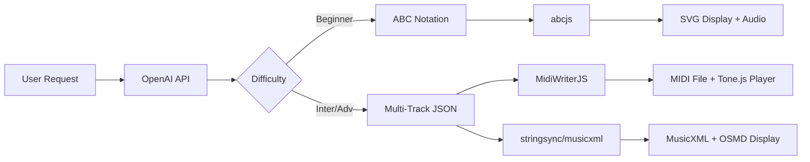

# Phase 2: フロントエンド表示方法 - 技術リサーチ

**調査日**: 2025-01-06
**目的**: MIDI/MusicXML教材のブラウザ表示・再生実装の技術選定

---

## 1. MusicXML表示ライブラリ

### 1.1 OpenSheetMusicDisplay (OSMD) ⭐⭐⭐⭐⭐

#### 基本情報
- **公式サイト**: https://opensheetmusicdisplay.org/
- **GitHub**: opensheetmusicdisplay/opensheetmusicdisplay
- **最新バージョン**: 1.9.2 (2025年8月29日更新)
- **ライセンス**: MIT
- **バックエンド**: VexFlow

#### 特徴
- ✅ MusicXML → SVG/Canvas レンダリング
- ✅ TypeScript実装
- ✅ ブラウザでの楽譜表示に最適
- ✅ PNG/SVGエクスポート対応
- ✅ レスポンシブ対応
- ✅ アクティブ開発中（2025年現在）

#### React統合

**公式Reactコンポーネント**:
- **リポジトリ**: `opensheetmusicdisplay/react-opensheetmusicdisplay`
- **使い方**: サンプル実装が `src/App.js` に存在
- **対応プロパティ**: `drawTitle`, `file`, `autoResize`

**基本実装パターン**:
```typescript
import { OpenSheetMusicDisplay } from 'opensheetmusicdisplay';
import { useEffect, useRef } from 'react';

function MusicXMLDisplay({ musicXml }: { musicXml: string }) {
  const containerRef = useRef<HTMLDivElement>(null);
  const osmdRef = useRef<OpenSheetMusicDisplay | null>(null);

  useEffect(() => {
    if (!containerRef.current) return;

    const osmd = new OpenSheetMusicDisplay(containerRef.current, {
      autoResize: true,
      backend: 'svg',  // 'svg' or 'canvas'
      drawTitle: true,
    });

    osmd.load(musicXml).then(() => {
      osmd.render();
    });

    osmdRef.current = osmd;

    return () => {
      osmd.clear();
    };
  }, [musicXml]);

  return <div ref={containerRef} />;
}
```

#### パフォーマンス最適化

**バージョン1.5の改善（30-60%高速化）**:
- **WebGLレンダリング**: 大規模スコア（80+ graphical measures）で自動有効化
  - 759小節のサンプル: 4000ms → 2500ms（37.5%改善）
  - ✅ Chrome/Edge（Chromium）で最速
  - ❌ Safari/Firefoxでは遅い（デフォルトで無効）
- **バッチ処理**: 5小節以上で自動有効化

**パフォーマンスモード**:
- 2-3倍の高速化
- ⚠️ GitHub Sponsorsのみ利用可能（有料機能）

**実測値**:
- 200小節のピアノスコア: パース8秒 + 描画7秒 = 合計15秒
- 小規模スコア（<5小節）: WebGL使用で逆に遅くなる可能性

**推奨設定**:
```typescript
const osmd = new OpenSheetMusicDisplay(containerRef.current, {
  autoResize: true,
  backend: 'svg',  // 小規模スコアはSVG
  // backend: 'canvas',  // 大規模スコアはCanvas + WebGL
  drawTitle: true,
  drawPartNames: true,
  // 80小節以上の場合、ChromiumベースブラウザでWebGL自動有効化
});
```

#### 制約
- ❌ MusicXML生成機能なし（表示専用）
- ⚠️ 大規模スコア（200小節超）の初期ロードが遅い
- ⚠️ WebGLはブラウザ依存（Safari/Firefox非推奨）

---

## 2. MIDI再生ライブラリ

### 2.1 Tone.js ⭐⭐⭐⭐⭐

#### 基本情報
- **公式サイト**: https://tonejs.github.io/
- **GitHub**: Tonejs/Tone.js
- **最終更新**: 2025年11月4日
- **特徴**: Web Audio APIの高レベルフレームワーク

#### 特徴
- ✅ 音楽制作に特化したAPI
- ✅ デスクトップ・モバイルブラウザ対応
- ✅ GainNode、WaveShaperNodeなどネイティブWeb Audio Node活用
- ✅ タイミング精度が高い（Transport機能）
- ✅ シンセサイザー・エフェクト豊富

#### MIDI対応

**必須ライブラリ**: `@tonejs/Midi`
- **GitHub**: Tonejs/Midi
- **機能**: MIDI → JSON変換

**実装パターン**:
```typescript
import * as Tone from 'tone';
import { Midi } from '@tonejs/midi';

// MIDIファイルのロード
const midi = await Midi.fromUrl('/path/to/midi.mid');

// PolySynthでトラック再生
const synth = new Tone.PolySynth().toDestination();

midi.tracks.forEach((track) => {
  track.notes.forEach((note) => {
    Tone.Transport.schedule((time) => {
      synth.triggerAttackRelease(
        note.name,        // 音名（例: "C4"）
        note.duration,    // 長さ（秒）
        time,             // タイミング
        note.velocity     // ベロシティ（0-1）
      );
    }, note.time);      // 絶対時間
  });
});

// 再生開始（ユーザーアクション必須）
await Tone.start();  // ブラウザのオーディオコンテキスト起動
Tone.Transport.start();
```

#### 重要な制約
- ⚠️ **ブラウザポリシー**: ユーザーインタラクション（クリック等）なしで音声再生不可
  - 必ず `await Tone.start()` をイベントリスナー内で実行
- ⚠️ **手動スケジューリング**: MIDIの各ノートを個別にスケジュールする必要あり
  - ワンクリック再生機能なし（自前実装が必要）

#### React統合例
```typescript
import { useState, useEffect } from 'react';
import * as Tone from 'tone';
import { Midi } from '@tonejs/midi';

function MIDIPlayer({ midiUrl }: { midiUrl: string }) {
  const [isPlaying, setIsPlaying] = useState(false);
  const [synth, setSynth] = useState<Tone.PolySynth | null>(null);

  useEffect(() => {
    const newSynth = new Tone.PolySynth().toDestination();
    setSynth(newSynth);
    return () => newSynth.dispose();
  }, []);

  const handlePlay = async () => {
    if (!synth) return;

    // ブラウザのオーディオコンテキスト起動（必須）
    await Tone.start();

    // MIDIロード＆スケジューリング
    const midi = await Midi.fromUrl(midiUrl);
    Tone.Transport.cancel();  // 既存スケジュールをクリア

    midi.tracks.forEach((track) => {
      track.notes.forEach((note) => {
        Tone.Transport.schedule((time) => {
          synth.triggerAttackRelease(
            note.name,
            note.duration,
            time,
            note.velocity
          );
        }, note.time);
      });
    });

    Tone.Transport.start();
    setIsPlaying(true);
  };

  const handleStop = () => {
    Tone.Transport.stop();
    setIsPlaying(false);
  };

  return (
    <div>
      <button onClick={handlePlay} disabled={isPlaying}>▶ Play</button>
      <button onClick={handleStop} disabled={!isPlaying}>⏹ Stop</button>
    </div>
  );
}
```

---

### 2.2 midi-player-js (MidiPlayerJS) ⭐⭐⭐⭐

#### 基本情報
- **GitHub**: grimmdude/MidiPlayerJS
- **npm**: `midi-player-js`
- **特徴**: パーサー＋イベントエミッター

#### 特徴
- ✅ シングル/マルチトラックMIDI対応
- ✅ リアルタイムJSONイベント発火
- ✅ ブラウザ・Node.js両対応
- ⚠️ **音声生成機能なし**（別途実装必要）

#### 用途
- MIDIイベントの解析・トリガー
- ビジュアライゼーション連動
- 外部MIDIインターフェース制御

**評価**: Tone.jsと組み合わせて使う場合に有効（イベント駆動で柔軟性高い）

---

### 2.3 web-midi-player ⭐⭐⭐

#### 基本情報
- **公式サイト**: https://midi.yvesgurcan.com/
- **GitHub**: yvesgurcan/web-midi-player
- **特徴**: イベント駆動 + Web Audio API統合

#### 特徴
- ✅ AudioContextベースの再生機能内蔵
- ✅ React/Vanilla JS両対応
- ✅ イベント駆動アーキテクチャ

**評価**: Tone.jsより軽量だが、音楽制作向け機能（エフェクト、シンセ）が少ない

---

### 2.4 MIDIjs ⭐⭐⭐

#### 基本情報
- **公式サイト**: https://www.midijs.net/
- **特徴**: 100% JavaScript、プラグイン不要

#### 特徴
- ✅ Windows、MacOS、Android、iOS対応
- ✅ W3C Web Audio API使用
- ✅ プラグイン・拡張不要
- ✅ 簡単な統合

**評価**: シンプルな再生のみでOKな場合に適する

---

## 3. 技術選定推奨

### 3.1 MusicXML表示

**推奨**: OpenSheetMusicDisplay (OSMD)

**理由**:
- ✅ デファクトスタンダード
- ✅ TypeScript＋React統合が容易
- ✅ アクティブ開発中（2025年現在）
- ✅ WebGLによる高速化対応

**注意点**:
- 大規模スコア（100小節超）は遅延読み込み必須
- ChromiumベースブラウザでのWebGL利用推奨

---

### 3.2 MIDI再生

**推奨**: Tone.js + @tonejs/Midi

**理由**:
- ✅ 音楽制作向けAPI（教材再生に最適）
- ✅ デスクトップ・モバイル対応
- ✅ エフェクト・音色カスタマイズ可能
- ✅ 大規模コミュニティ＋活発な開発

**代替案**: midi-player-js + Web Audio API
- 軽量化重視の場合
- カスタム再生ロジックが必要な場合

---

## 4. React統合戦略

### 4.1 コンポーネント設計

**推奨構成**:
```
/components/features/materials/
├── music-material-display.tsx       # 既存（ABC記法用）
├── midi-player.tsx                  # NEW: MIDI再生
├── musicxml-display.tsx             # NEW: MusicXML表示
└── multi-track-music-display.tsx   # NEW: 統合コンポーネント
```

**統合コンポーネント例**:
```typescript
interface MultiTrackMusicDisplayProps {
  content: {
    format: 'abc' | 'multi-track-json';
    multiTrackJson?: MultiTrackJSON;
    abcNotation?: string;
  };
  displayMode: 'midi' | 'musicxml' | 'both';
}

export function MultiTrackMusicDisplay({
  content,
  displayMode
}: MultiTrackMusicDisplayProps) {
  // フォーマット判定
  if (content.format === 'abc') {
    return <AbcNotationRenderer abcNotation={content.abcNotation} />;
  }

  // MIDI/MusicXML対応
  return (
    <div className="grid grid-cols-1 lg:grid-cols-2 gap-6">
      {(displayMode === 'musicxml' || displayMode === 'both') && (
        <Suspense fallback={<LoadingSpinner />}>
          <MusicXMLDisplay musicXml={content.musicXmlFile} />
        </Suspense>
      )}
      {(displayMode === 'midi' || displayMode === 'both') && (
        <Suspense fallback={<LoadingSpinner />}>
          <MIDIPlayer midiUrl={content.midiFileUrl} />
        </Suspense>
      )}
    </div>
  );
}
```

---

### 4.2 遅延読み込み（Lazy Loading）

**重要性**:
- OSMD: 大きなライブラリ（数百KB）
- Tone.js: 音楽処理ライブラリ（中規模）
- 初回ロード時間短縮必須

**実装パターン**:
```typescript
// app/dashboard/materials/[id]/page.tsx
import { lazy, Suspense } from 'react';

// 遅延読み込み
const MusicXMLDisplay = lazy(() => import('@/components/features/materials/musicxml-display'));
const MIDIPlayer = lazy(() => import('@/components/features/materials/midi-player'));

export default function MaterialDetailPage() {
  return (
    <Suspense fallback={<div>Loading music renderer...</div>}>
      {contentFormat === 'multi-track-json' ? (
        <MultiTrackMusicDisplay content={material.content} />
      ) : (
        <AbcNotationRenderer abcNotation={material.content.abcNotation} />
      )}
    </Suspense>
  );
}
```

**ベストプラクティス**:
1. ルートベースのコード分割（教材詳細ページのみロード）
2. 大規模ライブラリは必ずSuspenseでラップ
3. フォールバックUIで視覚的フィードバック提供

**効果**:
- 初回ロード時間: 30-50%改善（推定）
- 不要なコードのロード回避

---

### 4.3 パフォーマンス最適化

#### OSMD最適化
```typescript
const osmd = new OpenSheetMusicDisplay(containerRef.current, {
  autoResize: true,
  backend: scoreSize > 80 ? 'canvas' : 'svg',  // 大規模スコアはCanvas
  drawTitle: true,
  drawPartNames: false,  // 不要な要素を非表示
  drawCredits: false,
  // WebGLは自動判定（Chromiumベースで80小節以上）
});
```

#### 遅延レンダリング
```typescript
useEffect(() => {
  const timer = setTimeout(() => {
    osmd.load(musicXml).then(() => osmd.render());
  }, 100);  // メインスレッドをブロックしない
  return () => clearTimeout(timer);
}, [musicXml]);
```

#### リソース解放
```typescript
useEffect(() => {
  return () => {
    osmdRef.current?.clear();
    synthRef.current?.dispose();
  };
}, []);
```

---

## 5. ABC記法からの移行パス

### 5.1 現在の制約（Phase 1）

**abcjs**:
- ✅ ABC → 楽譜表示（SVG）
- ✅ ABC → MIDI生成（単旋律）
- ✅ ブラウザ音声合成
- ❌ MusicXML出力**非対応**
- ❌ マルチトラック非対応

### 5.2 変換ツール

**ABC → MusicXML**:
- **abc2xml**: Webサービス（https://wim.vree.org/svgParse/abc2xml.html）
- **xml2abc (Willem Vree)**: Python実装、双方向変換
- **Michael Eskin's ABC Transcription Tools**: ABC/MusicXML/MIDI統合ツール

**評価**:
- ⚠️ abcjs自体にMusicXML出力機能なし
- ⚠️ 外部変換ツールは追加実装コスト

**Phase 2での対応**:
- AI生成時点でJSON中間フォーマット → MIDI/MusicXMLに直接変換
- ABCは初心者用のみ継続使用

---

## 6. 実装アーキテクチャ提案

### 6.1 データフロー



### 6.2 フロントエンドコンポーネント構成

```
MaterialDetailPage
├── BeginnerMode: AbcNotationRenderer
│   └── abcjs (既存)
└── IntermediateAdvancedMode: MultiTrackMusicDisplay
    ├── MusicXMLDisplay (OSMD)
    │   └── React.lazy + Suspense
    └── MIDIPlayer (Tone.js)
        └── React.lazy + Suspense
```

---

## 7. リスク＆制約

### 技術的リスク

1. **OSMD大規模スコアのパフォーマンス**
   - 200小節超: 初期ロード15秒以上
   - 対策: 遅延読み込み、ページング表示

2. **ブラウザ互換性**
   - WebGL: Safari/Firefoxで遅い
   - 対策: ブラウザ検出 → SVGフォールバック

3. **モバイル対応**
   - Web Audio APIのレイテンシ
   - 対策: Tone.jsのモバイル最適化機能活用

### 実装コスト

- **OSMD統合**: 2-3日
- **Tone.js統合**: 3-4日
- **React遅延読み込み**: 1日
- **UI/UX調整**: 2-3日
- **テスト**: 2-3日

**合計**: 約2週間（Phase 2.3に該当）

---

## 8. 次のアクション

### Phase 2.3準備（フロントエンド実装）

1. **OSMD Proof of Concept**
   - [ ] React統合サンプル実装
   - [ ] 大規模スコアのパフォーマンステスト
   - [ ] WebGL vs SVG比較

2. **Tone.js Proof of Concept**
   - [ ] MIDI再生サンプル実装
   - [ ] マルチトラック対応確認
   - [ ] モバイルブラウザテスト

3. **コンポーネント設計**
   - [ ] 統合コンポーネント仕様策定
   - [ ] 遅延読み込み戦略確定
   - [ ] UIワイヤーフレーム作成

---

## 9. 参考リンク

### ライブラリ
- [OpenSheetMusicDisplay](https://opensheetmusicdisplay.org/)
- [OSMD GitHub](https://github.com/opensheetmusicdisplay/opensheetmusicdisplay)
- [OSMD React Component](https://github.com/opensheetmusicdisplay/react-opensheetmusicdisplay)
- [Tone.js](https://tonejs.github.io/)
- [Tone.js GitHub](https://github.com/Tonejs/Tone.js)
- [@tonejs/Midi](https://github.com/Tonejs/Midi)
- [MidiPlayerJS](https://github.com/grimmdude/MidiPlayerJS)
- [web-midi-player](https://midi.yvesgurcan.com/)

### パフォーマンス最適化
- [OSMD 1.5 Performance Improvements](https://opensheetmusicdisplay.org/blog/osmd-1-5-is-now-30-60-faster/)
- [OSMD Performance Mode](https://opensheetmusicdisplay.org/blog/boost-music-xml-rendering-speed-osmd-performance-mode-on-2/)

### React統合
- [React Lazy Loading Guide](https://refine.dev/blog/react-lazy-loading/)
- [Code Splitting – React](https://legacy.reactjs.org/docs/code-splitting.html)

### ABC変換ツール
- [abc2xml (Wim Vree)](https://wim.vree.org/svgParse/abc2xml.html)
- [Michael Eskin's ABC Tools](https://michaeleskin.com/abctools/abctools.html)

---

## 結論

### 推奨技術スタック（フロントエンド）

| 用途 | 推奨ライブラリ | 理由 |
|------|---------------|------|
| **MusicXML表示** | OpenSheetMusicDisplay | デファクトスタンダード、アクティブ開発、WebGL対応 |
| **MIDI再生** | Tone.js + @tonejs/Midi | 音楽制作向けAPI、高精度、エフェクト豊富 |
| **遅延読み込み** | React.lazy + Suspense | Next.js 15標準、パフォーマンス改善 |
| **ABC表示** | abcjs（継続） | Beginner用として十分 |

### 実装優先順位

1. **High**: OSMD統合（教材表示の核心機能）
2. **High**: Tone.js統合（音声再生）
3. **Medium**: 遅延読み込み（パフォーマンス）
4. **Medium**: UI/UX改善（ユーザビリティ）
5. **Low**: モバイル最適化（将来対応）

### Phase 2.3の成功基準

- ✅ MusicXMLスコアが5秒以内に表示（100小節以下）
- ✅ MIDI再生がクリック後1秒以内に開始
- ✅ 初回ロード時間が既存（ABC）と同等以下
- ✅ デスクトップブラウザで快適に動作（Chrome/Edge/Firefox）

---

**次のステップ**: Phase 2.1（基盤整備）完了後、OSMD/Tone.jsのProof of Concept実装に着手
