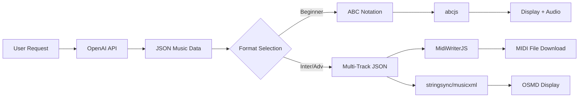

# Phase 2: MIDI/MusicXML対応 - 技術リサーチ

**調査日**: 2025-01-06
**目的**: Intermediate/Advanced教材向けMIDI/MusicXML生成・表示機能の実装計画策定

---

## 1. 技術スタック調査結果

### 1.1 MIDI生成ライブラリ（JavaScript/TypeScript）

#### 推奨：**MidiWriterJS** ⭐⭐⭐⭐⭐
- **npm**: `midi-writer-js`
- **GitHub**: grimmdude/MidiWriterJS
- **特徴**:
  - ✅ マルチトラック対応
  - ✅ TypeScript型定義あり
  - ✅ NoteEvent APIで簡潔に記述可能（NoteOn/NoteOff自動生成）
  - ✅ 複数出力形式（Data URI, Base64, ArrayBuffer）
  - ✅ アクティブ開発中（2025年時点）
  - ✅ VexFlowからのエクスポート対応
- **制約**:
  - なし（調査範囲では）

**評価**: 最も成熟しており、MUEDの要件（マルチトラック、表現力）に最適

#### 代替：**@PerryRylance/midi** ⭐⭐⭐⭐
- **特徴**:
  - ✅ 完全TypeScript実装
  - ✅ 型安全なMIDI構築
  - ✅ 無効なMIDIデータの生成を防ぐ
- **制約**:
  - 新しいライブラリ（成熟度が低い可能性）

**評価**: 型安全性重視の場合の選択肢

#### その他
- **jsmidgen**: 古い実装、128 ticks固定
- **midi-file**: 低レベルAPI、学習コスト高

---

### 1.2 MusicXML生成ライブラリ

#### 推奨：**stringsync/musicxml** ⭐⭐⭐⭐
- **特徴**:
  - ✅ TypeScript実装
  - ✅ プログラマティックなMusicXML構築
  - ✅ MusicXML仕様準拠の保証
  - ✅ パース＋編集＋シリアライズ
- **制約**:
  - ⚠️ API不安定（開発中）
  - ドキュメント不足

**評価**: TypeScript環境に最適だが、安定版待ち

#### 代替：**musicxml-interfaces** ⭐⭐⭐
- **特徴**:
  - ✅ 1:1 MusicXML-JSONマッピング
  - ✅ TypeScript型定義
- **制約**:
  - 3年更新なし（メンテナンス停止？）

---

### 1.3 MusicXML表示ライブラリ

#### 推奨：**OpenSheetMusicDisplay (OSMD)** ⭐⭐⭐⭐⭐
- **URL**: https://opensheetmusicdisplay.org/
- **特徴**:
  - ✅ TypeScript実装
  - ✅ ブラウザでMusicXMLをSVG表示
  - ✅ PNG/SVGエクスポート
  - ✅ レスポンシブ対応
  - ✅ アクティブ開発中
  - ✅ MIT License
- **制約**:
  - MusicXML生成機能なし（表示専用）

**評価**: フロントエンド表示に最適

---

### 1.4 ABC → MIDI/MusicXML変換

#### **abcjs** ⭐⭐⭐⭐⭐（既存実装）
- **現在使用中**: v6.5.2
- **MIDI機能**:
  - ✅ ABC → MIDIファイル生成
  - ✅ ブラウザ内音声合成（synth）
  - ✅ カスタムSoundFont対応
- **制約**:
  - ❌ マルチトラック非対応（単旋律のみ）
  - API複雑（v7.0で改善予定）

**評価**: Beginner教材には十分、Intermediate/Advancedには不足

#### **Verovio** ⭐⭐⭐⭐
- **バージョン**: 5.0 (2025)
- **特徴**:
  - ✅ ABC → MusicXML変換
  - ✅ MEI 5.1対応
  - ✅ MIDIタイムマップ出力改善
- **制約**:
  - WebAssemblyサイズ大（数MB）

---

## 2. AI生成アプローチ

### 2.1 現在のアプローチ（ABC記法）
```
OpenAI GPT-4 → ABC Notation (JSON) → abcjs → 楽譜表示 + 音声
```
- ✅ シンプル
- ❌ 単旋律限定

### 2.2 提案：JSON中間フォーマット
```
OpenAI GPT-4 → Structured JSON → MidiWriterJS → MIDI File
                                 ↘ stringsync/musicxml → MusicXML → OSMD表示
```

**JSON中間フォーマット例**:
```json
{
  "tracks": [
    {
      "instrument": "Violin I",
      "notes": [
        {"pitch": "D4", "duration": "quarter", "velocity": 80, "time": 0},
        {"pitch": "E4", "duration": "quarter", "velocity": 85, "time": 0.5}
      ]
    },
    {
      "instrument": "Violin II",
      "notes": [...]
    }
  ],
  "tempo": 120,
  "timeSignature": "4/4",
  "keySignature": "D minor"
}
```

### 2.3 AIによる直接MIDI生成の可能性

**調査結果**:
- ✅ GPT-4はMIDIバイナリをbase64で生成**できない**（OpenAI Structured OutputsはJSONのみ）
- ✅ GPT-4はJSON形式の音楽データ生成が**可能**
- ✅ MIDI Agent, LoopGPT等の既存ツールはJSON→MIDI変換を実装済み

**結論**: AI → JSON → MIDI変換が現実的

---

## 3. アーキテクチャ提案

### 3.1 データフロー



### 3.2 DBスキーマ拡張案

```typescript
// 既存
materials {
  id: uuid
  content: jsonb  // 現在はABC記法のみ
  type: text      // 'music'
  difficulty: text
}

// 拡張案
materials {
  id: uuid
  content: jsonb  // ABC または Multi-track JSON
  contentFormat: text  // 'abc' | 'multi-track-json'
  type: text
  difficulty: text
  // 新規フィールド
  midiFile: bytea | text(base64)  // 生成済みMIDIファイル
  musicXmlFile: text  // 生成済みMusicXML
  renderConfig: jsonb  // 表示設定（OSMD用）
}
```

### 3.3 フロントエンド実装案

#### Beginnerモード（既存）
```typescript
<AbcNotationRenderer abcNotation={content.abcNotation} />
```

#### Intermediate/Advancedモード（新規）
```typescript
<MultiTrackMusicDisplay
  content={content.multiTrackJson}
  format="midi" // or "musicxml"
/>

// 内部実装
- MIDI Player: Tone.js + MidiWriterJS
- Score Display: OSMD (MusicXML)
- ダウンロード: MIDI/MusicXML両対応
```

---

## 4. 実装フェーズ提案

### Phase 2.1: 基盤整備（2週間）
- [ ] DBスキーマ拡張
- [ ] MidiWriterJS統合
- [ ] JSON中間フォーマット定義
- [ ] 変換ロジック実装

### Phase 2.2: AI生成拡張（1週間）
- [ ] プロンプト改良（Multi-track JSON生成）
- [ ] バリデーション強化
- [ ] テスト教材生成

### Phase 2.3: フロントエンド実装（2週間）
- [ ] MIDI Player コンポーネント
- [ ] OSMD統合（MusicXML表示）
- [ ] ダウンロード機能
- [ ] UI/UX調整

### Phase 2.4: テスト＆改善（1週間）
- [ ] E2Eテスト
- [ ] パフォーマンス最適化
- [ ] ドキュメント作成

**総所要期間**: 約6週間

---

## 5. リスクと制約

### 技術的リスク
- ⚠️ stringsync/musicxml API不安定 → 代替策必要
- ⚠️ OSMD WebAssemblyサイズ → 遅延読み込み検討
- ⚠️ AI生成JSONの品質 → バリデーション強化必須

### 開発リソース
- MusicXML仕様の学習コスト高
- MIDI/MusicXML変換ロジックの複雑性

### 運用コスト
- ストレージ増加（MIDIファイル保存）
- AI生成トークン数増加（Multi-track JSON）

---

## 6. 次のアクション

### 即時対応
1. ✅ プロンプトに制限明記（完了）
2. ✅ 技術リサーチ（完了）
   - ✅ Step 1: MIDI/MusicXML生成技術調査（このドキュメント）
   - ✅ Step 2: フロントエンド表示方法調査（[phase2-frontend-display-research.md](./phase2-frontend-display-research.md)）

### Phase 2準備
1. [ ] MidiWriterJS Proof of Concept実装
2. [ ] Tone.js + OSMD Proof of Concept実装
3. [ ] JSON中間フォーマット仕様策定
4. [ ] DBマイグレーション計画
5. [ ] 詳細タスク分解

---

## 7. 参考リンク

- [MidiWriterJS](https://github.com/grimmdude/MidiWriterJS)
- [stringsync/musicxml](https://github.com/stringsync/musicxml)
- [OpenSheetMusicDisplay](https://opensheetmusicdisplay.org/)
- [abcjs Documentation](https://paulrosen.github.io/abcjs/)
- [OpenAI Structured Outputs](https://platform.openai.com/docs/guides/structured-outputs)
- [M6(GPT)3 Paper](https://arxiv.org/html/2409.12638)

---

**結論**:
- Beginner: ABC記法で十分（現状維持）
- Intermediate/Advanced: JSON中間フォーマット + MidiWriterJS/OSMD で実装可能
- 制約を受け入れない方針に沿った段階的実装が現実的
