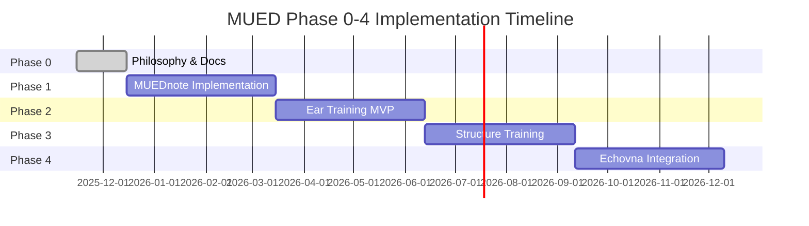

# MUED Development Roadmap - Phase 0-4

**Version**: 1.0
**Created**: 2025-11-15
**Period**: 2025年11月 - 2026年11月
**Focus**: Difference / Note / Form による音楽制作特化プラットフォーム構築

## Executive Summary

MUEDを「AI付き汎用LMS」から「音楽制作特化プラットフォーム」へ進化させる12ヶ月計画。Difference（耳）、Note（制作・学習ログ）、Form（構造）の3本柱を軸に、段階的に機能を実装します。

## Timeline Overview



## Phase Details

### 📋 Phase 0: 思想・ドキュメント統合
**期間**: 2025年11月15日 - 2025年12月15日（1ヶ月）
**状態**: 🟡 **進行中**

#### 目的
MUEDの思想（Difference/Note/Form）をリポジトリ全体に浸透させ、今後の開発の指針を確立する。

#### 主要成果物
| 成果物 | 状態 | 完了予定日 |
|-------|------|-----------|
| `/docs/PHILOSOPHY.md` | ✅ 完了 | 2025-11-15 |
| `/docs/roadmap.md` | ✅ 完了 | 2025-11-15 |
| `/docs/architecture.md` 更新 | ⬜ 未着手 | 2025-11-22 |
| ドメインモデル定義 | ⬜ 未着手 | 2025-11-29 |
| ビジネス文書統合 | ⬜ 未着手 | 2025-12-06 |

#### 完了条件
- [ ] PHILOSOPHY/architecture/roadmapの3文書が整合
- [ ] ClaudeCodeエージェントが新機能のフレーム判断可能
- [ ] 既存コードベースとの整合性確認完了

---

### 🎵 Phase 1: MUEDnote（Note）基盤実装
**期間**: 2025年12月16日 - 2026年3月15日（3ヶ月）
**状態**: 🟡 **進行中（60%完了）**

#### 目的
チャット型UIで音楽活動を自然言語記録し、AIが整形・タグ付けして資産化するシステムを構築する。

#### 主要機能
```typescript
// LogEntry Model
interface LogEntry {
  id: string
  userId: string
  type: 'lesson' | 'practice' | 'creation' | 'reflection' | 'system'
  targetId?: string  // 対象レッスン/教材/作品ID
  content: string    // Markdown/JSON
  aiSummary?: string // AI要約
  tags?: string[]
  emotion?: 'frustrated' | 'neutral' | 'satisfied' | 'excited'
  difficulty?: 1 | 2 | 3 | 4 | 5
  createdAt: Date
  updatedAt: Date
}
```

#### タスクリスト
- [ ] **Week 1-2**: データベース設計・マイグレーション
  - [ ] LogEntryテーブル作成
  - [ ] インデックス設計
  - [ ] AI人格システムテーブル（user_profile, user_memory）

- [ ] **Week 3-4**: Core API実装
  - [ ] CRUD operations
  - [ ] AI整形・タグ付けAPI
  - [ ] 人格システムAPI

- [ ] **Week 5-6**: チャットUI実装
  - [ ] チャット型インターフェース
  - [ ] リアルタイム応答
  - [ ] モバイル最適化

- [ ] **Week 7-8**: AI機能統合
  - [ ] 自動要約生成
  - [ ] キーワード抽出
  - [ ] 感情分析

- [ ] **Week 9-10**: 既存機能統合
  - [ ] レッスン詳細への「ノート」タブ
  - [ ] 教材ページへの記録機能
  - [ ] ダッシュボードへの最近のノート表示

- [ ] **Week 11-12**: テスト・最適化
  - [ ] E2Eテスト実装
  - [ ] パフォーマンス最適化
  - [ ] ユーザビリティテスト

#### KPI
- ログ記録率: 60%以上のアクティビティ
- AI要約精度: 80%以上の満足度
- 応答速度: P95 < 500ms

---

### 👂 Phase 2: Ear Training（Difference）MVP
**期間**: 2026年3月16日 - 2026年6月15日（3ヶ月）
**状態**: ⬜ **未着手**

#### 目的
「差分を聴く耳」を育てるトレーニング機能のMVPを実装する。

#### 主要機能
```typescript
// EarExercise Model
interface EarExercise {
  id: string
  title: string
  description: string
  type: 'eq' | 'balance' | 'rhythm' | 'pitch'
  audioAUrl: string
  audioBUrl: string
  differenceMetadata: {
    parameter: string
    value: number
    unit: string
  }
  correctAnswer: 'A' | 'B' | 'same'
  difficulty: 1 | 2 | 3 | 4 | 5
  tags: string[]
}
```

#### 実装計画
- [ ] **Month 1**: 基盤構築
  - [ ] EarExerciseモデル・DB設計
  - [ ] 音声ファイル管理システム
  - [ ] 基本的な再生UI

- [ ] **Month 2**: 問題システム
  - [ ] A/B比較UI実装
  - [ ] 回答・フィードバック機能
  - [ ] スコアリング・統計

- [ ] **Month 3**: LogEntry統合
  - [ ] 回答履歴の自動記録
  - [ ] 主観的メモ機能
  - [ ] 成長曲線可視化

#### MVP成功基準
- 2系統以上の問題タイプ実装（EQ/Balance）
- 正答率追跡機能の動作確認
- MUEDnoteとの連携確認

---

### 🏗️ Phase 3: Structure Training（Form）MVP
**期間**: 2026年6月16日 - 2026年9月15日（3ヶ月）
**状態**: ⬜ **未着手**

#### 目的
楽曲構造を理解し、制作に活かす能力を育成する機能のMVPを実装する。

#### 主要機能
```typescript
// FormExercise Model
interface FormExercise {
  id: string
  audioUrl?: string
  midiUrl?: string
  structureAnnotations: {
    sections: Section[]
    chords: Chord[]
    patterns: Pattern[]
  }
  exerciseType: 'section_order' | 'chord_function' | 'pattern_recognition'
  correctAnswer: any
  difficulty: 1 | 2 | 3 | 4 | 5
}
```

#### 実装計画
- [ ] **Month 1**: 可視化基盤
  - [ ] 波形表示コンポーネント
  - [ ] セクションブロック表示
  - [ ] 基本的な音声再生制御

- [ ] **Month 2**: 問題システム
  - [ ] セクション順当て問題
  - [ ] コード機能分類問題
  - [ ] 回答・採点機能

- [ ] **Month 3**: AI統合
  - [ ] 簡易構造解析API
  - [ ] 解説文自動生成
  - [ ] LogEntry連携

#### MVP成功基準
- 1-2問題タイプの安定動作
- 構造可視化UIの実装
- AI解析機能の基本動作

---

### 🔄 Phase 4: Echovna連携・PoC
**期間**: 2026年9月16日 - 2026年12月15日（3ヶ月）
**状態**: ⬜ **未着手**

#### 目的
物理空間（Echovna）とMUEDを接続し、実践的な学習循環を実現する。

#### 統合ポイント
1. **データインポート**
   - Echovnaでの録音データ取り込み
   - メタデータ自動抽出
   - MUEDnoteへの自動記録

2. **教材化パイプライン**
   - 録音素材からEarExercise生成
   - セッションデータからFormExercise生成
   - 品質管理・承認フロー

3. **フィードバックループ**
   - MUED学習結果のEchovna表示
   - 改善提案の実践追跡
   - 成果の可視化

#### マイルストーン
- [ ] **Month 1**: API設計・認証
- [ ] **Month 2**: データ連携実装
- [ ] **Month 3**: PoCテスト・クローズドβ

---

## Risk Management

### 技術的リスク
| リスク | 影響度 | 対策 |
|-------|--------|------|
| LogEntryのデータ量増大 | High | インデックス最適化、アーカイブ戦略 |
| AI処理コスト | Medium | キャッシュ活用、バッチ処理 |
| 音声ファイル管理 | Medium | CDN活用、圧縮最適化 |

### ビジネスリスク
| リスク | 影響度 | 対策 |
|-------|--------|------|
| ユーザー採用率低迷 | High | 段階的リリース、フィードバック収集 |
| 競合製品の出現 | Medium | 差別化要素（Note）の強化 |
| 開発遅延 | Medium | MVP機能の絞り込み |

## Success Metrics

### Phase全体KPI
- **ユーザー満足度**: NPS 40以上
- **機能利用率**: MAU 60%以上
- **データ蓄積**: 月間10,000 LogEntry以上

### Phase別KPI
| Phase | 主要指標 | 目標値 |
|-------|---------|--------|
| Phase 0 | ドキュメント整合性 | 100% |
| Phase 1 | ログ記録率 | 60% |
| Phase 2 | Ear正答率向上 | +20% |
| Phase 3 | Form理解度 | 70点 |
| Phase 4 | 統合成功率 | 80% |

## Resource Requirements

### 開発リソース
- **Phase 0**: 1名 × 1ヶ月
- **Phase 1**: 2名 × 3ヶ月
- **Phase 2**: 2名 × 3ヶ月
- **Phase 3**: 2名 × 3ヶ月
- **Phase 4**: 3名 × 3ヶ月

### インフラコスト（月額）
- **現状**: ¥50,000
- **Phase 1完了時**: ¥80,000
- **Phase 4完了時**: ¥150,000

## Revision History

- v1.0 (2025-11-15): 初版作成

## Related Documents

- [PHILOSOPHY.md](./PHILOSOPHY.md) - 思想定義
- [architecture.md](./architecture/business-logic-specification.md) - システム設計
- [MUED企画書251114.md](./business/MUED企画書251114.md) - 原案

---

*このロードマップは四半期ごとにレビュー・更新されます。*