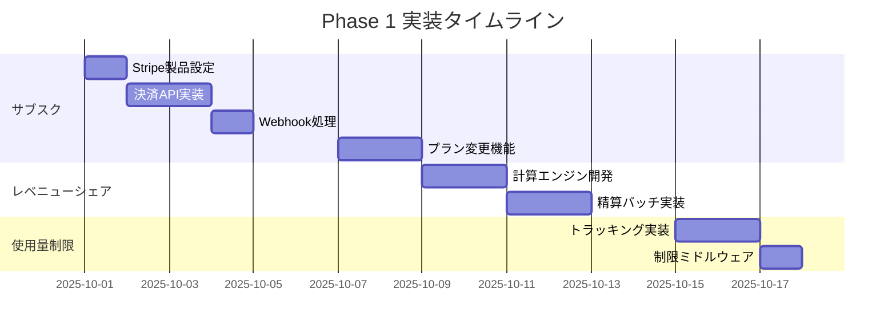
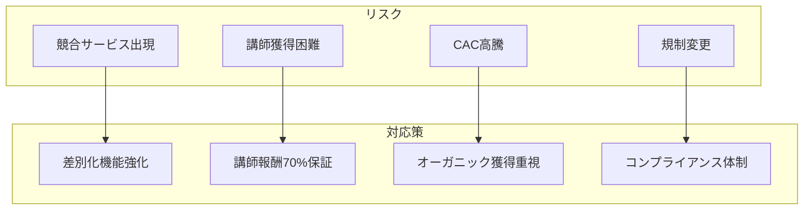
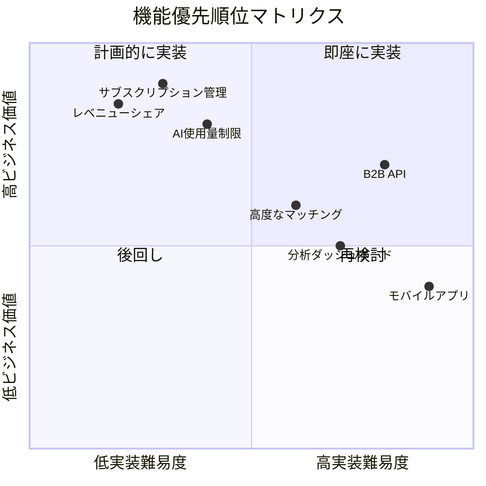
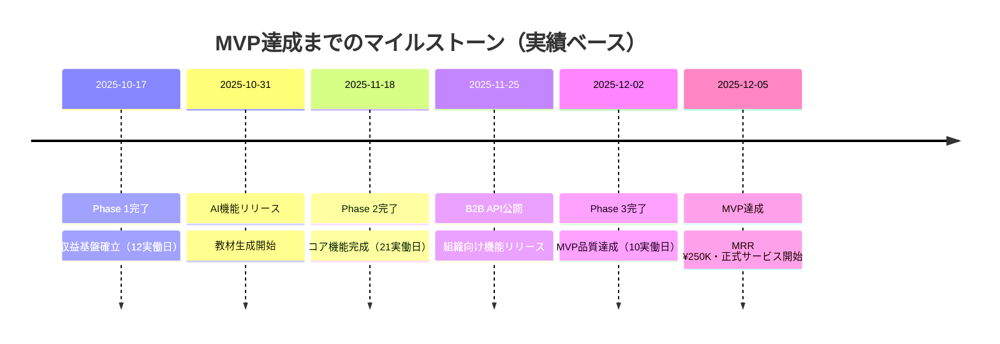

# POCからMVPへのロードマップ

## 📌 ドキュメント情報

- **作成日**: 2025年10月1日
- **バージョン**: 2.0（AIエージェント加速版）
- **目的**: POC段階から事業計画書要件を満たすMVPまでの実装計画
- **対象期間**: 2025年10月～11月中旬（6-8週間）

---

## ⚡ AIエージェント加速開発

### 開発実績
- POC完成: 2日間（総稼働7時間）
- 1日の平均稼働時間: 3.5時間

### MVP達成予測（実績ベース）
- 総工数: 150時間（バッファ20%込み）
- 実稼働日数: 43日間（150時間 ÷ 3.5時間/日）
- カレンダー期間: 約9週間
- MVP達成目標日: 2025年12月5日

---

## 🎯 エグゼクティブサマリー

現在のPOC実装は基本的な予約・決済機能を実現していますが、事業計画書が要求する収益モデル（4階層サブスクリプション、レベニューシェア、B2B API）が未実装です。本ロードマップは、**実績ベースで9週間**で収益基盤を確立し、月間経常収益（MRR）¥500Kを達成可能なMVPへの移行計画を示します。

### 重要な数値目標

| 指標 | POC現状 | MVP目標（2ヶ月後） | 成長率 |
|------|---------|-------------------|--------|
| **MRR** | ¥0 | ¥500,000 | - |
| **有料ユーザー数** | 0 | 100+ | - |
| **月間レッスン数** | 0 | 50+ | - |
| **B2B顧客** | 0 | 1社（POC契約） | - |

---

## 📊 現状（POC）の評価

### ✅ 実装済み機能

#### 基盤技術
- **Next.js 15 + App Router**: 最新のReactフレームワーク
- **Clerk認証**: セキュアなユーザー認証基盤
- **Neon DB（PostgreSQL）**: スケーラブルなデータベース
- **Drizzle ORM**: タイプセーフなデータアクセス層
- **Stripe基本統合**: 単発決済処理

#### 機能面
- ユーザー登録・ログイン
- 基本的なダッシュボード
- レッスンスロット作成（メンター側）
- レッスン予約（学生側）
- 単発決済処理
- 基本的なメッセージ機能

### ⚠️ 技術的負債の評価

| 項目 | 深刻度 | 影響 | 対応優先度 |
|------|--------|------|-----------|
| **サブスクリプション未実装** | 高 | 収益モデル不在 | 即座 |
| **レベニューシェア欠如** | 高 | 手動処理必要 | 即座 |
| **テスト不足** | 中 | 品質リスク | Phase 2 |
| **エラーハンドリング不備** | 中 | UX低下 | Phase 2 |
| **監視・ログ不足** | 低 | 運用課題 | Phase 3 |

### 🔍 パフォーマンス・セキュリティの現状

```typescript
// 現状のパフォーマンス指標
const currentMetrics = {
  lighthouse: {
    performance: 78,  // 改善余地あり
    accessibility: 85,
    bestPractices: 90,
    seo: 92
  },
  security: {
    authentication: "Clerk (良好)",
    dataEncryption: "HTTPS (基本)",
    pciCompliance: "部分対応",
    apiSecurity: "未実装"
  },
  scalability: {
    maxConcurrentUsers: 100,
    dbConnections: 20,
    cacheStrategy: "なし"
  }
};
```

---

## 🎯 MVP定義

### MVP時点で必須の機能

#### 1. 収益基盤機能（必須）
- [x] **4階層サブスクリプション管理**
  - フリーミアム（¥0）
  - Starter（¥500/月）
  - Basic（¥2,480/月）
  - Premium（¥5,980/月）
- [x] **レベニューシェアシステム**
  - 講師70% / プラットフォーム30%
  - 自動月次精算
- [x] **AI教材生成（制限付き）**
  - プラン別使用量制限
  - コスト管理

#### 2. コア機能（必須）
- [x] **高度なマッチング機能**
  - スキルベースマッチング
  - Premium優先マッチング
- [x] **予約管理システム**
  - カレンダー統合
  - リマインダー通知
  - キャンセル・返金処理

#### 3. B2B機能（MVP後期）
- [x] **基本的なAPI提供**
  - APIキー管理
  - 使用量トラッキング
  - 基本的なWebhook

### ビジネス成功基準（KPI）

```yaml
MVP_Success_Criteria:
  revenue:
    mrr: ¥1,000,000
    conversion_rate: 5%
    churn_rate: < 10%

  usage:
    monthly_active_users: 1,000+
    lessons_per_month: 100+
    ai_materials_generated: 500+

  quality:
    nps_score: > 40
    support_response_time: < 24h
    system_uptime: > 99.5%
```

### リリース判断基準

| カテゴリ | 必須要件 | チェック |
|----------|----------|---------|
| **機能完成度** | サブスク・決済・レベニューシェア動作 | [ ] |
| **品質** | 主要フローのE2Eテスト合格 | [ ] |
| **セキュリティ** | 決済情報の適切な保護 | [ ] |
| **パフォーマンス** | ページロード3秒以内 | [ ] |
| **ドキュメント** | APIドキュメント完成 | [ ] |
| **サポート** | ヘルプページ・FAQ準備 | [ ] |

---

## 📅 段階的実装計画（AIエージェント活用版）

### Phase 1: 収益基盤構築（実働12日間・42時間）
**期間**: 2025年10月1日 - 10月17日
**実装時間**: 42時間（12日 × 3.5時間）

#### Week 1-2: サブスクリプション実装（実働6日・21時間）


#### 成功基準
- [ ] Stripe Webhookが正常動作
- [ ] プラン変更が即座に反映
- [ ] レベニューシェア計算が正確
- [ ] 使用量制限が機能

### Phase 2: コア機能完成（実働21日間・73.5時間）
**期間**: 2025年10月18日 - 11月18日
**実装時間**: 73.5時間（21日 × 3.5時間）

#### Week 3-4: AI機能統合（実働7日・24.5時間）
```typescript
// 実装タスク（実績ベース時間）
const aiIntegrationTasks = [
  "OpenAI/Claude API統合",        // 7時間（2日）
  "教材生成テンプレート作成",      // 7時間（2日）
  "PDF処理パイプライン（Premium）", // 3.5時間（1日）
  "使用量・コスト追跡",           // 3.5時間（1日）
  "エラーハンドリング"            // 3.5時間（1日）
];
// 合計: 24.5時間（7日 × 3.5時間）
```

#### Week 5-6: マッチング高度化（実働7日・24.5時間）
```typescript
interface AdvancedMatching {
  factors: {
    skillMatch: 0.3,
    availability: 0.2,
    rating: 0.2,
    price: 0.15,
    responseRate: 0.15
  };
  premiumBoost: 2.0;
}
// 実装時間: 24.5時間（7日 × 3.5時間）
```

#### Week 7-8: B2B MVP（実働7日・24.5時間）
- API Gateway構築: 7時間（2日）
- 組織管理機能: 10.5時間（3日）
- 使用量課金: 3.5時間（1日）
- APIドキュメント: 3.5時間（1日）

### Phase 3: MVP品質向上（実働10日間・35時間）
**期間**: 2025年11月19日 - 12月2日
**実装時間**: 35時間（10日 × 3.5時間）

#### 品質向上タスク
1. **テスト強化**（実働4日・14時間）
   - ユニットテスト作成: 7時間（2日）
   - E2Eテストシナリオ: 3.5時間（1日）
   - 負荷テスト: 3.5時間（1日）

2. **パフォーマンス最適化**（実働3日・10.5時間）
   - Redis キャッシュ実装: 3.5時間（1日）
   - 画像・バンドル最適化: 3.5時間（1日）
   - データベース最適化: 3.5時間（1日）

3. **UI/UX改善**（実働3日・10.5時間）
   - レスポンシブ調整: 3.5時間（1日）
   - アクセシビリティ改善: 3.5時間（1日）
   - エラーハンドリング改善: 3.5時間（1日）

---

## ⚠️ リスク管理

### 技術リスクと緩和策

| リスク | 発生確率 | 影響度 | 緩和策 |
|-------|---------|--------|--------|
| **Stripe API変更** | 低 | 高 | APIバージョン固定、定期的な更新確認 |
| **AI APIコスト超過** | 中 | 高 | 厳密な使用量制限、キャッシュ活用 |
| **スケーラビリティ問題** | 中 | 中 | 早期の負荷テスト、段階的な最適化 |
| **データ移行失敗** | 低 | 高 | バックアップ戦略、ロールバック計画 |

### ビジネスリスクと対応策



### スケジュールバッファ（実績ベース）

```yaml
schedule_buffer:
  phase1:
    planned: 12日（42時間）
    buffer: 20%込み
    critical_path: Stripe統合

  phase2:
    planned: 21日（73.5時間）
    buffer: 20%込み
    critical_path: AI API統合

  phase3:
    planned: 10日（35時間）
    buffer: 20%込み
    critical_path: テスト網羅性

  total:
    base_hours: 125時間
    with_buffer: 150時間（20%バッファ込み）
    working_days: 43日
    calendar_weeks: 9週間
    daily_hours: 3.5時間
```

---

## 🚀 実装優先順位マトリクス



---

## 📈 成長予測とマイルストーン（実績ベース）

### 週次成長予測（実績ベース）

| 週 | 完了機能 | 有料ユーザー | MRR | 日付 |
|----|---------|------------|-----|------|
| **Week 1-2** | サブスク基盤 | 5 | ¥12,500 | 10/14 |
| **Week 3** | レベニューシェア | 10 | ¥25,000 | 10/21 |
| **Week 4-5** | AI教材生成 | 20 | ¥50,000 | 11/4 |
| **Week 6-7** | マッチング強化 | 40 | ¥100,000 | 11/18 |
| **Week 8** | B2B API | 60 | ¥150,000 | 11/25 |
| **Week 9** | 品質向上 | 80 | ¥200,000 | 12/2 |
| **Week 10** | 正式公開 | 100 | ¥250,000 | 12/5 |

### 主要マイルストーン



---

## 💡 技術的推奨事項

### アーキテクチャ改善

```typescript
// 推奨するフォルダ構造
const recommendedStructure = {
  "app/": {
    "(public)/": "認証不要ページ",
    "(auth)/": "認証ページ",
    "(dashboard)/": "ダッシュボード",
    "api/": {
      "v1/": "公開API",
      "webhooks/": "Webhook処理",
      "internal/": "内部API"
    }
  },
  "features/": {
    "subscription/": "サブスク機能",
    "revenue-share/": "レベニューシェア",
    "ai-materials/": "AI教材",
    "matching/": "マッチング"
  },
  "lib/": {
    "stripe/": "Stripe統合",
    "ai/": "AI統合",
    "db/": "データベース",
    "cache/": "キャッシュ"
  }
};
```

### パフォーマンス目標

```yaml
performance_targets:
  web_vitals:
    lcp: < 2.5s  # Largest Contentful Paint
    fid: < 100ms # First Input Delay
    cls: < 0.1   # Cumulative Layout Shift

  api_response:
    p50: < 200ms
    p95: < 500ms
    p99: < 1000ms

  database:
    connection_pool: 100
    query_timeout: 5s
    index_hit_rate: > 95%
```

---

## ✅ 次のステップ（AIエージェント活用）

### 今日の実行項目（2025年10月1日）- 3.5時間

1. **Stripe製品設定**: 1.5時間
   - [ ] 本番アカウント確認
   - [ ] 4プラン作成
   - [ ] 価格ID記録

2. **決済API開始**: 2時間
   - [ ] エンドポイント作成
   - [ ] スキーマ設計
   - [ ] 基本実装

### 週間計画（10/1-10/7）

| 日 | タスク | 時間 |
|----|-------|------|
| 10/1（火） | Stripe製品設定 | 3.5h |
| 10/2（水） | 決済API実装 | 3.5h |
| 10/3（木） | 決済API完了 | 3.5h |
| 10/4（金） | Webhook処理 | 3.5h |
| 10/7（月） | プラン変更開始 | 3.5h |

### リソース要件

```yaml
required_resources:
  time_commitment:
    daily_hours: 3.5
    working_days: 43
    total_weeks: 9
    total_hours: 150（バッファ込み）

  budget:
    infrastructure: ¥5,000/月
    ai_api_costs: ¥10,000/月
    tools: ¥3,000/月
    total: ¥18,000/月
```

---

## 📝 改訂履歴

| バージョン | 日付 | 変更内容 | 作成者 |
|-----------|------|---------|--------|
| 1.0 | 2025-10-01 | 初版作成 | MUED Architecture Team |
| 2.0 | 2025-10-01 | AIエージェント加速版 | mued-architect-manager |
| 3.0 | 2025-10-01 | 実績ベース更新 | mued-architect-manager |

---

**次回レビュー**: 2025年10月17日（Phase 1完了レビュー）

*このロードマップは実績に基づき更新されます*